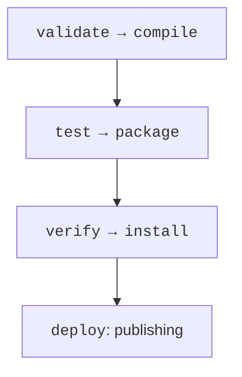
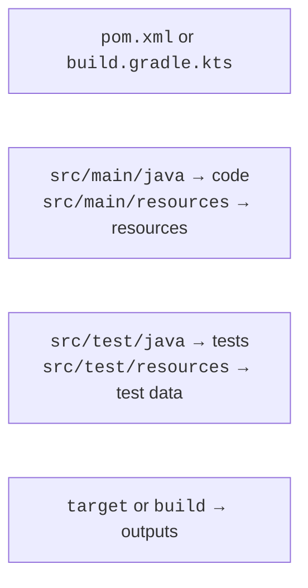
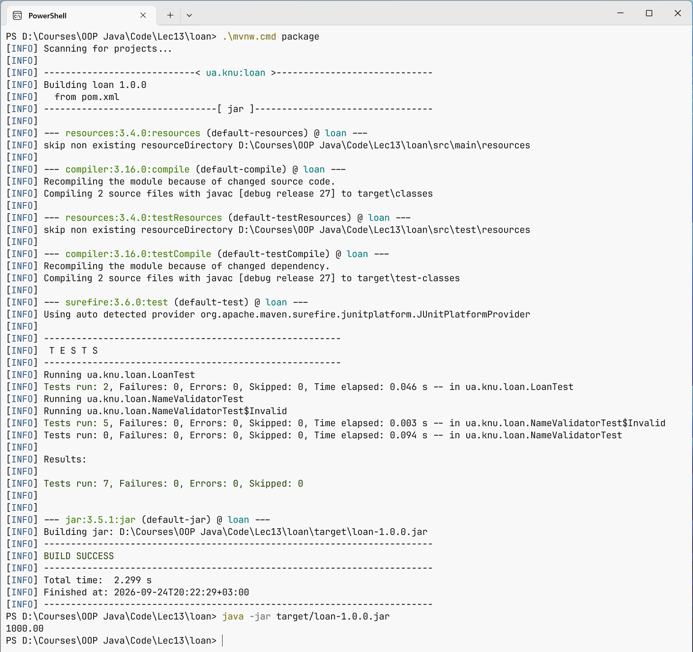

# Building with Maven

## Maven: coordinates and lifecycle

The **POM** file (`pom.xml`) describes coordinates, dependencies, and plugins. Coordinates have the form `groupId:artifactId:version`. The groupId is usually associated with the organization's domain, and the artifactId with a specific library. The artifact version is independent of the JDK. Maven Central is a repository of artifacts, not a catalog of arbitrary Git source repositories.

A dependency can have its own dependencies. Maven builds a tree and chooses versions according to its own rules; a conflict does not necessarily mean the newest version will be chosen. The `mvn dependency:tree` command explains the actual set. A BOM aligns the versions of related components centrally but does not add them to the code by itself.

The `compile` scope is the default; `test` is needed only by tests; `runtime` adds a library for execution, and `provided` means the environment must supply it. Do not declare a database driver as `provided` if you are running an ordinary console application without a container.



Figure 13.4. Maven phases run up to and including the chosen one {.caption}

`validate` checks the structure; `compile` compiles the main code; `test` runs unit tests; `package` creates a JAR; `verify` runs additional checks; `install` puts the artifact into the local Maven repository; `deploy` publishes it to a remote one. The command `mvn package` goes through the preceding phases, while `clean` belongs to a separate lifecycle and deletes build outputs.

`install` in Maven does not install a program in Windows. `deploy` is not run just to check local code: it is a publishing operation. The usual training cycle is `mvn test` and `mvn package`, without an external repository.

### Project structure and the Wrapper

The main code lives in `src/main/java`, resources in `src/main/resources`, and tests in `src/test/java`. Maven outputs go to `target`; Gradle outputs go to `build`. Generated classes and caches should not be copied into the sources or Git. The standard structure lets tools work without extra configuration.



Figure 13.5. Code, resources, and tests have separate directories {.caption}

The Maven Wrapper consists of the `mvnw` and `mvnw.cmd` scripts and the helper files in `.mvn/wrapper`. It pins the Maven version but does not automatically install the correct JDK. After the initial installation of Maven, create the wrapper and use it from then on. In Windows PowerShell, the command looks like `.\mvnw.cmd test`.

```powershell
mvn wrapper:wrapper -Dmaven=3.9.16
.\mvnw.cmd --version
.\mvnw.cmd test
```

Official getting started guide: <https://maven.apache.org/guides/getting-started/>. In the `--version` output, check for Java 27 and the correct JAVA\_HOME. The `release` option restricts not only the bytecode version but also the Java API available in the target release. An old javac cannot compile with `--release 27`, even if the number is written correctly in the POM.

## Example 2. A Maven project for a loan calculator

Create `pom.xml` and two Java files. The example shows a fixed annuity payment for a training model. Fees, calendar specifics, and real contracts are not modeled. The calculation uses double here to demonstrate numeric tests; accounting requires exact amounts and rounding rules.

```xml
<project xmlns="http://maven.apache.org/POM/4.0.0"
  xmlns:xsi="http://www.w3.org/2001/XMLSchema-instance"
  xsi:schemaLocation="http://maven.apache.org/POM/4.0.0
    https://maven.apache.org/xsd/maven-4.0.0.xsd">
  <modelVersion>4.0.0</modelVersion>
  <groupId>ua.knu</groupId>
  <artifactId>loan</artifactId>
  <version>1.0.0</version>
  <properties>
    <maven.compiler.release>27</maven.compiler.release>
    <project.build.sourceEncoding>UTF-8</project.build.sourceEncoding>
  </properties>
  <dependencyManagement>
    <dependencies>
      <dependency>
        <groupId>org.junit</groupId>
        <artifactId>junit-bom</artifactId>
        <version>6.1.3</version>
        <type>pom</type>
        <scope>import</scope>
      </dependency>
    </dependencies>
  </dependencyManagement>
  <dependencies>
    <dependency>
      <groupId>org.junit.jupiter</groupId>
      <artifactId>junit-jupiter</artifactId>
      <scope>test</scope>
    </dependency>
  </dependencies>
  <build>
    <plugins>
      <plugin>
        <artifactId>maven-compiler-plugin</artifactId>
        <version>3.16.0</version>
      </plugin>
      <plugin>
        <artifactId>maven-surefire-plugin</artifactId>
        <version>3.6.0</version>
      </plugin>
      <plugin>
        <artifactId>maven-jar-plugin</artifactId>
        <version>3.5.1</version>
        <configuration>
          <archive><manifest>
            <mainClass>ua.knu.loan.Loan</mainClass>
          </manifest></archive>
        </configuration>
      </plugin>
    </plugins>
  </build>
</project>
```

`src/main/java/ua/knu/loan/Loan.java`:

```java
package ua.knu.loan;

public final class Loan {
    private Loan() {}

    public static double payment(double sum, double annual,
                                 int months) {
        if (!Double.isFinite(sum) || !Double.isFinite(annual)
                || sum <= 0 || annual < 0 || annual > 100
                || months < 1 || months > 600) {
            throw new IllegalArgumentException("Invalid loan");
        }
        double rate = annual / 1200;
        if (rate == 0) return sum / months;
        double divisor = -Math.expm1(-months * Math.log1p(rate));
        double result = sum * rate / divisor;
        if (!Double.isFinite(result)) {
            throw new ArithmeticException("Payment overflow");
        }
        return result;
    }

    public static void main(String[] args) {
        System.out.printf(java.util.Locale.ROOT, "%.2f%n",
            payment(12000, 0, 12));
    }
}
```

`src/test/java/ua/knu/loan/LoanTest.java`:

```java
package ua.knu.loan;

import org.junit.jupiter.api.Test;
import static org.junit.jupiter.api.Assertions.*;

class LoanTest {
    @Test
    void zeroRate() {
        double actual = Loan.payment(12000, 0, 12);
        assertEquals(1000, actual, 0.000001);
    }

    @Test
    void rejectsInvalidInput() {
        assertAll(
            () -> assertThrows(IllegalArgumentException.class,
                () -> Loan.payment(-1, 10, 12)),
            () -> assertThrows(IllegalArgumentException.class,
                () -> Loan.payment(1000, Double.NaN, 12)),
            () -> assertThrows(IllegalArgumentException.class,
                () -> Loan.payment(1000, 10, 0)),
            () -> assertThrows(ArithmeticException.class,
                () -> Loan.payment(Double.MAX_VALUE, 100, 1))
        );
    }
}
```

```powershell
.\mvnw.cmd test
.\mvnw.cmd package
java -jar target/loan-1.0.0.jar
```

The program prints `1000.00`. The tests check the zero rate and the rejection of invalid data. The tolerance in `assertEquals` specifies the error acceptable for the domain; it does not hide any difference whatsoever. For a positive rate, add an independently verified reference example and a check that the payment increases monotonically with the rate.



Figure 13.6. Maven compiles, tests, and packages the program {.caption}
