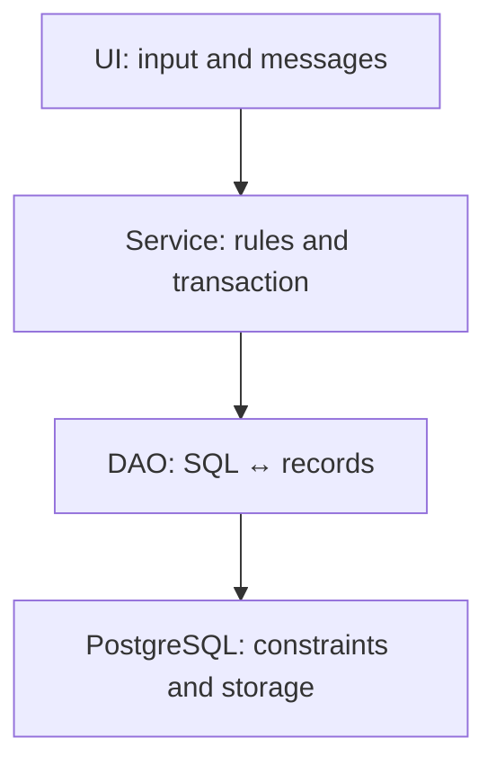
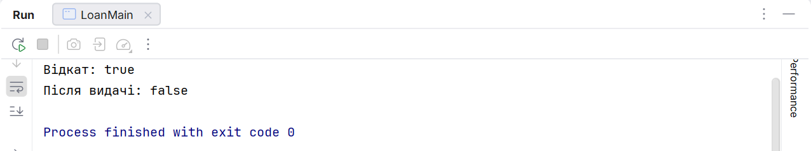

# DAO, DataSource, and testing

## DAO and batch changes

A **DAO** hides SQL behind `add`, `find`, and `list` methods. A service coordinates several DAOs in one transaction, and the console UI reads data and builds messages. A DAO must not print menus or ask for a password from the keyboard on its own.



Figure 14.11. Domain data is passed between layers without a ResultSet {.caption}

### Example 4. Readers, a generated key, and batch

The interface and implementation are nested in one class only to keep the listing compact. In a project, they can be moved into separate files. This DAO uses the connection it was given, does not close it, and does not perform a hidden commit – the caller manages the transaction.

```java
package demo;

import java.sql.*;
import java.util.List;

public final class ReadersMain {
    interface ReaderDao {
        long add(String name) throws SQLException;
        void addAll(List<String> names) throws SQLException;
    }

    static final class JdbcReaders implements ReaderDao {
        private final Connection connection;

        JdbcReaders(Connection connection) {
            this.connection = connection;
        }

        public long add(String name) throws SQLException {
            try (PreparedStatement insert =
                    connection.prepareStatement(
                    "INSERT INTO j14_readers(name) VALUES (?)",
                    new String[]{"id"})) {
                insert.setString(1, name);
                insert.executeUpdate();
                try (ResultSet keys = insert.getGeneratedKeys()) {
                    if (!keys.next()) {
                        throw new SQLException("No key");
                    }
                    return keys.getLong(1);
                }
            }
        }

        public void addAll(List<String> names) throws SQLException {
            try (PreparedStatement insert =
                    connection.prepareStatement(
                    "INSERT INTO j14_readers(name) VALUES (?)")) {
                for (String name : names) {
                    insert.setString(1, name);
                    insert.addBatch();
                }
                insert.executeBatch();
            }
        }
    }

    public static void main(String[] args) throws Exception {
        try (Connection connection = Db.open();
             Statement setup = connection.createStatement()) {
            setup.executeUpdate("""
                CREATE TEMP TABLE j14_readers (
                  id bigint GENERATED ALWAYS AS IDENTITY PRIMARY KEY,
                  name text NOT NULL CHECK (length(trim(name)) > 0))
                """);
            connection.setAutoCommit(false);
            try {
                ReaderDao dao = new JdbcReaders(connection);
                System.out.println("id: " + dao.add("Olena"));
                dao.addAll(List.of("Taras", "Maria"));
                connection.commit();
            } catch (SQLException error) {
                connection.rollback();
                throw error;
            }
            try (ResultSet rows = setup.executeQuery(
                    "SELECT count(*) FROM j14_readers")) {
                rows.next();
                System.out.println("Readers: " + rows.getLong(1));
            }
        }
    }
}
```

```text
id: 1
Readers: 3
```

`RETURN_GENERATED_KEYS` or a list of key column names tells the driver to return the keys. Do not look up the new id with `SELECT max(id)`: another client may work between the insert and the read. PostgreSQL sequences can have gaps after a rollback; an id is not a continuous row number in a report.

The result of executeBatch contains the number of changes for each element or special JDBC values, in particular SUCCESS\_NO\_INFO. Do not sum them as ordinary positive numbers. A batch by itself does not guarantee atomicity – a transaction provides it.

## DataSource, metadata, and errors

A `DataSource` is a factory of connections. `PGSimpleDataSource` configures PostgreSQL without manually assembling a DriverManager call, but it is not a pool. HikariCP is an example of a separate pool that reuses a limited number of connections. Its owner closes the pool when the application shuts down.

A pool does not mean a shared Connection for all threads. A short operation takes its own connection and returns it through close. Using one Connection concurrently from different background tasks complicates transactions and is not a substitute for a proper data access architecture.

DatabaseMetaData describes the server, the driver, the tables, and the capabilities; ResultSetMetaData describes the columns of a particular result. They are useful for diagnostics and generic reports, but a domain DAO usually has explicit field names and types.

SQLException contains the SQLState, a vendor code, and a chain of causes. The state class `23` denotes constraint violations; the exact code helps distinguish a duplicate from a foreign key violation. A driver message may contain data values, so the user is shown clear text without leaking secrets.

`Connection refused` makes you check the server, the port, and the address; `password authentication failed` – the role and authentication; `No suitable driver` – the dependency and the URL. Disabling certificate verification is not a universal way to fix the network. For a remote server, TLS and access are configured by its owner.

## Testing the DAO and transactions

Run integration tests in your own training database or in a unique schema. Test an insert and a reread with a new connection, an empty result, an apostrophe, a nullable date, a duplicate, an unknown foreign key, and deleting a missing id. A rollback should be verified by the data, not by a console message.

For a transfer, test that the sum of the two balances is preserved, an insufficient balance, an artificial failure after the debit, and two concurrent requests. A test on SQLite or H2 does not prove the correctness of PostgreSQL locking, so the course's main transactional scenarios are run on PostgreSQL itself.



Figure 14.12. The domain result and confirmation of the rollback {.caption}
