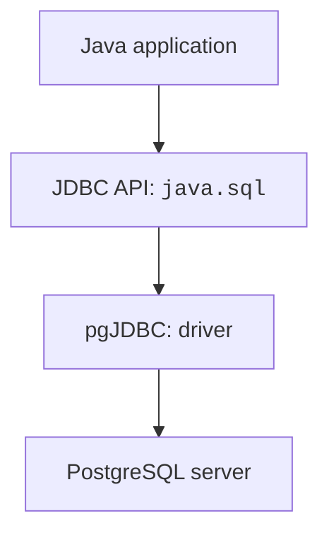
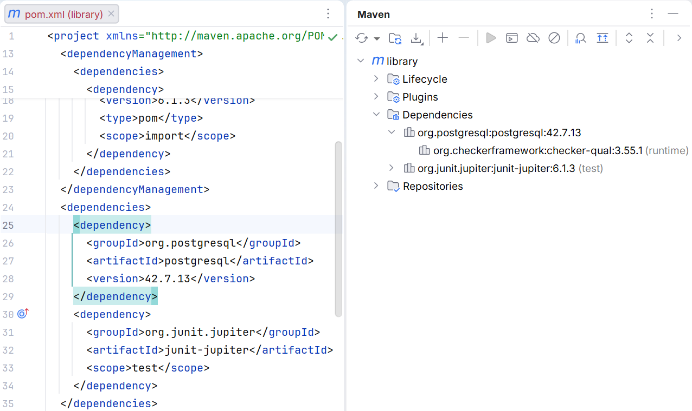
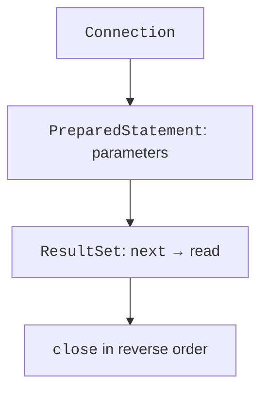
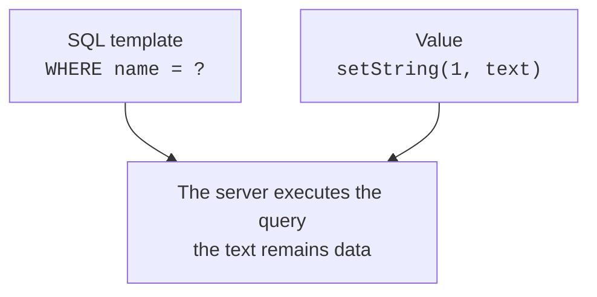

# JDBC and queries

## JDBC: API, driver, and connection

**JDBC** is the Java platform API for accessing relational databases. The Connection, PreparedStatement, and ResultSet interfaces belong to `java.sql`. The PostgreSQL driver implements these interfaces and translates calls into the server's protocol. Changing the driver does not automatically make arbitrary SQL portable between DBMSs.



Figure 14.5. The driver separates the Java API from the PostgreSQL protocol {.caption}

Add the pgJDBC dependency to the Maven POM from topic 13. For a program on the module path, the descriptor has `requires java.sql`. In this topic, the console examples run on the classpath so that the focus stays on JDBC; JPMS will return in the JavaFX project. <https://jdbc.postgresql.org/documentation/>.

```xml
<dependency>
  <groupId>org.postgresql</groupId>
  <artifactId>postgresql</artifactId>
  <version>42.7.13</version>
</dependency>
```

A modern JDBC driver registers itself automatically through the service mechanism if the JAR is available at runtime. The old `Class.forName("org.postgresql.Driver")` is usually unnecessary. `No suitable driver` should first make you check the runtime classpath and the JDBC URL, rather than add random try/catch blocks.



Figure 14.6. pgJDBC among the application's Maven dependencies {.caption}

### A shared configuration class

Add the `src/main/java/demo/Db.java` shown below to each separate example in this topic. It is a complete shared helper class, not a hidden external library. Run the other programs separately, setting the corresponding mainClass.

Configure `DB_URL`, `DB_USER`, and `DB_PASSWORD` for the child launch process. The URL has the form `jdbc:postgresql://localhost:5432/library`. The password is not printed to the log and is not added to the repository.

```java
package demo;

import java.sql.Connection;
import java.sql.DriverManager;
import java.sql.SQLException;
import java.util.Properties;

public final class Db {
    private Db() {}

    private static String required(String key) {
        String value = System.getenv(key);
        if (value == null || value.isBlank()) {
            throw new IllegalStateException("Missing " + key);
        }
        return value;
    }

    public static Connection open() throws SQLException {
        Properties properties = new Properties();
        properties.setProperty("user", required("DB_USER"));
        properties.setProperty("password", required("DB_PASSWORD"));
        properties.setProperty("connectTimeout", "5");
        properties.setProperty("socketTimeout", "10");
        return DriverManager.getConnection(required("DB_URL"),
            properties);
    }
}
```

`Properties` passes parameters separately from the URL. The connection timeout and the socket timeout help avoid waiting on the network forever. They do not replace domain-level error handling. Environment secrets are available to the process; do not show them in a report or in a screenshot of the run settings.

## Example 1. The first connection

`src/main/java/demo/ConnectMain.java`:

```java
package demo;

import java.sql.Connection;
import java.sql.DatabaseMetaData;

public final class ConnectMain {
    public static void main(String[] args) throws Exception {
        try (Connection connection = Db.open()) {
            DatabaseMetaData metadata = connection.getMetaData();
            System.out.println(metadata.getDatabaseProductName());
            System.out.println(metadata.getDatabaseMajorVersion());
            System.out.println(metadata.getDriverVersion());
        }
    }
}
```

For the tested server, the result is the name `PostgreSQL`, the major version `18`, and the driver version `42.7.13`. The driver number and the server version are independent. If the server runs a different supported release, its metadata will naturally differ.

`try-with-resources` closes the Connection even if an exception occurs. Nested resources are closed in reverse order: ResultSet, Statement, Connection. Do not return an open ResultSet from a method that immediately closes its connection.



Figure 14.7. The short lifecycle of JDBC resources {.caption}

## Query parameters and results

`executeQuery` is used for a query with a ResultSet, and `executeUpdate` for INSERT/UPDATE/DELETE and some DDL. The returned count of changed rows matters: zero when changing by id means a missing record or an unmet condition. `execute` is needed when the shape of the result may vary.

PreparedStatement parameters are marked with `?` and numbered from one. `setString`, `setLong`, `setBigDecimal`, and `setObject` pass values separately from the SQL syntax. A variable column name or ASC/DESC cannot be substituted as a value parameter: such parts are chosen from an allowed list.



Figure 14.8. A parameter value does not become part of the SQL syntax {.caption}

Unsafe concatenation can turn a user's string into an SQL condition. With a PreparedStatement, the same text remains a single value. This rule also applies to "ordinary" names with an apostrophe, which break manual quoting. For LIKE, the `%` and `_` characters remain wildcards; a literal search requires separate escaping of the pattern.

A ResultSet is initially positioned before the first row. The loop `while (rows.next())` moves to each result. Column indices also start at one; a name or alias is often more readable. `getInt` returns zero for SQL NULL, so when necessary check `wasNull` or read a nullable type with `getObject`. Do not lose the difference between zero and absence.

## Example 2. A book catalog with JOIN

The program creates its own temporary tables, adds two rows, and reads the books of a specific author. The Book record contains plain data, so it remains usable after the ResultSet is closed.

```java
package demo;

import java.sql.*;
import java.util.ArrayList;
import java.util.List;

public final class CatalogMain {
    record Book(long id, String title, String author) {}

    static List<Book> find(Connection connection, String author)
            throws SQLException {
        String sql = """
            SELECT b.id, b.title, a.name AS author
            FROM j14_books b JOIN j14_authors a ON a.id=b.author_id
            WHERE a.name = ? ORDER BY b.id
            """;
        List<Book> books = new ArrayList<>();
        try (PreparedStatement query =
                connection.prepareStatement(sql)) {
            query.setString(1, author);
            try (ResultSet rows = query.executeQuery()) {
                while (rows.next()) {
                    books.add(new Book(rows.getLong("id"),
                        rows.getString("title"),
                        rows.getString("author")));
                }
            }
        }

        return List.copyOf(books);
    }

    public static void main(String[] args) throws Exception {
        try (Connection connection = Db.open();
             Statement setup = connection.createStatement()) {
            setup.executeUpdate("""
                CREATE TEMP TABLE j14_authors (
                  id bigint PRIMARY KEY, name text NOT NULL)
                """);
            setup.executeUpdate("""
                CREATE TEMP TABLE j14_books (
                  id bigint PRIMARY KEY, title text NOT NULL,
                  author_id bigint REFERENCES j14_authors(id))
                """);
            setup.executeUpdate("""
                INSERT INTO j14_authors VALUES (1, 'Author A')
                """);
            setup.executeUpdate("""
                INSERT INTO j14_books VALUES
                  (1, 'Spring', 1), (2, 'Summer', 1)
                """);
            find(connection, "Author A").forEach(System.out::println);
            System.out.println("Unknown: " +
                find(connection, "' OR '1'='1").size());
        }
    }
}
```

```text
Book[id=1, title=Spring, author=Author A]
Book[id=2, title=Summer, author=Author A]
Unknown: 0
```

Without ORDER BY, the order of the result is not guaranteed. INNER JOIN returns only matches, while LEFT JOIN keeps all rows of the left table. For a report that includes "authors without books too," you need LEFT JOIN and COUNT of the book key; `COUNT(*)` would have a different meaning for the artificial row with NULL on the right.


Figure 14.9. Checking a JOIN in the SQL console {.caption}
