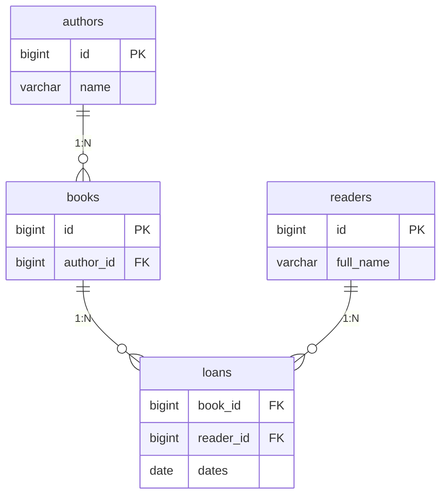
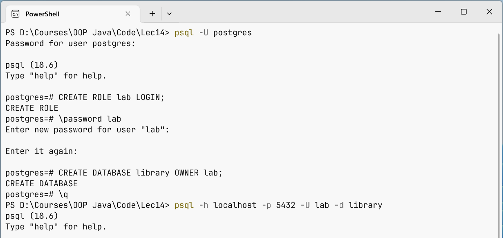
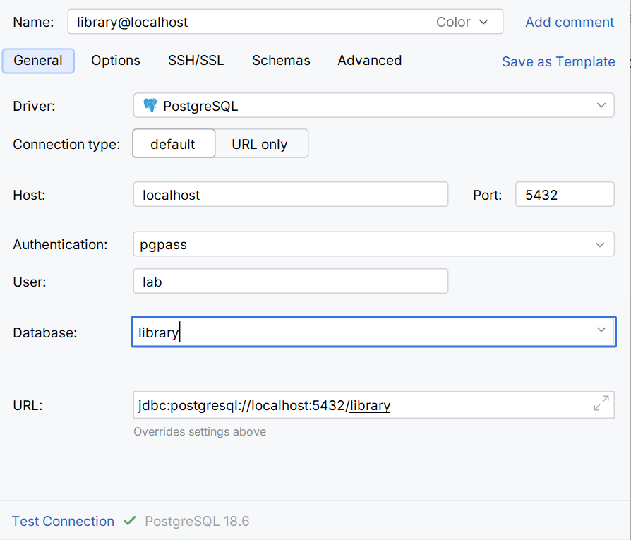

# The relational model and PostgreSQL

## Persistent data and the relational model

A Java collection stores objects until the process ends. A file can keep them longer, but you would have to implement relationship checks and consistent work by several clients yourself. A **database management system** provides queries, constraints, transactions, and concurrency control.

In this course, the main DBMS is **PostgreSQL**. It is a server: a Java client connects to the PostgreSQL process over a network protocol, even if both run on the same computer. A JDBC configuration file does not contain the database itself. Official documentation: <https://www.postgresql.org/docs/current/>.

A table describes a set of rows with typed columns. A primary key uniquely identifies a row. A foreign key refers to another table, and UNIQUE, NOT NULL, and CHECK protect domain constraints. Validation in a Java form does not replace the constraints of a server that other clients may also access.



Figure 14.1. Books, authors, readers, and loan history {.caption}

Books are not identified by title alone: different editions can have the same title. The relationship to an author is stored as a key, not as a copy of the author's name. The loans table is separate because one book can be lent many times on different dates.

## Setting up PostgreSQL

Use the official download: <https://www.postgresql.org/download/>. On Windows, the installer lets you choose the server, command-line tools, the data directory, and the port; the default port is 5432. On Linux and macOS, follow the instructions for your specific distribution, because package and service names differ. The examples were tested on PostgreSQL 18.6.

Create a separate training database and role. Do not run an everyday program as the `postgres` administrator. Set the password with an interactive psql command so that it does not remain in a copied SQL file. The administrative commands below are run by the owner of the local training server.

```sql
CREATE ROLE lab LOGIN;
```

In psql, run `\password lab`, then:

```sql
CREATE DATABASE library OWNER lab;
```

Connect with `psql -h localhost -p 5432 -U lab -d library`. For a non-standard port, replace it both in psql and in the JDBC URL. Check `SELECT current_user, current_database();`. Changing the role's password does not automatically change the saved Java configuration.

::: info Screenshot
PostgreSQL 18 installer: server and command line tools; no secrets.
:::

Figure 14.2. Choosing the components of a local PostgreSQL {.caption}



Figure 14.3. A separate role and database for the lab {.caption}

In DataGrip or the Database window of IntelliJ IDEA, create a PostgreSQL data source: host, port, database, user. Download the suggested driver and run *Test Connection*. In the SQL console, a query is executed with **Ctrl+Enter**. Do not confuse the IDE's connection with the program's connection: they are different clients with their own parameters. <https://www.jetbrains.com/help/datagrip/connecting-to-a-database.html>.

Check the IDE licensing terms for your type of use on the product's official page; the fact that this is coursework is not a technical requirement of JDBC. For all the examples, the free psql and a command-line Maven build are sufficient.



Figure 14.4. Connecting to the training database {.caption}

### DDL, DML, and exact types

DDL describes structure: CREATE TABLE, ALTER TABLE, CREATE INDEX. DML changes rows: INSERT, UPDATE, DELETE. SELECT reads data. The `generated always as identity` type provides a server-generated numeric key. For money, `numeric(12,2)` with Java BigDecimal, or whole cents, are suitable; double does not guarantee an exact decimal representation.

`date` corresponds to a calendar date without a time; JDBC can read it as a LocalDate. The moment of an event across different time zones requires a different agreed contract. NULL means the absence of a value, not an empty string, zero, or the date "01/01/1970".

```sql
CREATE TABLE authors (
  id bigint GENERATED ALWAYS AS IDENTITY PRIMARY KEY,
  name varchar(120) NOT NULL
);
CREATE TABLE books (
  id bigint GENERATED ALWAYS AS IDENTITY PRIMARY KEY,
  title varchar(200) NOT NULL,
  author_id bigint NOT NULL REFERENCES authors(id),
  price numeric(12,2) NOT NULL CHECK (price >= 0)
);
```

This is the schema for your own training database. Running CREATE TABLE again for an existing object is an error; a real project changes its schema with migrations. The demo programs below create temporary tables that disappear when their connection is closed. They do not drop any existing tables in your database.
