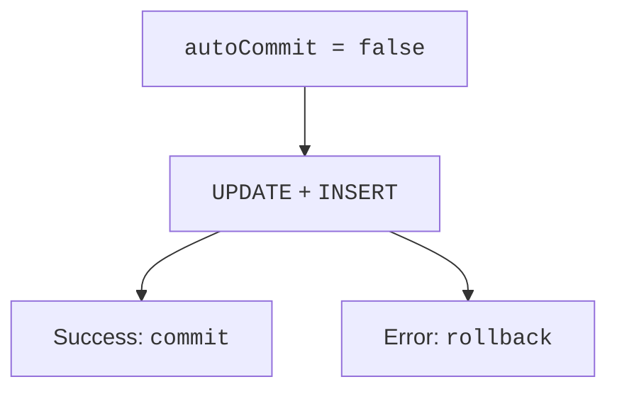

# Transactions and concurrency

## Transactions and concurrency

By default, JDBC works in auto-commit mode: each completed SQL operation is committed separately. If lending a book consists of changing its availability and writing a log record, you need a single transaction: `setAutoCommit(false)`, all the actions, `commit`. On an error, call `rollback` and propagate the error.



Figure 14.10. Lending changes the availability and the log atomically {.caption}

After an SQL error in PostgreSQL, the current transaction usually stays in an error state until it is rolled back. A simple catch that prints a message does not recover it. The rollback itself can also end with an exception, so the original cause is kept, and the secondary one is added through `addSuppressed`.

If a Connection is passed in from outside, the method must have a clear agreement about who manages the transaction. When a connection is returned to a pool, its settings should be restored. In the complete examples, the owner opens a new connection per operation and closes it after commit or rollback, so it is not accidentally reused.

### Example 3. Lending a book

A conditional UPDATE changes the row only when the book is available. This is more important than a preceding SELECT without locking: another client can change the state between the read and the write. The number of changed rows determines whether the right to lend was obtained.

```java
package demo;

import java.sql.*;

public final class LoanMain {
    static void issue(Connection connection, long book,
                      String reader, boolean fail)
            throws SQLException {
        connection.setAutoCommit(false);
        try {
            try (PreparedStatement update =
                    connection.prepareStatement(
                    "UPDATE j14_stock SET available=false " +
                    "WHERE id=? AND available=true")) {
                update.setLong(1, book);
                if (update.executeUpdate() != 1) {
                    throw new SQLException(
                        "Book unavailable", "P0001");
                }
            }
            if (fail) throw new SQLException("Simulated failure");
            try (PreparedStatement insert =
                    connection.prepareStatement(
                    "INSERT INTO j14_loans(book_id,reader) "
                    + "VALUES (?,?)")) {
                insert.setLong(1, book);
                insert.setString(2, reader);
                insert.executeUpdate();
            }
            connection.commit();
        } catch (SQLException error) {
            try { connection.rollback(); }
            catch (SQLException rollback) {
                error.addSuppressed(rollback);
            }
            throw error;
        }
    }

    static boolean available(Connection connection)
            throws SQLException {
        try (Statement statement = connection.createStatement();
             ResultSet rows = statement.executeQuery(
                 "SELECT available FROM j14_stock WHERE id=1")) {
            if (!rows.next()) throw new SQLException("Missing book");
            return rows.getBoolean(1);
        }
    }

    public static void main(String[] args) throws Exception {
        try (Connection connection = Db.open();
             Statement setup = connection.createStatement()) {
            setup.executeUpdate("""
                CREATE TEMP TABLE j14_stock (
                  id bigint PRIMARY KEY, available boolean NOT NULL)
                """);
            setup.executeUpdate("""
                CREATE TEMP TABLE j14_loans (
                  book_id bigint REFERENCES j14_stock(id),
                  reader text)
                """);
            setup.executeUpdate(
                "INSERT INTO j14_stock VALUES (1,true)");
            try { issue(connection, 1, "Olena", true); }
            catch (SQLException expected) {
                System.out.println(
                    "Rollback: " + available(connection));
            }
            issue(connection, 1, "Olena", false);
            System.out.println(
                "After lending: " + available(connection));
        }
    }
}
```

```text
Rollback: true
After lending: false
```

The test must also check the number of log rows: 0 after the failed action and 1 after the successful one. A second request to lend the same book must be rejected rather than create a second log entry. The temporary tables of this example are suitable for a single connection; a test with two concurrent clients requires a shared isolated schema.

### Isolation and savepoints

Isolation determines which changes of other transactions are visible. PostgreSQL usually starts with READ COMMITTED: each statement sees its own current snapshot. REPEATABLE READ and SERIALIZABLE provide stronger guarantees but may require retrying the whole transaction after a conflict. Retry only operations with a defined policy and a limited number of attempts.

`SELECT ... FOR UPDATE` locks the selected rows for a consistent change. When locking several accounts, take them in a fixed id order to reduce the risk of a deadlock. Do not keep a transaction open while the user is thinking about a dialog: the form is validated before the short operation starts.

`setSavepoint` creates a point for partial rollback; `rollback(savepoint)` returns to it. This is not an independent commit inside another transaction. After a partial rollback, you must explicitly decide whether the further result is allowed by the domain rules.
