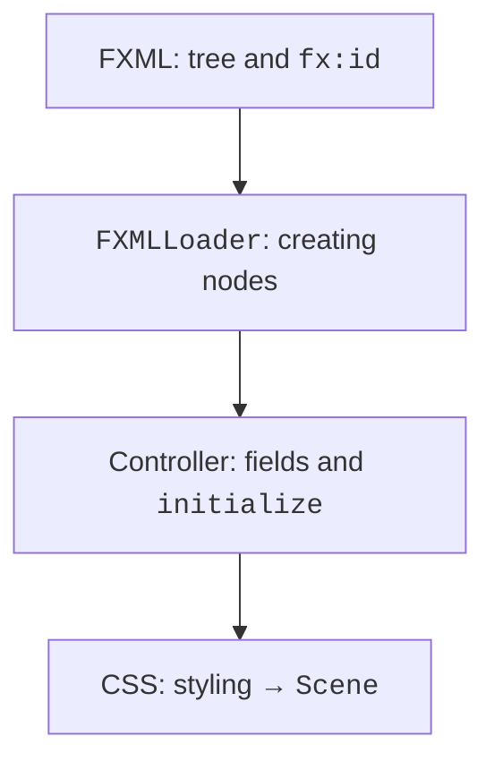
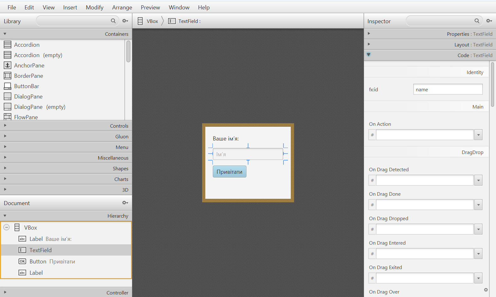
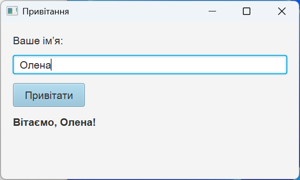
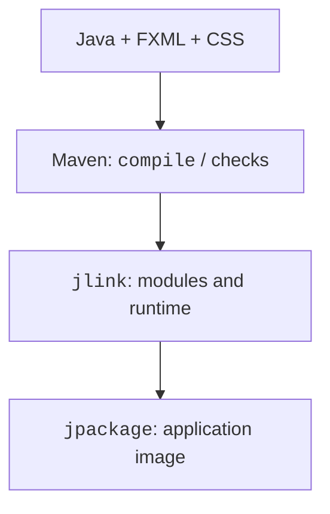

# CSS, FXML, and distribution

## CSS and resources

JavaFX CSS styles controls through class, id, and pseudo-class selectors. It is not a complete implementation of browser CSS. JavaFX properties have the `-fx-` prefix. The `.button` style applies to buttons, and `#status` to the node with the corresponding id. An external CSS file is more convenient than many repeated setStyle calls.

A resource is looked up with getResource, relative to the classpath or to the class's package. A leading slash means the classpath root. Objects.requireNonNull immediately explains that a resource is missing; otherwise a random NullPointerException will occur later. Check resources in the built JAR too, not only from the IDE.

## Example 4. An FXML greeting form

FXML describes a tree of objects declaratively; the controller contains the handlers. It is neither HTML nor a computation language. FXMLLoader reads the XML, creates the nodes, passes the fields with fx:id to the controller, and only then calls initialize. The controller's constructor does not yet have access to the injected `@FXML` fields.



Figure 15.8. The loader combines markup, a controller, and CSS {.caption}

The file `src/main/resources/demo/greeting.fxml`:

```xml
<?xml version="1.0" encoding="UTF-8"?>
<?import javafx.scene.control.*?>
<?import javafx.scene.layout.VBox?>
<?import javafx.geometry.Insets?>
<VBox xmlns:fx="http://javafx.com/fxml/1" spacing="12"
  fx:controller="demo.GreetingController">
  <padding><Insets top="16" right="16"
    bottom="16" left="16"/></padding>
  <Label text="Your name:"/>
  <TextField fx:id="name" promptText="Name"/>
  <Button fx:id="greet" text="Greet"
    onAction="#greet" defaultButton="true"/>
  <Label fx:id="status" wrapText="true"/>
</VBox>
```

The file `src/main/java/demo/GreetingController.java`:

```java
package demo;

import javafx.fxml.FXML;
import javafx.scene.control.Label;
import javafx.scene.control.TextField;

public final class GreetingController {
    @FXML private TextField name;
    @FXML private Label status;

    @FXML
    private void initialize() {
        status.setText("Enter your name and click the button");
    }

    @FXML
    private void greet() {
        String value = name.getText().strip();
        if (value.isEmpty() || value.length() > 40) {
            status.setText("From 1 to 40 characters required");
            name.requestFocus();
            return;
        }
        status.setText("Welcome, " + value + "!");
    }
}
```

The file `src/main/java/demo/GreetingMain.java`:

```java
package demo;

import java.util.Objects;
import javafx.application.Application;
import javafx.fxml.FXMLLoader;
import javafx.scene.Scene;
import javafx.stage.Stage;

public final class GreetingMain extends Application {
    @Override
    public void start(Stage stage) throws Exception {
        var fxml = Objects.requireNonNull(
            getClass().getResource("/demo/greeting.fxml"),
            "Missing greeting.fxml");
        var css = Objects.requireNonNull(
            getClass().getResource("/demo/app.css"),
            "Missing app.css");
        Scene scene = new Scene(FXMLLoader.load(fxml), 400, 210);
        scene.getStylesheets().add(css.toExternalForm());
        stage.setScene(scene);
        stage.setTitle("Greeting");
        stage.show();
    }

    public static void main(String[] args) { launch(args); }
}
```

The file `src/main/resources/demo/app.css`:

```css
.root {
  -fx-font-family: "Arial";
  -fx-font-size: 14px;
  -fx-background-color: #f4f4f4;
}
.button { -fx-padding: 8 16 8 16; }
#status { -fx-font-weight: bold; }
```

The expected result after entering ` Olena ` is `Welcome, Olena!`. An empty name leaves the form open and shows the length requirement. This is a greeting, not an identity check: real authentication cannot be replaced by a string comparison or by hiding a field with a PasswordField.

Scene Builder edits FXML visually. You choose controls in the Library, Hierarchy shows the tree, and the Inspector shows Layout, Properties, and Code. In Code, set the fx:id and the handler name without the leading hash sign; in the saved FXML, onAction has the `#`. The Scene Builder version must support the controls used. The editor does not generate the controller code or the project dependencies.



Figure 15.9. The FXML tree and properties in Scene Builder {.caption}



Figure 15.10. The FXML form after CSS is applied {.caption}

## Testing and distribution

Test pure transformations with JUnit without starting the graphics subsystem. A UI scenario separately checks clicks, focus, resources, and the state of controls. Creating a node does not prove that the form is correct at a different Windows scale: you need to check a narrow window, the keyboard, and a large font manually.

A modular application can be built into a runtime image:

```text
mvn clean javafx:jlink
```

The plugin uses module-info and the modules of the current platform. The resulting runtime image does not need a separate JDK, but it is platform-specific: a Windows image does not run on Linux. Check the launch from a directory other than the project root to detect incorrect relative resource paths.

jpackage adds a launcher and, if needed, an installer. First you create an app-image and check it, then you build an installer of the required format. For the module shown, the image is created by this PowerShell command:

```powershell
jpackage --type app-image --name JavaFxCourse `
  --dest package --runtime-image target/image `
  --module demo.fx/demo.CounterMain
```

It creates `package/JavaFxCourse` without installing anything into the system. The packager does not address signing, updates, licenses, or data migration. The platform tools needed for MSI/EXE are installed separately. In the next topic, we will add a layered architecture and PostgreSQL access without blocking the window.



Figure 15.11. From sources to a verifiable application image {.caption}
