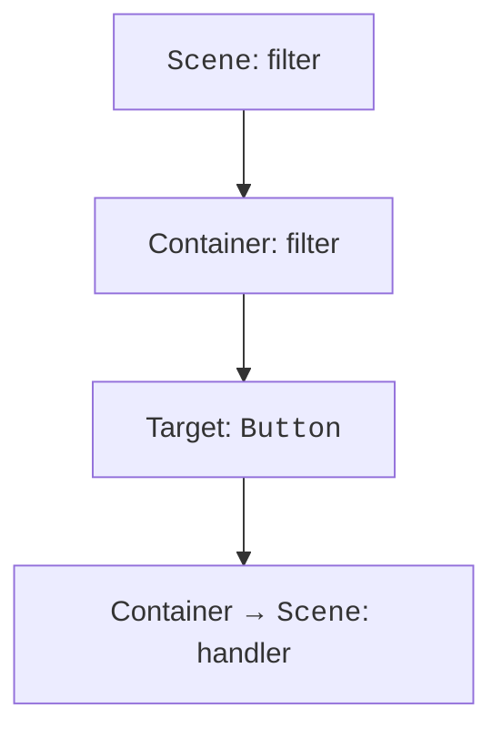

# Events and the UI thread

## Event propagation and the UI thread

An event's path goes from the scene down to the target node (**capturing**, filters) and then back up (**bubbling**, handlers). `addEventFilter` is suitable for preliminary control, and `addEventHandler` for reacting. `consume` stops further propagation; use it only when there is a specific need, so as not to accidentally break keyboard navigation.



Figure 15.6. A filter sees the event before the target's handler {.caption}

The JavaFX Application Thread handles events, layout, and scene updates. A long loop, Thread.sleep, or a JDBC query in setOnAction freezes the window. Computation or I/O is performed in a background Task; changes to live controls are brought back to the FX thread. Platform.runLater queues a short action, but by itself it does not move heavy work to the background.

## Example 3. A simple graphics editor

A Canvas stores painted pixels; an individual stroke is not a node of the Scene Graph. To restore the drawing reliably after the canvas is resized, you need your own model of strokes. Here the size is fixed, and a ColorPicker and a Slider set the pen parameters.

```java
package demo;

import javafx.application.Application;
import javafx.geometry.Insets;
import javafx.scene.Scene;
import javafx.scene.canvas.Canvas;
import javafx.scene.control.*;
import javafx.scene.layout.VBox;
import javafx.scene.layout.HBox;
import javafx.scene.paint.Color;
import javafx.stage.Stage;

public final class PaintMain extends Application {
    @Override
    public void start(Stage stage) {
        Canvas canvas = new Canvas(560, 300);
        canvas.setId("canvas");
        var pen = canvas.getGraphicsContext2D();
        ColorPicker color = new ColorPicker(Color.BLACK);
        Slider width = new Slider(1, 20, 3);
        width.setShowTickLabels(true);
        Button clear = new Button("Clear");
        clear.setId("clear");
        canvas.setOnMousePressed(event -> {
            pen.setStroke(color.getValue());
            pen.setLineWidth(width.getValue());
            pen.beginPath();
            pen.moveTo(event.getX(), event.getY());
        });
        canvas.setOnMouseDragged(event -> {
            pen.lineTo(event.getX(), event.getY());
            pen.stroke();
        });
        clear.setOnAction(event -> pen.clearRect(0, 0,
            canvas.getWidth(), canvas.getHeight()));
        VBox root = new VBox(10,
            new HBox(10, color, width, clear), canvas);
        root.setPadding(new Insets(12));
        stage.setTitle("Canvas");
        stage.setScene(new Scene(root));
        stage.show();
    }

    public static void main(String[] args) { launch(args); }
}
```

Dragging after a press draws a line; clearing removes the pixels but does not change the pen's color and width. An editor with Undo needs a list of commands or strokes, not an attempt to reconstruct the original objects from a finished raster image.

Animation should be defined with Timeline, KeyFrame, or Transition. A Timeline updates properties over time rather than relying on an exact number of frames. AnimationTimer receives the frame time and is suitable for simulations. After the corresponding scene is closed, a long-running animation must be stopped; otherwise it keeps references to objects that are no longer needed.

The LineChart, BarChart, and PieChart charts are meant for data, not arbitrary drawing. CategoryAxis represents categories, and NumberAxis a numeric scale. Label the axes, units, and series; an empty data set should produce an empty chart with an explanation, not a made-up zero measurement. Do not use color as the only way to distinguish series in a printed report.

::: info Screenshot
Run PaintMain, draw two strokes, show picker and slider.
:::

Figure 15.7. A canvas with strokes of different widths {.caption}
