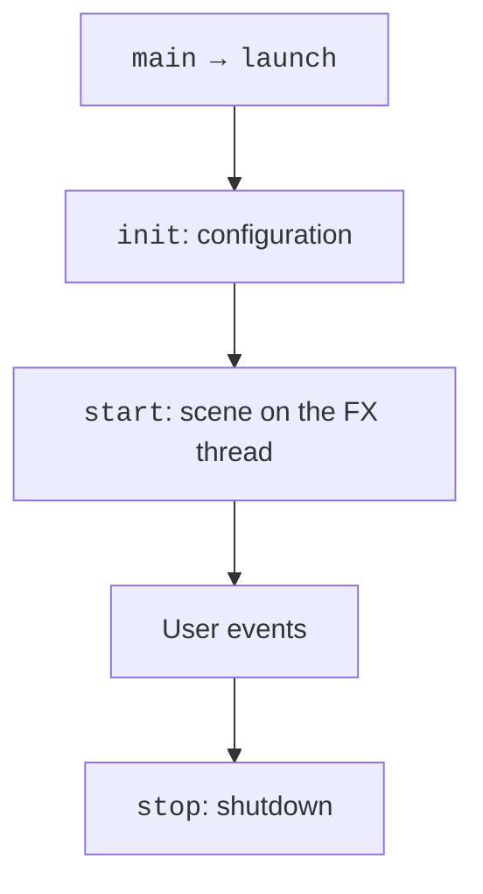
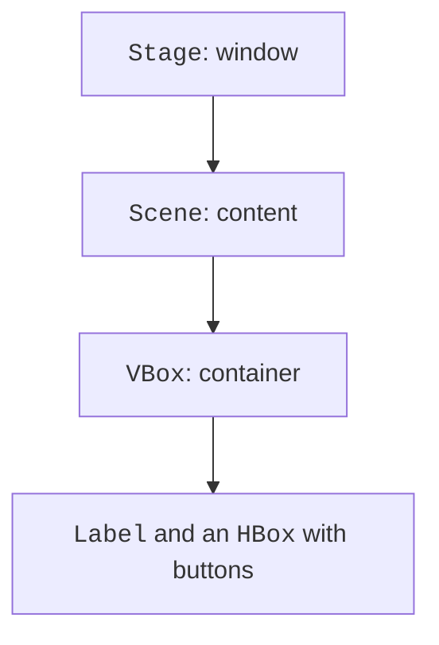

# Your first JavaFX application

## From a console algorithm to a graphical application

A console program usually determines the order of input itself. In a window, the user can click a button several times, change a previous field, or close the form. That is why a GUI is an **event-driven program**: it waits for events and runs short handlers that move the model and the interface into a new state.

JavaFX is a separate library for graphical JVM applications. It is not part of the standard JDK distribution. The OpenJFX project provides modules, native libraries for a specific operating system, and documentation. In this course, we use **JavaFX 27** with **JDK 27**; Maven downloads the required platform artifacts. Documentation: <https://openjfx.io/openjfx-docs/>.

The `Application` class defines the lifecycle. `launch` starts the runtime only once per process. `init` is suitable for preparing configuration but not for creating a Stage or Scene. `start(Stage)` runs on the JavaFX Application Thread and creates the window. `stop` releases resources after the application finishes. You should not call start manually like an ordinary main.



Figure 15.1. The sequence of creating and closing an application {.caption}

A **Stage** is an operating system window, a **Scene** is its content, and a **Node** is a node in the tree of elements. A button, a label, a container, and a Canvas are all nodes. A node has one parent: the same button cannot be placed in two containers at once.

## A reproducible Maven project

Create `src/main/java/demo` and `src/main/resources/demo`. Java classes are stored in the first directory, and FXML and CSS in the second. Maven copies resources to the classpath; an absolute path on your own disk is not a portable way to find them. The complete POM below is suitable for all examples in this topic. To run a different example, change only `mainClass`.

```xml
<project xmlns="http://maven.apache.org/POM/4.0.0"
  xmlns:xsi="http://www.w3.org/2001/XMLSchema-instance"
  xsi:schemaLocation="http://maven.apache.org/POM/4.0.0
    https://maven.apache.org/xsd/maven-4.0.0.xsd">
  <modelVersion>4.0.0</modelVersion>
  <groupId>ua.knu</groupId>
  <artifactId>fx-course</artifactId>
  <version>1.0.0</version>
  <properties>
    <maven.compiler.release>27</maven.compiler.release>
    <project.build.sourceEncoding>UTF-8</project.build.sourceEncoding>
    <javafx.version>27</javafx.version>
  </properties>
  <dependencies>
    <dependency>
      <groupId>org.openjfx</groupId>
      <artifactId>javafx-controls</artifactId>
      <version>${javafx.version}</version>
    </dependency>
    <dependency>
      <groupId>org.openjfx</groupId>
      <artifactId>javafx-fxml</artifactId>
      <version>${javafx.version}</version>
    </dependency>
  </dependencies>
  <build>
    <plugins>
      <plugin>
        <groupId>org.apache.maven.plugins</groupId>
        <artifactId>maven-compiler-plugin</artifactId>
        <version>3.16.0</version>
      </plugin>
      <plugin>
        <groupId>org.openjfx</groupId>
        <artifactId>javafx-maven-plugin</artifactId>
        <version>0.0.8</version>
        <configuration>
          <mainClass>demo.fx/demo.CounterMain</mainClass>
        </configuration>
      </plugin>
    </plugins>
  </build>
</project>
```

The module descriptor `src/main/java/module-info.java` exports the package for launching and opens the FXML controllers to the loader's reflection. `opens` does not replace `exports`: these are different kinds of access, discussed in the previous topic.

```java
module demo.fx {
    requires javafx.controls;
    requires javafx.fxml;
    exports demo;
    opens demo to javafx.fxml;
}
```

```text
mvn -version
mvn clean compile
mvn javafx:run
```

Check the JDK in the first command: the Project SDK setting in the IDE does not always match the terminal's JAVA\_HOME. The error `JavaFX runtime components are missing` means that the launch path did not configure the JavaFX modules. Running through the Maven plugin helps reproduce the correct module path.

::: info Screenshot
Show pom.xml JavaFX 27 and Maven dependency tree.
:::

Figure 15.2. JavaFX 27 among the Maven project's dependencies {.caption}

## Example 1. A click counter

Let's create a self-contained class `demo.CounterMain`. The count variable belongs to the application object, not to a local handler. One button increases the value, and the second returns it to the initial state. The VBox layout arranges the elements vertically automatically.

```java
package demo;

import javafx.application.Application;
import javafx.geometry.Insets;
import javafx.scene.Scene;
import javafx.scene.control.Button;
import javafx.scene.control.Label;
import javafx.scene.layout.HBox;
import javafx.scene.layout.VBox;
import javafx.stage.Stage;

public final class CounterMain extends Application {
    private int count;

    @Override
    public void start(Stage stage) {
        Label value = new Label("0");
        value.setId("value");
        Button add = new Button("Add");
        add.setId("add");
        Button reset = new Button("Reset");
        reset.setId("reset");
        add.setOnAction(event -> {
            count = Math.incrementExact(count);
            value.setText(Integer.toString(count));
        });
        reset.setOnAction(event -> {
            count = 0;
            value.setText("0");
        });
        VBox root = new VBox(12, value, new HBox(8, add, reset));
        root.setPadding(new Insets(16));
        stage.setTitle("Counter");
        stage.setScene(new Scene(root, 320, 160));
        stage.show();
    }

    public static void main(String[] args) { launch(args); }
}
```

After three clicks, the label contains `3`, and after a reset, `0`. The handler receives an ActionEvent but does not need its fields here. The lambda captures the value reference; it is the Label object that changes, not the value of the local variable. This complies with Java's effectively final rule for captured variables.



Figure 15.3. The tree of the first application {.caption}

Most controls respond to semantic events. A button's setOnAction supports both the mouse and the keyboard. setOnMouseClicked is not an equivalent replacement: it binds the action specifically to the mouse. Labels should describe the action, and the focus order should match the input sequence. Do not convey state through color alone.
