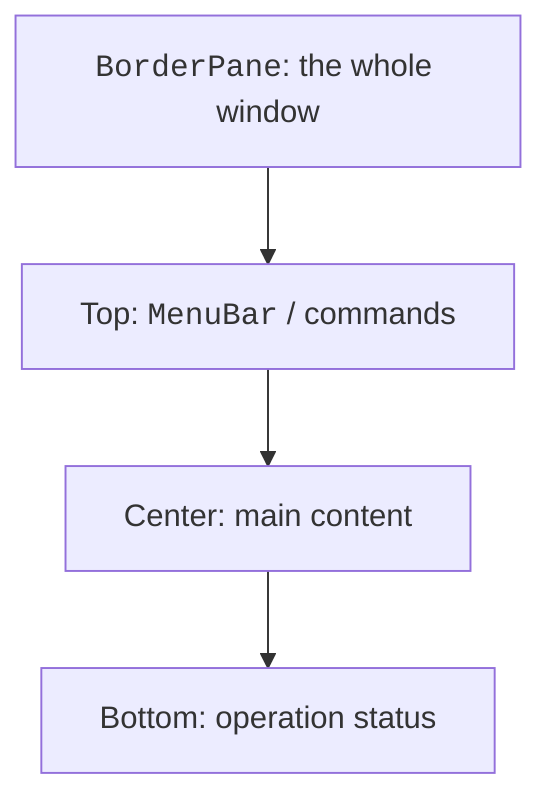
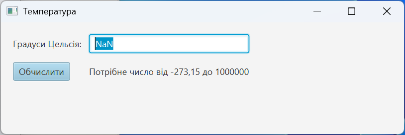

# Layout and controls

## Layout without fixed coordinates

Containers compute the sizes of their children from their minimum, preferred, and maximum sizes. `setPrefWidth` expresses a preference; it does not guarantee a fixed width. It is usually unnecessary to pin every control to layoutX/layoutY: such a form falls apart after a change of font or window size.

| Container | Purpose |
| --- | --- |
| VBox / HBox | A single vertical or horizontal row. |
| BorderPane | A center and four edges; the center gets the remaining space. |
| GridPane | A table of rows and columns for a form. |
| StackPane | Overlapping nodes: background, content, message. |
| FlowPane / TilePane | Wrapping elements when space runs out. |
| AnchorPane | Offsets from the edges; convenient for individual scenes. |

Padding is the container's inner space, spacing is the gap between children, and margin is the outer offset of a particular node. In an HBox, you can let a field stretch with HBox.hgrow; in a GridPane, ColumnConstraints are used for this. A ScrollPane adds scrolling; it does not automatically shrink text to an unreadable size.



Figure 15.4. Typical areas of a window and their responsibilities {.caption}

## Example 2. A temperature converter

We move the computation into a pure method: it can be tested without JavaFX. The field accepts a dot or a comma as the decimal separator. An empty value, NaN, infinity, and a temperature below absolute zero must produce a clear message.

```java
package demo;

import java.util.Locale;
import javafx.application.Application;
import javafx.geometry.Insets;
import javafx.scene.Scene;
import javafx.scene.control.*;
import javafx.scene.layout.GridPane;
import javafx.stage.Stage;

public final class TemperatureMain extends Application {
    public static double fahrenheit(String input) {
        double c = Double.parseDouble(
            input.strip().replace(',', '.'));
        if (!Double.isFinite(c) || c < -273.15 || c > 1_000_000) {
            throw new IllegalArgumentException("Out of range");
        }
        return c * 1.8 + 32;
    }

    @Override
    public void start(Stage stage) {
        TextField input = new TextField();
        input.setId("input");
        input.setPromptText("For example, 20.5");
        Label output = new Label("Enter a temperature");
        output.setId("output");
        Label caption = new Label("Degrees Celsius:");
        caption.setLabelFor(input);
        Button convert = new Button("Calculate");
        convert.setId("convert");
        convert.setDefaultButton(true);
        convert.setOnAction(event -> {
            try {
                double result = fahrenheit(input.getText());
                output.setText(String.format(Locale.ROOT,
                    "%.2f °F", result));
            } catch (IllegalArgumentException error) {
                output.setText(
                    "Enter a number from -273.15 to 1000000");
                input.requestFocus();
            }
        });
        GridPane root = new GridPane();
        root.setHgap(10);
        root.setVgap(12);
        root.setPadding(new Insets(16));
        root.addRow(0, caption, input);
        root.addRow(1, convert, output);
        stage.setTitle("Temperature");
        stage.setScene(new Scene(root, 540, 150));
        stage.show();
    }

    public static void main(String[] args) { launch(args); }
}
```

The reference input `20` gives `68.00 °F`, and `0` gives `32.00 °F`. The string `NaN` is technically parsed by Double.parseDouble, so the finiteness check is a necessary part of the contract. The upper bound is an explicit limitation of the training tool. For exact financial calculations, choose BigDecimal rather than carrying over double from the temperature example.



Figure 15.5. The state of the form after invalid input {.caption}

## Controls, dialogs, and selection

Label shows text, TextField accepts a single line, and TextArea several lines. PasswordField masks characters but does not encrypt them or implement authentication. CheckBox defines an independent flag, and RadioButtons in a ToggleGroup define a mutually exclusive choice. ComboBox combines a list with a selection field; DatePicker returns a LocalDate.

ListView displays a list, TableView displays columns of objects, and TreeView displays a hierarchy. All of them have a selection model. When nothing is selected, selectedItem may be null: a delete handler must account for this. An ObservableList notifies the interface about changes; an ordinary ArrayList provides no such notifications. We will look at properties and tables in detail in the next topic.

Alert is suitable for short messages, TextInputDialog for a single value, and FileChooser for choosing a file. The result of a dialog's showAndWait is an Optional; pressing Escape or the close button does not mean confirmation. FileChooser returns null on cancellation. Do not turn cancellation into an error.
