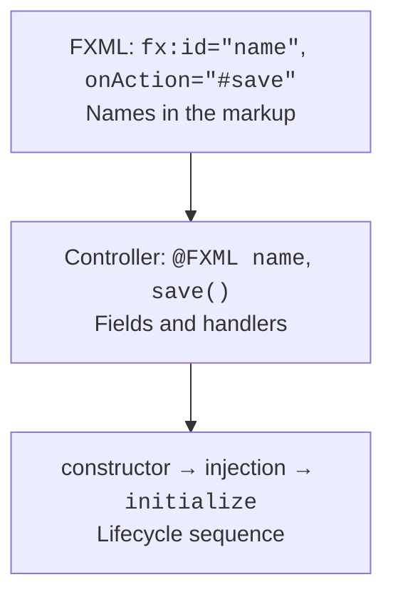
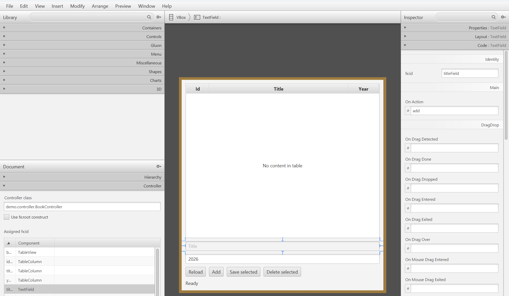
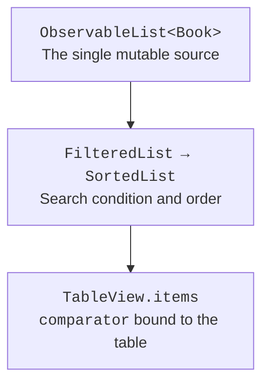
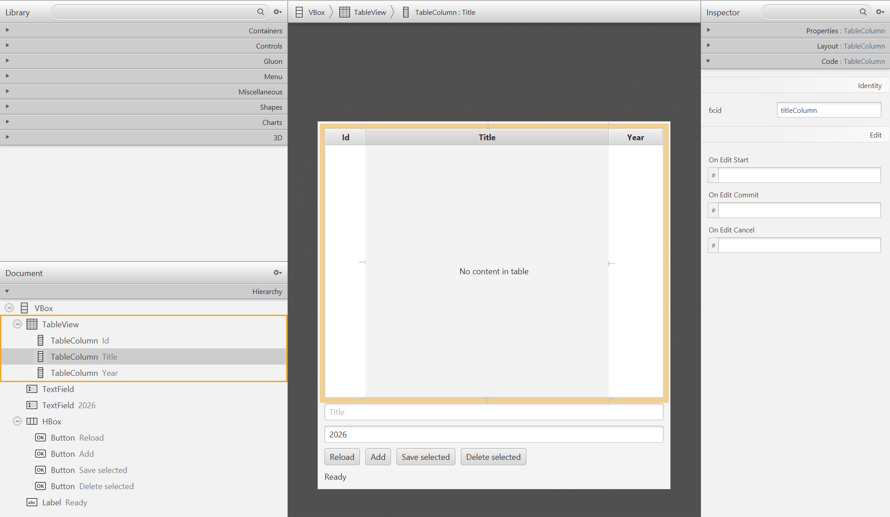
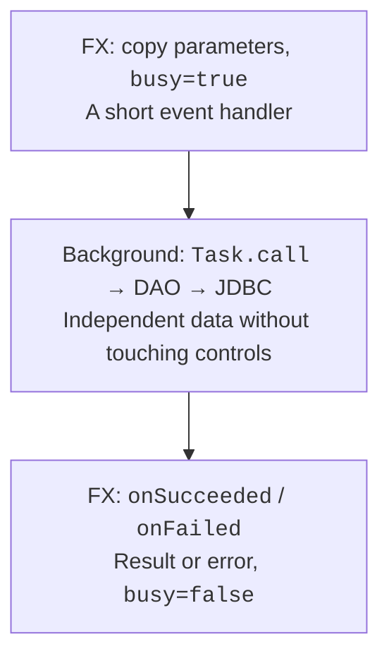

# Controllers, tables, and background tasks

## FXML and creating a controller

FXML describes an object graph and refers to the controller class, field identifiers, and event handlers. FXMLLoader creates the controller, injects the annotated fields, and only then calls initialize. In the constructor, TextField fields may still be null; the constructor receives dependencies rather than configuring controls.



Figure 16.5. The fx:id and handler names must match the controller. {.caption}

The `setControllerFactory` factory lets you pass a service through the controller's constructor. Do not create a controller with new separately from the one the loader uses. `getController` returns the loaded instance after load. The alternative `setController` is used for FXML without fx:controller; assigning both at the same time is an error.

For a second scene, data is passed as an immutable id, a DTO, or a draft through a controller method. A static global "current user" field hides the dependency and makes testing harder. A modal window must have an owner and a defined cancellation result; closing it with the close button does not mean an automatic Save.



Figure 16.6. Identifiers and handlers in Scene Builder {.caption}

## Observable lists and tables

An ObservableList reports structural changes: additions, removals, permutations. A change to a field of an ordinary object is not by itself a change to the list. An extractor in FXCollections lets you observe specific properties of the elements and generate the updates that filters and sorting need.

FilteredList and SortedList are views of a single source. You modify the original ObservableList rather than trying to add elements arbitrarily to the filtered list. The SortedList's comparator is bound to the table's comparatorProperty so that clicking a column header controls the order.



Figure 16.7. One data source, separate views for filtering and ordering. {.caption}

A cell value factory returns an ObservableValue for a cell, and a cell factory creates its visual representation. These are different factories. A lambda that accesses a property directly is checked by the compiler and does not need the reflective PropertyValueFactory. For an immutable record, you can return a read-only wrapper; for a mutable field, it is better to return the actual property.

### Example 3. A table with search

The program stores immutable rows, so data is replaced by replacing an element, not by hidden changes to its fields. Search is case-insensitive; with no filter, all books are visible.

```java
package demo;

import java.util.Locale;
import javafx.application.Application;
import javafx.beans.property.ReadOnlyStringWrapper;
import javafx.collections.FXCollections;
import javafx.collections.transformation.FilteredList;
import javafx.collections.transformation.SortedList;
import javafx.scene.Scene;
import javafx.scene.control.TableColumn;
import javafx.scene.control.TableView;
import javafx.scene.control.TextField;
import javafx.scene.layout.VBox;
import javafx.stage.Stage;

public class TableMain extends Application {
    record Book(String title) {}

    @Override public void start(Stage stage) {
        var source = FXCollections.observableArrayList(
            new Book("Java"), new Book("SQL"), new Book("JavaFX"));
        var filtered = new FilteredList<>(source, book -> true);
        var sorted = new SortedList<>(filtered);
        TableView<Book> table = new TableView<>();
        TableColumn<Book, String> title = new TableColumn<>("Title");
        title.setCellValueFactory(cell ->
            new ReadOnlyStringWrapper(cell.getValue().title()));
        table.getColumns().add(title);
        sorted.comparatorProperty().bind(table.comparatorProperty());
        table.setItems(sorted);
        TextField search = new TextField();
        search.setPromptText("Search title");
        search.textProperty().addListener((value, oldText, text) -> {
            String query = text.strip().toLowerCase(Locale.ROOT);
            filtered.setPredicate(book -> book.title()
                .toLowerCase(Locale.ROOT).contains(query));
        });
        stage.setScene(new Scene(
            new VBox(10, search, table), 400, 300));
        stage.setTitle("Book search");
        stage.show();
    }

    public static void main(String[] args) { launch(args); }
}
```

Initially, Java, SQL, and JavaFX are visible. The query `java` leaves Java and JavaFX; the Title header changes their order. Row selection is a separate state: after filtering, a previously selected row may disappear, so Save/Delete must check the current selection and not use an old index into the source.



Figure 16.8. The structure of a TableView in Scene Builder {.caption}

## A background query and operation state

The JavaFX Application Thread should run short handlers and scene updates. JDBC, reading large files, and waiting on the network are done in the background. Task.call returns independent data; onSucceeded, onFailed, and onCancelled apply the result on the FX thread. Inside call, you do not read a TextField or modify an ObservableList bound to a table.



Figure 16.9. The UI state changes on the FX thread, and JDBC runs in the background. {.caption}

Form values are copied into immutable local variables before the Task starts. The busy state is set immediately so that a double click does not create two requests. Buttons are disabled through a binding and become available again after any final state. A successful commit and a failed reread are different events: the message must not claim that the save was rolled back if the database has already accepted the change.

A Task is single-use. A Service creates a new Task for repeated runs and has its own lifecycle. cancel is a cooperative signal, not a guaranteed JDBC rollback. Once a commit has started, you should not promise the user that canceling "changed nothing." For long queries, use timeouts, Statement.cancel under a well-thought-out contract, and rereading the state after an uncertain result of a network operation.
