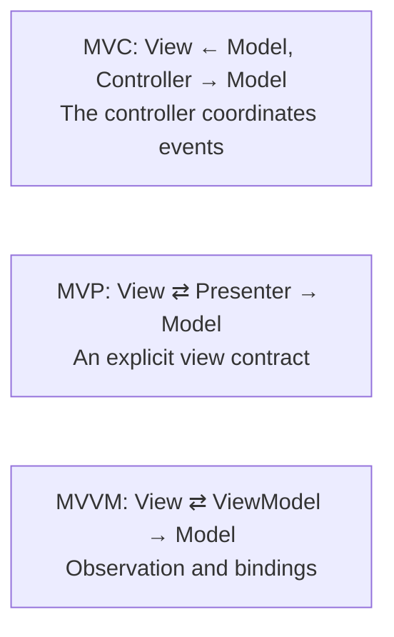
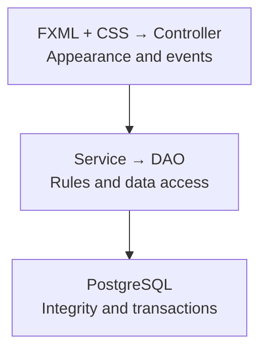

# Architectural patterns and the project

## MVC, MVP, and MVVM

In MVC, the model represents state and rules, the view displays it, and the controller interprets user actions. In MVP, the presenter controls the view through an explicit interface. In MVVM, the viewmodel provides properties and commands that the view works with through bindings. The names describe the direction of dependencies, not magical properties of folders with matching names.



Figure 16.1. Different ways to separate the view from behavior. {.caption}

A JavaFX FXML controller often combines event coordination with part of the view state. This is a practical MVC-like division, but the presence of FXML does not by itself prove a clean architecture. SQL inside onSave remains SQL inside the controller, even if the markup has been moved to a separate file.



Figure 16.2. The direction of dependencies from the view to PostgreSQL. {.caption}

It is convenient to have model, controller, service, and dao packages, plus view and css resources. Domain records can be ordinary records without JavaFX. JavaFX properties are appropriate in a view model that lives on the FX Application Thread. Do not pass a mutable ObservableList from the interface to the DAO: a background query should return an independent List of immutable data.

## Project setup

Use the complete JavaFX 27 Maven project from the previous topic: JDK 27, the javafx.controls and javafx.fxml modules, compiler plugin 3.16.0, and javafx-maven-plugin 0.0.8. Each example below is a separate program in the demo package; the mainClass in the POM is changed to its name. For the PostgreSQL examples, add the dependency:

```xml
<dependency>
  <groupId>org.postgresql</groupId>
  <artifactId>postgresql</artifactId>
  <version>42.7.13</version>
</dependency>
```

The module descriptor `src/main/java/module-info.java`:

```java
module demo.fx {
    requires javafx.controls;
    requires javafx.fxml;
    requires java.sql;
    requires org.postgresql.jdbc;
    exports demo;
    opens demo to javafx.fxml;
}
```

opens gives FXMLLoader reflective access to the annotated fields and methods. exports exposes the package's public API but does not replace opens for private FXML access. If the controllers are moved to demo.controller, it is that package that must be opened. Examples without PostgreSQL do not need that dependency, but they can run in the same complete project.

::: info Screenshot
Show model, controller, service, dao, resources/view, and module-info.java in a real Maven project. Do not show a configuration with a password or a private database URL.
:::

Figure 16.3. Packages and resources of an MVC project {.caption}
