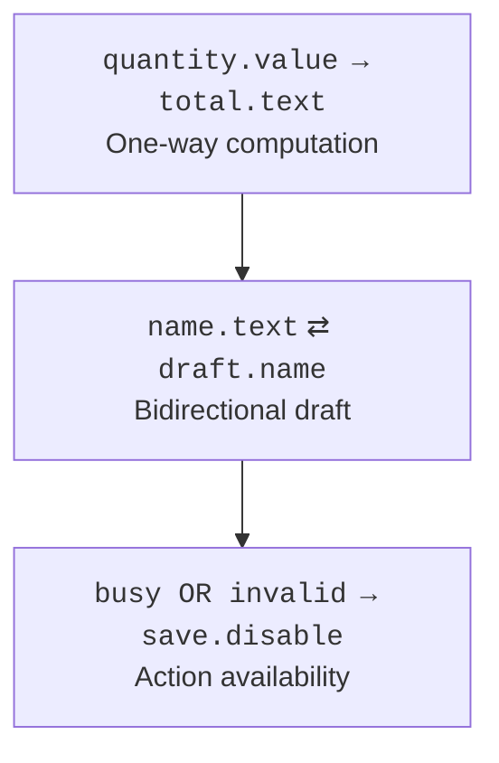

# Properties and bindings

## Properties and observation

A Property combines a value with the ability to observe changes. StringProperty, IntegerProperty, and ObjectProperty have typed operations. The JavaFX Beans convention defines three forms of access: getName, setName, and nameProperty. The last one returns a stable property object rather than creating a new one on every call.

ReadOnlyProperty allows observation without giving the client a setter. For internal modification with external reading, ReadOnlyStringWrapper and similar wrappers are useful. This protects the API, but it does not provide automatic thread safety or deep immutability.

### Example 1. A book model with a listener

This program uses only javafx.base and does not open a window. The listener observes a change of the title; after removeListener, the next rename does not trigger the callback. External code can set an invalid value through the property, so the view model must not be the only boundary of domain validation.

```java
package demo;

import javafx.beans.property.SimpleStringProperty;
import javafx.beans.property.StringProperty;
import javafx.beans.value.ChangeListener;

public class PropertyMain {
    static final class Book {
        private final StringProperty title =
            new SimpleStringProperty(this, "title", "Draft");

        String getTitle() { return title.get(); }
        void setTitle(String value) { title.set(value); }
        StringProperty titleProperty() { return title; }
    }

    public static void main(String[] args) {
        Book book = new Book();
        ChangeListener<String> listener = (value, oldText, newText) ->
            System.out.println(oldText + " -> " + newText);
        book.titleProperty().addListener(listener);
        book.setTitle("Java");
        book.titleProperty().removeListener(listener);
        book.setTitle("Java 27");
        System.out.println(book.getTitle());
    }
}
```

```text
Draft -> Java
Java 27
```

A ChangeListener receives the old and the new value. An InvalidationListener only reports that a computed value has become invalid; a lazy binding may defer recomputation until the value is read. Do not rely on these events occurring the same number of times. A long-lived listener source can keep a closed form in memory; remove the registration when the form's lifecycle ends.

WeakChangeListener weakens the reference to the listener, but the author must keep a strong reference to the original listener as long as it is needed. Otherwise it may disappear earlier than expected. Weak listeners do not replace clear ownership of a form's resources.

## Bindings and form state

`target.bind(source)` defines a one-way dependency. Calling set directly on a bound property is usually rejected; unbind is needed first. `bindBidirectional` allows changes from both sides, but it creates a shared current state, not a draft. This is crucial for a Cancel button: editing must happen in a separate copy that is applied only after Save.



Figure 16.4. Form values determine the total and whether saving is available. {.caption}

Bindings.createStringBinding and createBooleanBinding take a computation and an explicit list of dependencies. If you forget a dependency, the label may not update. `when(...).then(...).otherwise(...)` is convenient for simple conditions; complex domain logic is better moved into an ordinary method and tested without the GUI.

A StringConverter converts between text and a type, but the binding itself does not define a user-friendly policy for a partially entered number. An empty field, a minus sign without digits, and a complete number are different editing states. For complex input, a TextFormatter, a separate draft text, and an explicit message are useful.

### Example 2. A quantity calculator

The price is given in cents, and the quantity is limited by a Spinner. The label and the button's availability depend entirely on properties. A quantity of zero is allowed as an editing state but not as a finished order. Console output appears after the click.

```java
package demo;

import javafx.application.Application;
import javafx.beans.binding.Bindings;
import javafx.scene.Scene;
import javafx.scene.control.Button;
import javafx.scene.control.Label;
import javafx.scene.control.Spinner;
import javafx.scene.layout.VBox;
import javafx.stage.Stage;

public class BindingMain extends Application {
    @Override public void start(Stage stage) {
        Spinner<Integer> quantity = new Spinner<>(0, 100, 2);
        Label total = new Label();
        total.textProperty().bind(Bindings.createStringBinding(
            () -> "Total cents: " + quantity.getValue() * 250L,
            quantity.valueProperty()));
        Button save = new Button("Save");
        save.disableProperty().bind(Bindings.createBooleanBinding(
            () -> quantity.getValue() == 0,
            quantity.valueProperty()));
        save.setOnAction(event ->
            System.out.println(total.getText()));
        stage.setScene(new Scene(new VBox(10, quantity, total, save),
            340, 180));
        stage.setTitle("Order binding");
        stage.show();
    }

    public static void main(String[] args) { launch(args); }
}
```

The initial label is `Total cents: 500`. After setting 0, the Save button is disabled; after 3, the label shows 750. These transitions are checked on the FX Application Thread, not by changing controls from an arbitrary test thread.
