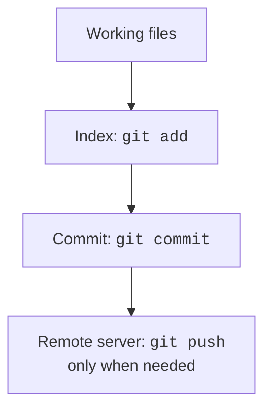

# Building, sharing, and Git

## Building and sharing a program

### The wrapper and Java settings

After creating the project, check `gradle/wrapper/gradle-wrapper.properties`. The distributionUrl line determines the Gradle version. Having a wrapper does not mean Gradle can run on any Java version. For the course, fix the version at Gradle 9.7.0 and use JDK 25 as the build process JVM.

In the current PowerShell terminal, you can set this as follows:

```powershell
$env:JAVA_HOME = 'C:\Java\jdk-25'
.\gradlew.bat --version
```

Changing `$env:JAVA_HOME` in this window does not change permanent Windows settings. After closing the terminal, restore the setting or use the IDE configuration. Save the `--version` report: it helps distinguish an environment problem from an error in your program.

If Gradle cannot find the installed JDK 27, you can specify its path in local `gradle.properties`. That path belongs to one computer and must not be required for other students:

```properties
org.gradle.java.installations.paths=C:/Java/jdk-27
```

The IDE wizard usually creates the wrapper. If you create the project manually, first download Gradle, then run `gradle wrapper --gradle-version 9.7.0` to create the wrapper files. Do not try to run `gradlew` when the file does not yet exist in the directory.

::: info Screenshot
Show Project SDK27 and Gradle JVM25, actual –version output.
:::

Figure 1.7. Separate settings for the Gradle JVM and project JDK {.caption}

### Build output

The main Gradle tasks are `build`, which compiles and runs checks; `run`, which launches the application; and `clean`, which removes this project's generated output. The application plugin's `installDist` task creates a directory containing launch scripts and dependencies.

```powershell
.\gradlew.bat --version
.\gradlew.bat build
.\gradlew.bat installDist
```

A launch script appears in `build/install/hello-kotlin/bin/`, and JAR files appear in `lib/`. Share the entire directory, not just your own JAR. The script requires Java; use JDK 27 and a new working directory when checking it.

The `kotlinc` compiler lets you work without an IDE. For a small single file, you can create a JAR containing the standard library:

```powershell
kotlinc Main.kt -jvm-target 26 -include-runtime -d hello.jar
java -jar hello.jar
```

This is an additional way to check the program, not a replacement for a Gradle project with several libraries. Compare results from the IDE, Gradle, and JAR: the substantive result should match for identical input.

## Git and reproducibility

::: info Screenshot
Show build/install/hello-kotlin bin and lib folders and actual launch from another working directory.
:::

Figure 1.8. The complete distribution and running outside the IDE {.caption}

Before saving the project, check that the distribution contains no personal files or hidden settings. The build command can recreate the output directory; Git history is what restores source code and configuration.

Git stores change history, but it does not automatically back up unsaved files. The working directory, index, and commit are different states. First inspect changes, then add the required files to the index and create a commit.



Figure 1.9. Working files, index, and Git history {.caption}

Install Git from <https://git-scm.com/downloads>. For a teaching repository, you can set the name and address locally without changing the computer's global settings:

```powershell
git init -b main
git config user.name "Student"
git config user.email "student@example.invalid"
git status
git add .
git commit -m "Create Kotlin project"
git log --oneline
```

Before `git add .`, create `.gitignore`:

```text
.gradle/
.kotlin/
build/
.idea/
*.iml
local.properties
```

Do not exclude `gradlew`, `gradlew.bat`, or `gradle/wrapper/`. Check `git diff` and `git diff --staged` before committing. Adding an already tracked file to `.gitignore` does not remove it from history. Do not add passwords, tokens, databases containing real personal data, or tool caches.

::: info Screenshot
Commit tool window and Git Log, three meaningful commits.
:::

Figure 1.10. Reviewing changes and local repository history {.caption}

In IntelliJ IDEA, you can enable Git integration, open *Commit*, and inspect *Git Log*. The `push` command sends commits to a remote server; an ordinary `commit` does not. A local repository is enough to submit the assignment; publishing on GitHub is a separate optional action.
