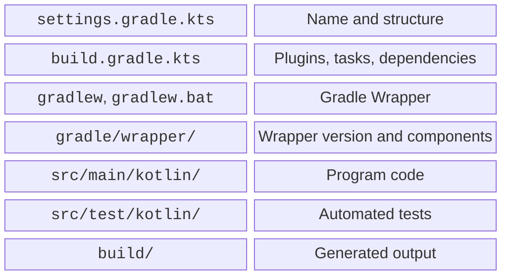

# IntelliJ IDEA and a Gradle project

## IntelliJ IDEA and your first project

IntelliJ IDEA provides an editor, code analysis, execution, a debugger, and Gradle and Git integration. Since 2025.3, the product has had a unified distribution; basic Java/Kotlin features are available free of charge. You do not need a subscription to advanced features for this course. Check current terms at <https://www.jetbrains.com/idea/download/>.

Install the current IntelliJ IDEA using the official installer or Toolbox App. The IDE has its own runtime, but this does not mean the teaching project's JDK is already configured. System requirements and instructions: <https://www.jetbrains.com/help/idea/installation-guide.html>. Leave enough disk space for Gradle caches and dependencies.

Create a project through *New Project → Kotlin*. Select *Build system: Gradle*, *Gradle DSL: Kotlin*, JDK 27 for the project, and a simple path without personal data, such as `C:\Labs\Hello`. Add sample code and wait for synchronization. If the wizard created different plugin versions, compare them with the course configuration.

::: info Screenshot
New Project: Kotlin, Gradle, Kotlin DSL, Project JDK27.
:::

Figure 1.4. New Kotlin project settings {.caption}

Under *Settings → Build, Execution, Deployment → Build Tools → Gradle*, set a compatible JVM 25 for Gradle. The project SDK and Gradle JVM need not be the same. In the *Project* window, open `src/main/kotlin/Main.kt`, and look for execution results in *Run*. *Build* contains build diagnostics; *Terminal* is a regular shell.

Wizard documentation: <https://www.jetbrains.com/help/idea/create-your-first-kotlin-app.html>. Individual option names may change between IDE versions. Focus on the purpose of each setting and record the IDE version in your report. Do not add personal paths to the shared build file.

## Gradle project structure

Gradle automates dependency retrieval, compilation, tests, and distribution creation. The **Gradle Wrapper** fixes the version of Gradle itself for a project. Wrapper files belong in Git; generated `build/` output and the `.gradle/` cache do not.



Figure 1.5. Main files in the teaching project {.caption}

`settings.gradle.kts` defines the project's structure and name:

```kotlin
rootProject.name = "hello-kotlin"
```

`build.gradle.kts` describes plugins, dependencies, and tasks. The `.kts` extension denotes a Kotlin script; this is build configuration, not a regular program file with `main`. The course's initial configuration:

```kotlin
import org.jetbrains.kotlin.gradle.dsl.JvmTarget

plugins {
    kotlin("jvm") version "2.4.20"
    application
}

repositories { mavenCentral() }

kotlin {
    jvmToolchain(27)
    compilerOptions { jvmTarget.set(JvmTarget.JVM_26) }
}

tasks.withType<JavaCompile>().configureEach {
    options.release.set(26)
}

application { mainClass.set("MainKt") }
tasks.named<JavaExec>("run") {
    standardInput = System.`in`
}
```

The toolchain JDK and bytecode version are different concepts. Here the program uses JDK 27, while the bytecode target is explicitly aligned for Java and Kotlin. Do not disable JVM target compatibility validation to hide an error. Programs in this topic do not require APIs available only in Java 27.

`mavenCentral()` is a dependency repository; the first synchronization requires network access. Subsequent runs often use a cache, but a cache on the author's computer does not replace correct dependency declarations. Do not copy arbitrary JAR files from forums into system directories.

In large projects, versions may be moved to `gradle/libs.versions.toml`. A short explicit file is enough for the first assignment. Dependencies and plugins have different roles: the former are needed by the code; the latter change the build process.
