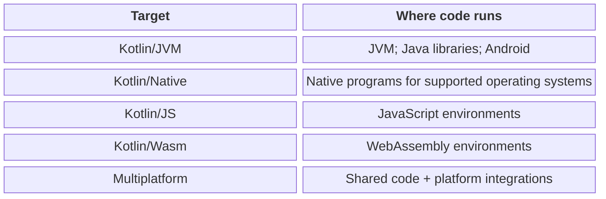
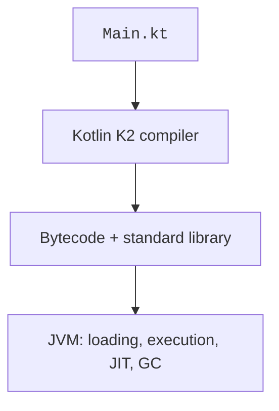

# Kotlin, JVM, and JDK

## Kotlin as a programming language

**Kotlin** is a statically typed language developed by JetBrains. The project was introduced in 2011, and version 1.0 was released in 2016. Static typing means the compiler checks types before execution. Type inference often lets you omit explicit types, but it does not make Kotlin a dynamically typed language.

The course uses Kotlin/JVM: code runs on the Java Virtual Machine and can use Java libraries. Kotlin also supports other targets, but shared syntax does not mean every JVM library works in a browser or on iOS. Official documentation: <https://kotlinlang.org/docs/home.html>.



Figure 1.1. Kotlin platforms and the boundaries of shared code {.caption}

**Kotlin Multiplatform** lets you share part of your code across platforms. A shared module contains abstractions available everywhere, while a platform module contains specific integrations. For example, `java.time` is a JVM API, not a universal API for all Kotlin targets. In the final topics, we will create desktop applications; installing Android Studio is unnecessary for the basic assignments.

The K2 compiler became the default in Kotlin 2.0. The 2.4 family includes language and tooling updates; the exact plugin version must be recorded in the build file. Version 2.4.20 was checked during preparation. Do not substitute an earlier version based only on the “Kotlin” name in an IDE menu: the editor and Gradle use different mechanisms to select components.

## How a program runs on the JVM

The text in `Main.kt` is compiled into bytecode. The class loader locates the required classes, and the JVM verifies and executes them. Frequently executed sections may be JIT-compiled into machine code. Garbage collection reclaims unreachable objects but does not close arbitrary files or transactions on the author's behalf.



Figure 1.2. From a Kotlin file to execution on the JVM {.caption}

A file containing a top-level `main` function compiles to a class whose name is derived from the filename: for `Main.kt`, this is usually `MainKt`. If the package `course` is declared, the full name is `course.MainKt`. This is the name specified for launching through Gradle. Letter case matters even on Windows.

The Kotlin standard library provides `println`, collections, and many extension functions. It must be available at runtime. Therefore, a JAR containing your own classes cannot always be launched by double-clicking: dependencies, an entry point manifest, or launch settings may be missing.

Compilation and execution are separate stages. An incorrect argument type can stop compilation, while division by zero or an invalid number from the console can interrupt an already built program. Before looking for an error, determine the stage at which it occurred.

## JDK, JRE, and choosing a version

The **JDK** contains development tools and a runtime environment. **JRE** means a runtime environment without the complete set of developer tools. For the course, install a JDK rather than looking for a separate old JRE. OpenJDK is an open-source project on which vendors base their distributions.

JDK 27 was released on September 15, 2026. It is not an LTS release; the LTS designation and support period depend on the vendor. JDK 25 is the preceding LTS release in common distributions. The course uses JDK 27 for programs and a compatible JDK 25 for the Gradle build process. These are two independent settings.

::: tip Build process compatibility
At the time of preparation, the current Gradle compatibility table does not list JVM 27 as a supported runtime for Gradle. Do not silently ignore warnings or assume the newest JDK is automatically compatible with every plugin. The supported JVM for the Gradle process and the program's JDK may differ.
:::

Sources to check: <https://jdk.java.net/27/>, <https://docs.gradle.org/current/userguide/compatibility.html>, <https://kotlinlang.org/docs/gradle-configure-project.html>. Record actual versions in your report, not just tool names.

For Windows, download the official OpenJDK 27 x64 archive, verify its checksum, and extract it to a permanent directory. Do not use a temporary downloads folder as the only location for your JDK. Alternatively, use *Download JDK* in IntelliJ IDEA. Do not rename library files inside the distribution.

::: info Screenshot
Run java -version and javac -version using the actual JDK27 path.
:::

Figure 1.3. Checking the installed JDK 27 {.caption}

Checking with an absolute path in PowerShell does not depend on directory order in PATH. Below, `C:\Java\jdk-27` is an example installation location; replace it with your own.

```powershell
& 'C:\Java\jdk-27\bin\java.exe' -version
& 'C:\Java\jdk-27\bin\javac.exe' -version
Get-Command java -All
```

`JAVA_HOME` must point to the JDK root, not to `bin`. If several Java installations exist, `java -version` may show a different version than expected. Compare the absolute path, IDE settings, and the JVM reported by `gradlew --version`.

On Linux and macOS, command names are similar, but the PATH separator and installation procedure differ. Do not overwrite the system Java just for one project. Use a separately installed JDK and tool settings specific to that project.
