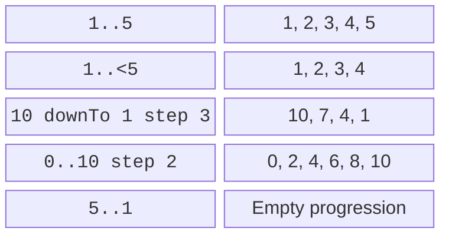
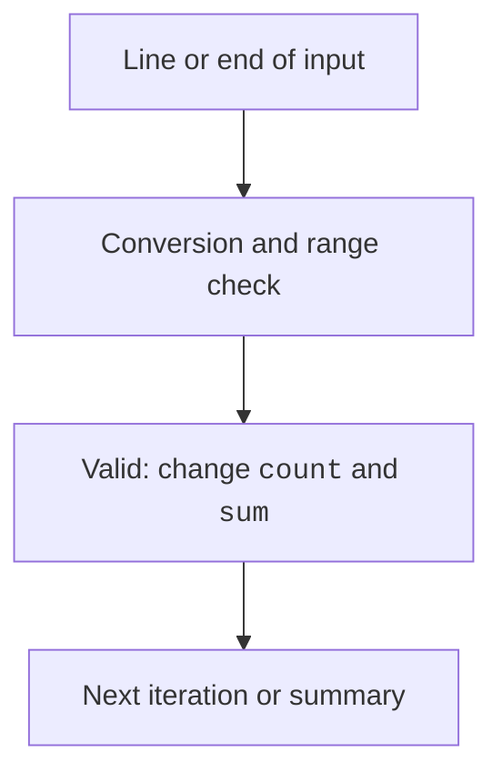

# Ranges and loops

## Ranges and the for loop

`1..5` includes both bounds; `1..<5` excludes the right bound. Use `downTo` for descending order and `step` to specify a positive step. The step must not be zero or negative.



Figure 2.5. Progression bounds and direction {.caption}

```kotlin
fun main() {
    var total = 0
    for (i in 1..5) total += i
    println("Sum: $total")
    for (i in 10 downTo 1 step 3) print("$i ")
    println()
    for (i in 0..<3) print("$i ")
    println()
}
```

Output: `Sum: 15`, then `10 7 4 1`, then `0 1 2`. An empty ascending range such as `5..1` does not automatically mean descending order. An indexed loop often uses an exclusive upper bound to avoid accessing beyond the last element.

In this topic, you do not need to store every entered number in an array to find a sum or count. An accumulator is enough. This reduces the number of states to explain and works for a data stream.

## while, do-while, and loop termination

`while` checks the condition first, so its body may never execute. `do-while` executes the body first, so it performs at least one iteration. `break` exits the loop; `continue` moves to the next iteration. `return` exits the function.



Figure 2.6. Reading, validation, and accumulation {.caption}

```kotlin
fun main() {
    var sum = 0L
    var count = 0
    while (true) {
        val text = readlnOrNull() ?: break
        if (text == "stop") break
        val value = text.toIntOrNull()
        if (value == null || value !in -1000..1000) {
            println("Invalid line skipped")
            continue
        }
        if (count == 1000) {
            println("Data limit")
            break
        }
        sum += value
        count++
    }
    println("n=$count; sum=$sum")
}
```

For the lines `10`, `bad`, `-3`, and `stop`, the result after the skipped-line message is `n=2; sum=7`. An empty stream yields `n=0; sum=0`, a valid counting summary. An average needs a separate message in this case, since division by zero is not the definition of an empty sample's average.

The limit of 1000 records and the bounds on each number let you explain the sum's range. `while (true)` alone does not guarantee infinite execution: here, exit conditions are explicit. Without a state change or exit, a loop can hang and require the user to stop it.

For nested loops, the `outer@` label enables `break@outer`. It is appropriate for stopping a search at its first match, but too many labels make control flow hard to check. `repeat(n)` executes a block `n` times; an explicit `for` is simpler here.
