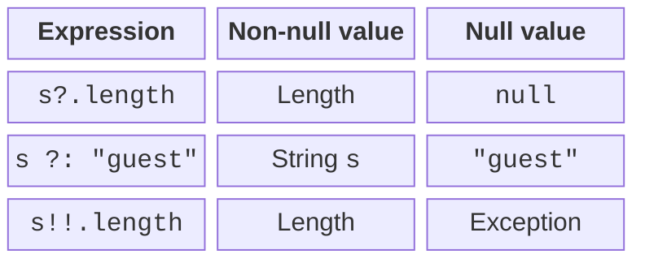
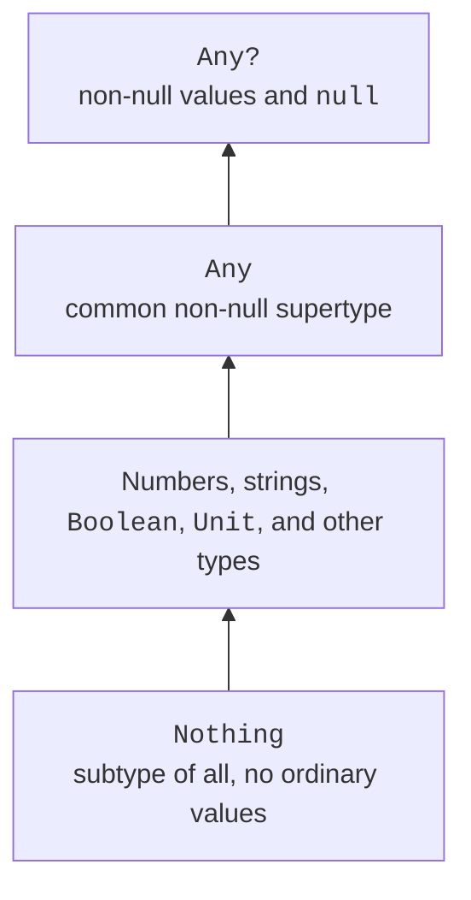

# Null safety and special types

## Nullable types and safe input

The type `String` does not allow `null`; `String?` does. The question mark is part of the static contract. This is why you cannot call `.length` on an arbitrary `String?` without a check or a safe operation.



Figure 2.2. Three ways to handle a nullable value {.caption}

The `?.` operator accesses a member only for a non-null value; otherwise, it returns `null`. The elvis operator `?:` defines the result for `null`. The `!!` operator asserts that a value is not `null` and throws an exception if the author is wrong. It does not repair missing data.

```kotlin
fun main() {
    print("Count 1–100: ")
    val text = readlnOrNull()
    val count = text?.trim()?.toIntOrNull()
    if (count == null || count !in 1..100) {
        println("Invalid count")
        return
    }
    println("Accepted: $count")
    println("Doubled: ${count * 2}")
}
```

For `12`, the output is `Accepted: 12` and `Doubled: 24`. For `abc`, `0`, an empty line, or an ended stream, an error message is printed. After the check, the compiler knows that `count` has a non-null value. This is an example of a *smart cast*.

The right operand of `||` is not evaluated when the left is already true; the right operand of `&&` is not evaluated when the left is false. Short-circuit evaluation allows conditions to be ordered safely. Expressions with side effects inside conditions are harder to understand; a separate check is better for beginners.

`let` is sometimes used after `?.` to execute a block for a non-null value. The block is a lambda, covered in detail in Topic 11. In this topic, an explicit `if` is often simpler and shows every branch more clearly.

## Any, Unit, Nothing, and type checking

`Any` is the common supertype of non-null Kotlin types; `Any?` also allows `null`. `Unit` is the return type of a function with no meaningful result. `Nothing` has no ordinary instances and describes a path that does not return normally, such as an unconditional `throw`.



Figure 2.3. Simplified relationships between Kotlin types {.caption}

An `is` check determines whether a value has the required type. After a successful check of a stable value, the compiler permits operations of that type. `as` throws an exception if a cast fails, while `as?` returns `null`. Casting does not convert a string of digits into a number: that requires numeric parsing.

```kotlin
fun main() {
    val value: Any = "Kotlin"
    if (value is String) {
        println(value.length)
    }
    val number = value as? Int
    println(number ?: -1)
}
```

Output: `6`, followed by `-1`. Choose a default value carefully: if `-1` is a valid result in the problem domain, it cannot also unambiguously mean an error. Sometimes retaining `null` is better.

A smart cast may be impossible for a property whose value can change between checking and reading. In that case, save the result in a local `val` and check that instead. Later, this rule will help with objects and graphical interface state.
