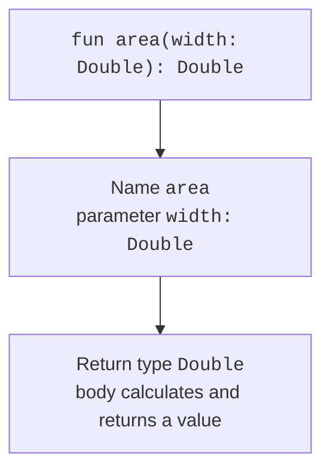

# Function declarations and kinds

## Declaration and calls

After `fun`, write the name, parameters in parentheses, and return type. Each parameter has a name and type. In a block body, use `return` to return a value. An expression body after `=` is convenient for a short calculation; the return type can often be inferred, but an explicit type remains useful for a public contract.

```kotlin
fun rectangleArea(width: Double, height: Double): Double {
    require(width.isFinite() && height.isFinite())
    require(width >= 0.0 && height >= 0.0)
    val area = width * height
    require(area.isFinite())
    return area
}

fun square(value: Int): Long = value.toLong() * value

fun main() {
    println(rectangleArea(3.0, 4.0))
    println(square(50_000))
}
```

```text
12.0
2500000000
```



Figure 3.1. A function signature describes its input and result. {.caption}

In `square`, conversion to `Long` happens before multiplication. If you first calculate `value * value` as `Int` and then convert the result, overflow has already occurred. A function's return type does not automatically change the type of all intermediate operations.

Parameters cannot be reassigned inside a function. If you need a mutable intermediate value, declare a local `var`. Passing an object means passing a reference value: the function cannot replace the caller's variable, but it can modify an accessible mutable object. Strings do not allow such content changes because `String` is immutable.

## Unit, Nothing, and preconditions

A function that performs an action without a useful result has type `Unit`. For a block body, it can be omitted. For example, `fun greet(name: String) { println(name) }` returns `Unit`; printing to the console is not returning a string to the caller.

The `Nothing` type describes a function that does not complete with a normal return. A typical example is `error("message")`, which throws an exception. Thus, the expression `value ?: error("missing")` can have a non-null type: the error branch does not produce an alternative value. Full exception handling is covered in the next topic.

`require(condition)` specifies an argument precondition. If it is violated, an `IllegalArgumentException` occurs. At this stage, it is enough to understand that this is an explicit contract failure, rather than an accidental error inside a formula. In a console program, you can first check invalid text with `toIntOrNull` or `toDoubleOrNull`, and check domain bounds before calling the calculation.

A contract includes more than types. `Double` can contain NaN, infinity, and negative numbers, but a rectangle's width has a narrower set of valid values. A function comment or description should state its units, bounds, rounding rule, and possible failure.

## Top-level and local functions

A function can be declared directly in a file without a class. This is normal Kotlin style for independent operations. Declaration order in a file does not require placing a helper function above its use. Packages and imports determine visibility between files; they will be covered in detail along with classes.

A local function is declared inside another function. It does not clutter the outer namespace and can read local values of the enclosing function. This is appropriate for a small helper operation that does not need to be used separately.

```kotlin
fun borderText(text: String): String {
    fun clean(value: String): String = value.trim()
    val normalized = clean(text)
    return "[$normalized]"
}

fun main() {
    println(borderText("  Kotlin  "))
}
```

A local function should not hide a complex, independent algorithm just because it is currently called only once. If separate testing or reuse is needed, a top-level function with explicit parameters is often more convenient. Also avoid using a global variable instead of an argument: hidden input makes the result depend on call order.
