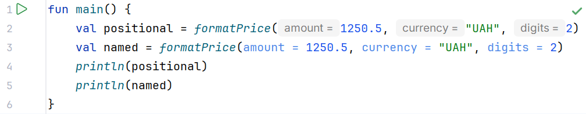

# Parameters and arguments

## Default parameters and named arguments

A default value is supplied when the corresponding argument is absent from the call. It is part of the API. Changing a default percentage or mode can change the behavior of existing calls, even if the signature still compiles.

A named argument has the form `discount = 0.1`. It explains the value without requiring you to remember the order of several parameters of the same type, and lets you skip a parameter with a default value. After reordering arguments, use names consistently to avoid ambiguous reading.

### Example 1. Discounted price

```kotlin
import java.util.Locale

fun discountedPrice(amount: Double, discount: Double = 0.0): Double {
    require(amount.isFinite() && amount >= 0.0)
    require(discount.isFinite() && discount in 0.0..1.0)
    return amount * (1.0 - discount)
}

fun formatPrice(
    amount: Double,
    currency: String = "UAH",
    digits: Int = 2
): String {
    require(amount.isFinite())
    require(currency in setOf("UAH", "EUR", "USD"))
    require(digits in 0..4)
    return String.format(
        Locale.ROOT, "%.${digits}f %s", amount, currency
    )
}

fun main() {
    println(formatPrice(discountedPrice(1250.5)))
    val sale = discountedPrice(amount = 1000.0, discount = 0.15)
    println(formatPrice(sale, digits = 0))
    println(formatPrice(amount = 12.5, currency = "EUR", digits = 1))
    check(discountedPrice(10.0, discount = 1.0) == 0.0)
}
```

```text
1250.50 UAH
850 UAH
12.5 EUR
```

For financial accounting, binary `Double` is not a universal representation of money. Here, it demonstrates functions and formatting. In later tasks, exact amounts can be stored as integer kopiykas or represented with `BigDecimal` and explicit rounding. Formatting with two digits changes only the text, not the precision of the internal value.



Figure 3.2. Parameter names make a call with several arguments clear. {.caption}

Positional and named arguments can be combined according to the language rules, but reordered arguments must be named. Do not pass the same parameter twice. A parameter name becomes important for source compatibility: renaming it can break named calls even without changing types.

Default parameters often replace a set of overloads with different argument counts. For Java callers, the `@JvmOverloads` annotation can generate corresponding overloads, but it does not need to be added to every teaching function. Named arguments for ordinary Java methods are not supported in the same way as for Kotlin functions: a Java API may not retain reliable parameter names.

## Vararg and array spreading

`vararg` lets you pass a variable number of arguments of one type. Inside the function, they are available as an array. For `vararg Int`, this is a specialized `IntArray`. A function can have only one vararg parameter; if other parameters follow it, they are usually passed by name.

The spread operator `*array` passes the elements of an existing array as separate arguments. The array itself and its elements are different levels of data, so without the asterisk, the argument type may not match. Arrays are covered in detail in Topic 10; here, the `intArrayOf` constructor and traversal with `for` are sufficient.

### Example 2. Number statistics

```kotlin
fun describe(vararg values: Int, label: String = "numbers"): String {
    if (values.isEmpty()) return "$label: empty"
    var minimum = values[0]
    var maximum = values[0]
    var sum = 0L
    for (value in values) {
        if (value < minimum) minimum = value
        if (value > maximum) maximum = value
        sum += value.toLong()
    }
    val mean = sum.toDouble() / values.size
    return "$label: min=$minimum max=$maximum mean=$mean"
}

fun main() {
    println(describe(2, 4, 6))
    val measurements = intArrayOf(-5, 0, 5)
    println(describe(*measurements, label = "sample"))
    println(describe(label = "missing"))
    println(describe(Int.MAX_VALUE, Int.MAX_VALUE))
}
```

```text
numbers: min=2 max=6 mean=4.0
sample: min=-5 max=5 mean=0.0
missing: empty
numbers: min=2147483647 max=2147483647 mean=2.147483647E9
```

An empty set is checked before accessing the first element or dividing. The sum uses `Long`; for a valid `IntArray` size, the sum of `Int` values fits in this range. Converting the sum to `Double` may lose precision for large integers, so the mean's text is not an exact rational number.

Vararg is convenient for a small set of arguments, but it is not always the best interface for large data processing operations. Spreading may create an array copy, and repeated calls may cause unnecessary memory allocations. A function that naturally works with an existing array can accept it without vararg.
