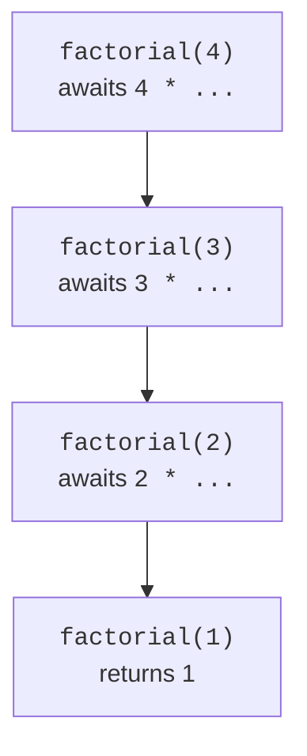
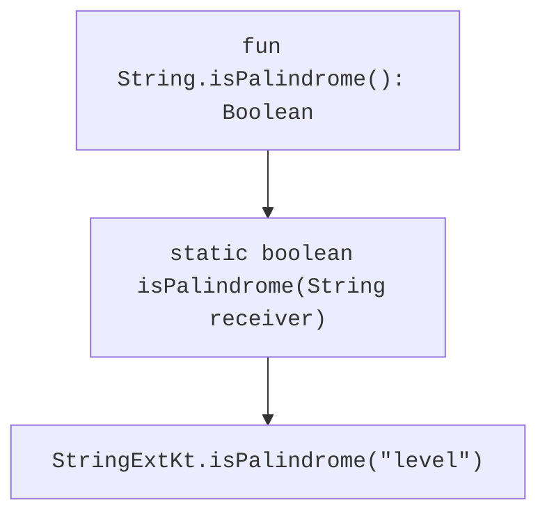

# Recursion, infix functions, and extensions

## Recursion and the call stack

A recursive function calls itself for a simpler subproblem. It must have a base case and a step that moves toward it. For factorial, the base case is zero or one, and the recursive step decreases the argument by one. A precondition rejects negative input.

```kotlin
fun factorial(number: Int): Long {
    require(number in 0..20)
    if (number <= 1) return 1L
    return number * factorial(number - 1)
}

tailrec fun gcd(a: Long, b: Long): Long {
    require(a >= 0 && b >= 0)
    return if (b == 0L) a else gcd(b, a % b)
}

fun main() {
    println(factorial(4))
    println(factorial(0))
    println(gcd(48, 18))
}
```

```text
24
1
6
```



Figure 3.3. Each ordinary recursive call waits for the subproblem's result. {.caption}

Factorial must multiply after the recursive call returns, so it is not tail-recursive in this form. `gcd` immediately returns the next call's result; `tailrec` lets the compiler convert such a tail call into a loop. If the optimization conditions are not met, the compiler reports this.

Ordinary deep recursion consumes stack space and can cause `StackOverflowError`. Tailrec does not fix an incorrect base case or prevent numeric overflow. The factorial limit of 20 is determined by the range of `Long`, not just stack capacity. A demonstration check with 21 should fail rather than produce an incorrect number.

## Infix functions

A member or extension function with one parameter can be marked `infix` and called without a dot or parentheses. The parameter cannot be vararg or have a default value. Infix syntax is appropriate for a short domain operation that reads naturally between two values.

```kotlin
infix fun String.withSuffix(suffix: String): String = this + suffix

fun main() {
    println("file" withSuffix ".txt")
    println("file".withSuffix(".txt"))
}
```

Both calls are equivalent. Do not guess the precedence of an infix call based on familiarity with arithmetic operators. In a complex expression, parentheses make the intent explicit. Do not make every function infix merely to shorten the syntax.

## Extension functions

An extension is written as `fun String.name(...)`. The type before the dot is the **receiver** type, and `this` in the body is the receiver's value. The call looks like a method call, but an extension does not change the `String` class, add fields to its objects, or gain access to private implementation details.



Figure 3.4. The JVM representation of an extension passes the receiver as a static method argument. {.caption}

An extension is selected statically based on the receiver's declared type. It is not a virtual overriding mechanism. If a real class method with a matching signature is available, it takes precedence over the extension. A detailed comparison with actual polymorphism will appear in the inheritance topic.

An extension can be declared for a nullable receiver: `fun String?.orLabel(): String = this ?: "missing"`. Its body checks `this` before accessing non-null members. Calling it with a dot on null is valid here because null is part of the receiver's declared contract.

### Example 3. Palindromes and word counts

The sample palindrome ignores whitespace and case but preserves punctuation. The check works with `Char` in strings of ordinary letters; full Unicode grapheme analysis requires a different contract. The word count is defined by transitions from whitespace to non-whitespace.

```kotlin
fun String.isPalindrome(): Boolean {
    val cleaned = StringBuilder()
    for (character in this) {
        if (!character.isWhitespace()) {
            cleaned.append(character.lowercaseChar())
        }
    }
    var left = 0
    var right = cleaned.length - 1
    while (left < right) {
        if (cleaned[left] != cleaned[right]) return false
        left++
        right--
    }
    return true
}

val String.wordCount: Int
    get() {
        var count = 0
        var inside = false
        for (character in this) {
            if (character.isWhitespace()) {
                inside = false
            } else if (!inside) {
                count++
                inside = true
            }
        }
        return count
    }

fun String?.orLabel(): String = this ?: "missing"

fun main() {
    println("Never odd or even".isPalindrome())
    println("Kotlin".isPalindrome())
    println("  Ada\tLovelace  ".wordCount)
    println("".isPalindrome())
    println((null as String?).orLabel())
}
```

```text
true
false
2
true
missing
```

An extension property has a getter but no backing field of its own. Thus, `wordCount` is recalculated on every read. If an operation is expensive, a function may signal the work to clients better than a property. Under this contract, an empty string is a palindrome because there are no differing symmetric pairs.

::: info Screenshot
IntelliJ IDEA: type "level".; show isPalindrome completion from the current file.
:::

Figure 3.5. A custom extension is available through ordinary code completion. {.caption}

Place extension functions in a clearly named file and package. In another package, import them like top-level functions. From Java, call an extension as a static function with the receiver as its first argument. The facade class name is normally derived from the Kotlin filename, such as `StringExtKt`.

::: info Screenshot
IntelliJ IDEA Tools &gt; Kotlin &gt; Show Kotlin Bytecode &gt; Decompile; show isPalindrome(String) static method.
:::

Figure 3.6. Decompilation shows a static method with a receiver. {.caption}
