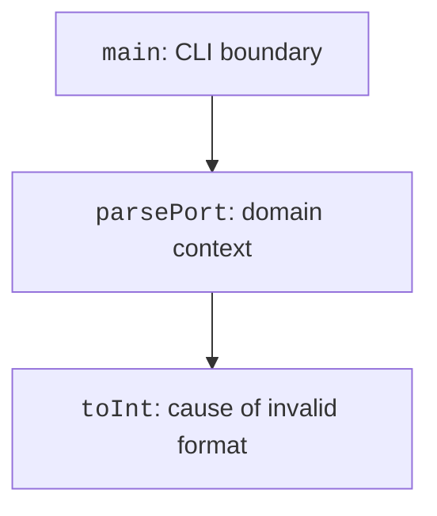

# Stack traces and the debugger

## Stack traces and causes

### Checking resource closing after an exception

You can check resource closing without accessing a real file. The teaching resource changes a flag in `close`, and we deliberately cause an error inside `use`.

```kotlin
class Probe : AutoCloseable {
    var closed: Boolean = false
        private set

    override fun close() {
        closed = true
    }
}

fun main() {
    val probe = Probe()
    try {
        probe.use {
            check(!it.closed)
            throw IllegalArgumentException("Sample failure")
        }
    } catch (error: IllegalArgumentException) {
        println(error.message)
    }
    println("Closed: ${probe.closed}")
    check(probe.closed)
}
```

The result is `Sample failure`, followed by `Closed: true`. The setter is closed to external assignment so that the check observes the actual call to `close`. The property model will be covered in detail in Topic 5.

This test checks behavior: the resource is closed after an error. Checking only that the word `use` appears in the source is insufficient. Another resource mistakenly created outside the block could still remain open.

When designing error handling, create a table of independent scenarios. Each row should check the visible result and state rather than an internal line number.

| **Scenario** | **Expectation** |
| --- | --- |
| Operation succeeds | Value obtained, resource closed |
| Parsing error | Error propagated, resource closed |
| Failed precondition | Domain model state unchanged |
| Missing result | Explicit null or documented Result |
| Logic error | Formula test detects the difference |

The call stack shows which functions led to the error location. Start with the type and message, find the first line of your own code, and then inspect callers. If there is a `Caused by`, do not stop at the outer wrapper.



Figure 4.6. Calls and exception propagation back to main {.caption}

Do not rely on an exact line number from someone else's screenshot: it changes after editing. The function name and operation matter. When passing an error onward, add context, but do not insert passwords or the full contents of a private document into the message.

::: info Screenshot
Run deliberate text.toInt failure; show type and clickable own source line.
:::

Figure 4.7. Stack trace of a string conversion error {.caption}

For the demonstration, create a separate file with a call to `parsePort("abc")` without a handler. Save the trace, explain `cause`, and then restore error handling. A deliberately crashing scenario is not the normal way to end a CLI program.

## The IntelliJ IDEA debugger

A breakpoint pauses the program before the marked line executes. The *Variables* window shows current values, *Frames* shows the stack, and *Watches* shows expressions to observe. Available local variables depend on the selected frame.

*Step Over* executes a line without entering the called function, *Step Into* enters it, and *Step Out* completes the current call. *Resume* continues to the next stop. For complex libraries, start with your own code so you do not get lost in internal JVM calls.

::: info Screenshot
Pause corrected average before return; show sum,count,Frames and step controls.
:::

Figure 4.8. Local variables and call frames {.caption}

A conditional breakpoint triggers only when a specified expression holds, such as `i == 5`. A logging breakpoint can print values without pausing execution. The condition expression should be simple and must not change program state.

::: info Screenshot
Breakpoint condition index==2 in loop; show actual condition popup.
:::

Figure 4.9. A condition for stopping at the required iteration {.caption}

An exception breakpoint is useful when `catch` is far away or the error is caught by a library. In *View Breakpoints*, add the required type, such as `NumberFormatException`, and specify whether to stop for caught exceptions, uncaught exceptions, or both.

::: info Screenshot
Java Exception Breakpoints: NumberFormatException, caught/uncaught settings.
:::

Figure 4.10. Breaking at the moment an exception occurs {.caption}
