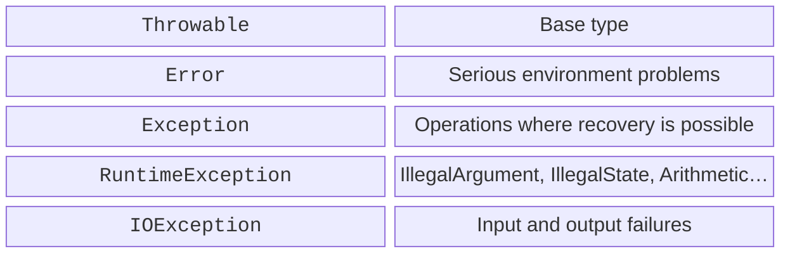
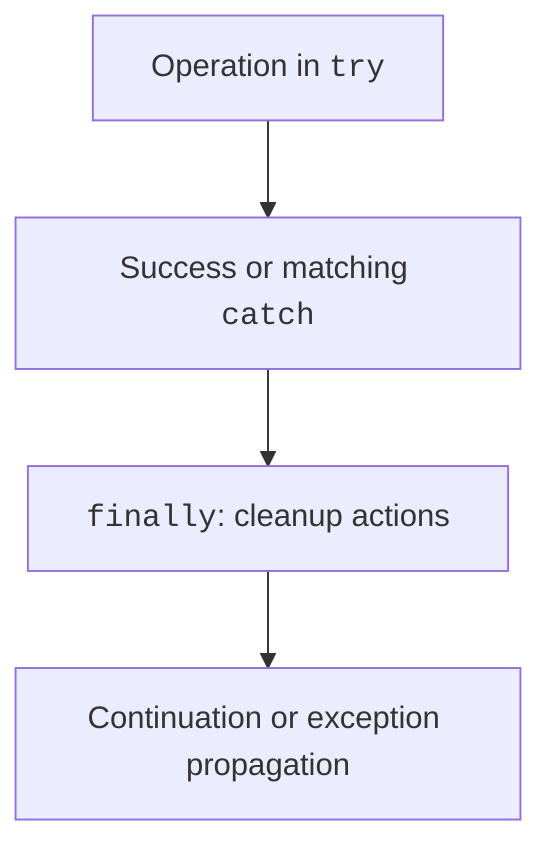

# Exceptions and try–catch

## Errors and their observable behavior

A program may be syntactically correct and still fail to meet its requirements. The compiler finds compilation errors, exceptions occur at runtime, and a logic error may produce an entirely ordinary number. Thus, exception handling does not replace checking formulas.

An **exception** is an object that describes abnormal completion of an operation. After `throw`, normal execution of the current block is interrupted. The runtime looks for a matching handler in the current call and then higher up the stack. If no such handler exists, the unfinished path reaches the program boundary and usually terminates the program.

A user error must not corrupt data state. For example, an invalid transfer amount must be rejected before funds are withdrawn. A “something went wrong” message does not help if the balance is already incorrect afterward. An error contract describes both the message and the state after the error.

Official explanation: <https://kotlinlang.org/docs/exceptions.html>. This topic uses stable Kotlin 2.4 constructs; experimental alternatives to the error model are not prerequisites for completing the lab.

## The Throwable hierarchy on the JVM

The base type is `Throwable`. The `Exception` branch contains errors that applications can often handle, while `Error` contains serious environment or runtime problems, such as insufficient memory. An ordinary input form should not catch all `Throwable` instances and continue as if program state were reliable.



Figure 4.1. Simplified JVM exception hierarchy {.caption}

`NumberFormatException` is a subtype of `IllegalArgumentException`. Therefore, place a narrow handler before a broad one. `ArithmeticException` is used, among other things, for integer division by zero; floating-point division has different semantics and may produce infinity or `NaN`.

Kotlin does not require checked exceptions to be declared in a function signature. This differs from Java, but it does not mean a function cannot throw an exception. `@Throws` is sometimes used for Java callers; the annotation does not turn Kotlin code behavior into automatic checking of every error.

The same failed operation can mean different things at different levels. In a parsing function, it is a “nonnumeric string”; in a form, an “invalid quantity field”; in a CLI, a nonzero exit code. Transforming an error should add context, not destroy its original cause.

## try, catch, and finally

`try` surrounds an operation expected to throw an exception. `catch` specifies the type that can be handled at that location. `finally` performs cleanup during normal exit or stack unwinding. It is not a guarantee against a process crash or power loss.



Figure 4.2. Handler selection and cleanup actions {.caption}

Do not place all of `main` inside one large `try` if you only need to handle one expected failure. A narrow boundary makes it clear which operation caused the message. An empty `catch` hides the cause and makes subsequent results unreliable.

### Example 1. Safe integer division

```kotlin
fun main() {
    try {
        print("Dividend: ")
        val a = readlnOrNull()?.toInt()
            ?: throw IllegalArgumentException("Missing dividend")
        print("Divisor: ")
        val b = readlnOrNull()?.toInt()
            ?: throw IllegalArgumentException("Missing divisor")
        require(a in -1000000..1000000)
        require(b in -1000000..1000000)
        println("Quotient: ${a / b}")
        println("Remainder: ${a % b}")
    } catch (error: NumberFormatException) {
        println("An integer is required")
    } catch (error: ArithmeticException) {
        println("Division by zero")
    } catch (error: IllegalArgumentException) {
        println("Invalid input: ${error.message}")
    } finally {
        println("Attempt completed")
    }
}
```

For 17 and 5, the result is quotient 3, remainder 2, followed by `Attempt completed`. For 17 and 0, there is no quotient message: control passes to the matching `catch` and then to `finally`. For the string `abc`, the number format handler runs.

The imposed numeric bounds also eliminate the special overflow case `Int.MIN_VALUE / -1`. Do not expect all integer arithmetic overflow to automatically throw an exception. Topic 2 already showed how a product can silently go out of range.


Figure 4.3. Control passing to the division-by-zero handler {.caption}
