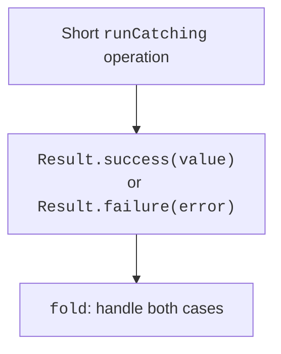

# Result and resources

## Choosing between null, exceptions, and Result

`null` suits the expected absence of a value, such as a search with no result. An exception suits a contract violation or an operation failure. `Result<T>` lets you pass success or failure as a value that the caller handles explicitly.



Figure 4.4. Success and failure as a Result value {.caption}

`runCatching` executes a block and converts its result or a caught `Throwable` into a `Result`. This is a broad mechanism. Do not use it carelessly around an entire program or coroutines: coroutine cancellation must also propagate. Topic 13 will cover this rule for `CancellationException`.

`getOrNull` hides an error's cause behind `null`. `getOrElse` lets you produce an alternative, and `fold` lets you handle both outcomes. `onSuccess` and `onFailure` are convenient for observation, but do not automatically turn failure into success.

### Example 3. Parsing coordinates

The string must contain exactly two decimal coordinates separated by a comma, each from −1000 to 1000. The decimal separator is a period. We return `Pair<Double, Double>`; a pair stores two related quantities without introducing a custom class.

```kotlin
fun coordinates(text: String): Result<Pair<Double, Double>> {
    return runCatching {
        require(text.length <= 100) { "String too long" }
        val parts = text.split(',')
        require(parts.size == 2) { "x,y required" }
        val x = parts[0].trim().toDouble()
        val y = parts[1].trim().toDouble()
        require(x.isFinite() && y.isFinite()) {
            "Coordinates must be finite"
        }
        require(x in -1000.0..1000.0 &&
                y in -1000.0..1000.0) { "Coordinates out of range" }
        x to y
    }
}

fun main() {
    val result = coordinates("3,4")
    val message = result.fold(
        onSuccess = { point ->
            "x=${point.first}; y=${point.second}"
        },
        onFailure = { error -> "Error: ${error.message}" }
    )
    println(message)
    println(coordinates("bad").isFailure)
}
```

The result is `x=3.0; y=4.0`, followed by `true`. The braces after `onSuccess` contain a lambda; its `point` parameter is available inside its body. For now, understanding this local syntax is sufficient; higher-order functions will be studied in detail in Topic 11.

Here, the `runCatching` block is limited to briefly parsing a local string synchronously. In a production API, you can choose an explicit `try/catch` for specific exceptions if other failures must not be converted to data. The result must be handled: an unused `Result` can hide an error just as an empty `catch` can.

## Transforming Result and errors in handlers

`map` changes a successful value, but an exception inside its transformation is not necessarily converted to `Result.failure`. For transformations that may throw, there is `mapCatching`. Likewise, read the contract of each operation instead of assuming the entire chain is automatically protected.

```kotlin
fun main() {
    val source = Result.success("12")
    val parsed = source.mapCatching { it.toInt() }
    println(parsed.getOrElse { -1 })
    val invalid = Result.success("abc")
        .mapCatching { it.toInt() }
    println(invalid.fold(
        onSuccess = { "Number: $it" },
        onFailure = { "Invalid number" }
    ))
}
```

Output: `12`, followed by `Invalid number`. The alternative −1 only demonstrates the method here; if −1 is in the valid domain range, another form of error representation is needed. `getOrThrow` returns the value or rethrows the stored exception: the handling boundary remains explicit.

::: info Screenshot
Inspect parsed and invalid from mapCatching example; no synthetic UI.
:::

Figure 4.5. Successful and failed Result values in the debugger {.caption}

## Resources and use

An open resource needs to be closed whether processing succeeds or fails. For `AutoCloseable` and corresponding Java resources, `use` is convenient. The resource is available in the block, and `close` is called after the block finishes, including when an exception occurs.

```kotlin
import java.io.StringReader

fun main() {
    val text = "10\n20\n30\n"
    val total = StringReader(text).buffered().use { reader ->
        var sum = 0
        while (true) {
            val line = reader.readLine() ?: break
            sum += line.toInt()
        }
        sum
    }
    println("Sum: $total")
}
```

The result is `Sum: 60`. The example uses memory, so it does not depend on an external file being present. For a real file, the same principle closes the reader after success or a parsing error. Paths and formats will be studied in Topic 12.

If both the main block and resource closing throw exceptions, the original failure must not be lost. The `use` mechanism preserves the closing error as *suppressed* alongside the primary one. A handwritten `finally { close() }` requires attention to this case.

Do not return a lazy reading stream from a `use` block if it will be consumed after the resource closes. A computation that needs an open reader must finish inside the block or have some other explicitly defined ownership.
