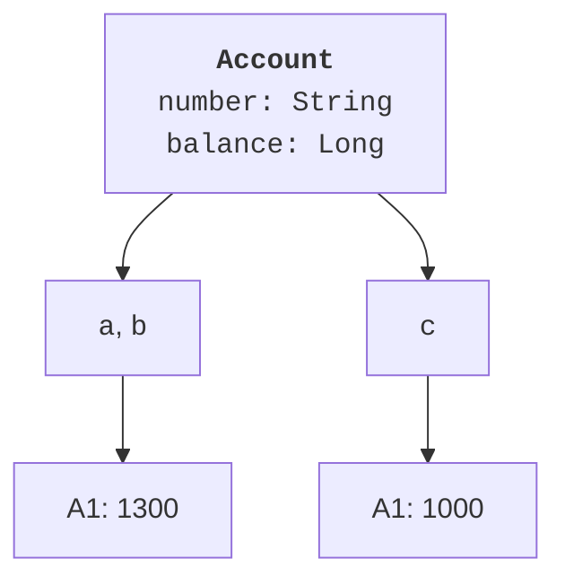
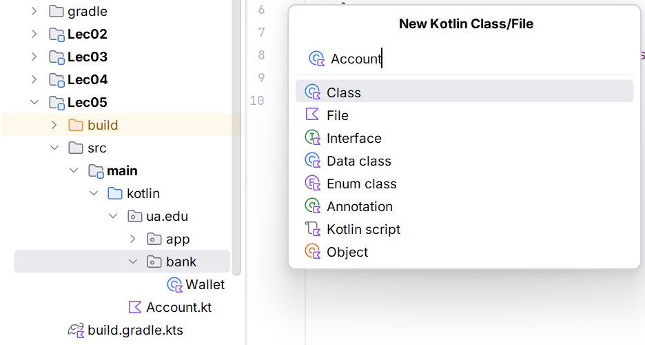
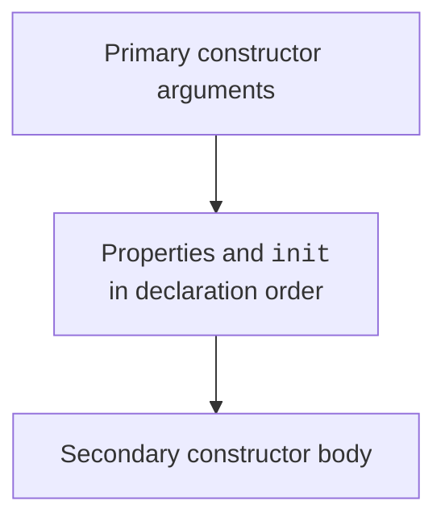

# Classes, constructors, and initialization

## From separate variables to a model

In an account management program, the owner's name, number, and balance share one meaning. If stored in independent variables, you must remember everywhere which values belong together. Ensuring that no one withdraws more money than the account holds is even harder. A class combines state with the actions that change it. Official syntax description: <https://kotlinlang.org/docs/classes.html>.

A **class** describes a type of object, its properties, and available methods. An **object** is a particular instance with its own identity and state. Two accounts may have equal balances yet be different accounts. An **invariant** is a condition that must hold after successful object creation and after each completed public operation. For example, the balance is nonnegative and the number is not empty.

A class should not be responsible for everything: the account validates the amount, while the console interface requests text and displays messages. This separation lets you test the model without a keyboard and later use it in a graphical application. Method names describe domain actions: `deposit`, `withdraw`, `rename`. A method named `setEverything` hides meaning and complicates validation.

Creation looks like `Account("A1", 1000)`: there is no `new` keyword. The variable contains an object reference. Assigning `val b = a` does not copy the object, so a change through `b` is also visible through `a`. `val` prohibits reassigning the variable itself but does not make the object immutable. Immutability depends on its interface.



Figure 5.1. A class, independent objects, and a shared reference {.caption}

The `===` operation checks reference identity. `==` performs a null-safe equality check. For an ordinary class without its own `equals`, inherited equality corresponds to identity. Data classes in Topic 7 will have a different, meaningful contract. Do not check the identity of numbers and strings to determine value equality: JVM representation details are unnecessary here.

## Primary constructors and properties

The primary constructor is written in the header. A parameter with `val` also declares a read-only property; one with `var` declares a read/write property. A parameter without these keywords is an input value for initialization, not a public property. If the initial value needs transformation or restricted access, declare the property separately in the class body.

A constructor must ensure a valid initial state. Use `require` to check an argument; it throws `IllegalArgumentException` on failure. For an invalid action sequence, such as starting an already running device, `check` and `IllegalStateException` are appropriate. The exception explains the cause; the external interface from Topic 4 catches it.

Default parameters provide clear, concise calls. Do not create five secondary constructors merely for different argument counts. A secondary constructor is needed when the input representation is genuinely different or Java integration requires it. Named arguments from Topic 3 help readers understand a call without looking up parameter order.

### Example 1. An account with a protected balance

The model stores sample amounts as integer kopiykas in `Long`. An upper bound of one billion kopiykas keeps the example simple and prevents overflow during permitted operations. The balance is readable but can only be changed through validated methods. This is a local model without banking APIs.

```kotlin
class Account(val number: String, initial: Long = 0) {
    var balance: Long = initial
        private set

    init {
        require(number.isNotBlank()) { "Empty number" }
        require(initial in 0..1_000_000_000L)
    }

    fun deposit(amount: Long) {
        require(amount > 0) { "Amount must be positive" }
        require(amount <= 1_000_000_000L - balance)
        balance += amount
    }

    fun withdraw(amount: Long) {
        require(amount > 0) { "Amount must be positive" }
        require(amount <= balance) { "Insufficient balance" }
        balance -= amount
    }

    override fun toString(): String = "$number: $balance"
}

fun main() {
    val a = Account("A1", 1000)
    val b = a
    val c = Account("A1", 1000)
    b.deposit(500)
    a.withdraw(200)
    println(a)
    println(c)
    println("same=${a === b}; equal=${a == c}")
    try {
        a.withdraw(2000)
    } catch (e: IllegalArgumentException) {
        println("Rejected: ${e.message}")
    }
    println("balance=${a.balance}")
}
```

```text
A1: 1300
A1: 1000
same=true; equal=false
Rejected: Insufficient balance
balance=1300
```

All conditions are checked before assignment, so a failed operation does not leave the object partially changed. External code cannot write `a.balance = -100`. However, `private set` does not prevent mistakes within the class itself: correct method bodies remain our responsibility. The check after failure demonstrates state preservation.

`override fun toString()` defines a short human-readable representation. This is a minimal override of an `Any` method; the detailed mechanism is covered in Topic 6. The representation string is not a storage format and must not contain passwords or other hidden data.



Figure 5.2. Creating a class in IntelliJ IDEA {.caption}

## Initializers and secondary constructors

An `init` block is not a separate method that can be called externally. Its code belongs to object creation. Property initializers and `init` blocks execute in declaration order. Thus, do not read a property declared below while assuming it already has its completed value. The sequence appears in Fig. 5.3. A secondary constructor body runs after delegating to the primary constructor through `this(...)`.



Figure 5.3. Stages of instance creation {.caption}

One logical rule should have one validation location. If both constructors accept a year of study, the secondary constructor passes the converted number to the primary one, and `init` checks the bounds. Do not duplicate the range in two constructors: they may diverge when requirements change. Do not silently convert invalid text to zero when zero is not a real domain value.
