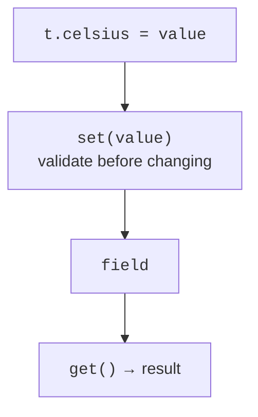

# Properties, accessors, and lateinit

## Properties, accessors, and backing fields

A property is an access interface, not merely a memory cell. It can have a getter `get()` and setter `set(value)`. For an ordinary property, the compiler provides these automatically. A custom setter lets you validate a new value, while a getter can calculate a derived value. Details: <https://kotlinlang.org/docs/properties.html>.

The special name `field` is available inside accessors and denotes the property's backing field. Assigning to the property itself in its setter calls the setter again, causing recursion. A computed property without storage needs only a getter; no separate field is required. In particular, do not duplicate an area alongside a width.



Figure 5.4. Validating writes and reading from a field {.caption}

**A property's initial initializer does not call its custom setter.** Therefore, checking only in `set` does not protect the constructor. Check the initial argument in `init`, use a shared validation function, or initialize through an explicit controlled action. This is one of the most common mistakes in a first class with properties.

### Example 2. Temperature and a derived scale

The number must be finite and no lower than absolute zero. `NaN` and infinity are not valid measurements. One private function handles creation and later changes. The Fahrenheit getter reads current state, so there cannot be two inconsistent temperatures.

```kotlin
class Temperature(initial: Double) {
    var celsius: Double = checked(initial)
        set(value) {
            field = checked(value)
        }

    val fahrenheit: Double
        get() = celsius * 9.0 / 5.0 + 32.0

    private fun checked(value: Double): Double {
        require(value.isFinite() && value >= -273.15) {
            "Invalid temperature"
        }
        return value
    }
}

fun main() {
    val t = Temperature(0.0)
    println("${t.celsius} C = ${t.fahrenheit} F")
    t.celsius = 25.0
    println("${t.celsius} C = ${t.fahrenheit} F")
    try {
        t.celsius = Double.NaN
    } catch (e: IllegalArgumentException) {
        println(e.message)
    }
    println(t.celsius)
}
```

```text
0.0 C = 32.0 F
25.0 C = 77.0 F
Invalid temperature
25.0
```

A getter should be predictable: reading a temperature should not send a network request, withdraw funds, or change another object. An expensive or state-changing operation is better expressed as a method. A `val` property with a getter does not promise the same value on every read: here, the result depends on `celsius`.

## Deferred assignment with lateinit

When a value will arrive after object creation, first consider whether it should be passed to the constructor instead. For genuinely late assignment, there is `lateinit var`: the property is not nullable, but reading it before assignment throws `UninitializedPropertyAccessException`. This is not automatic computation; the `lazy` delegate appears in Topic 8.

`lateinit` cannot be used with `val`, nullable types, or primitive types such as `Int`. The property cannot have custom accessors. The check `this::mentor.isInitialized` is performed where the corresponding property's field is accessible. Do not turn it into a universal replacement for a carefully designed object lifecycle.

### Example 3. A student and mentor assignment

```kotlin
class Student(val name: String, val year: Int) {
    lateinit var mentor: String
        private set

    init {
        require(name.isNotBlank())
        require(year in 1..6)
        println("init: $name, year=$year")
    }

    constructor(name: String) : this(name, 1) {
        println("secondary")
    }

    fun assignMentor(value: String) {
        require(value.isNotBlank())
        mentor = value.trim()
    }

    fun describe(): String {
        val teacher = if (this::mentor.isInitialized) {
            mentor
        } else {
            "not assigned"
        }
        return "$name: $teacher"
    }
}

fun main() {
    val student = Student("Olena")
    println(student.describe())
    student.assignMentor("  Iryna  ")
    println(student.describe())
}
```

```text
init: Olena, year=1
secondary
Olena: not assigned
Olena: Iryna
```

In this example, constructor messages are needed only to observe execution order. In an application model, remove them so that creating an object does not print unexpected text. An alternative is a nullable mentor and an explicit “not assigned” state; the choice depends on the model's contract.
