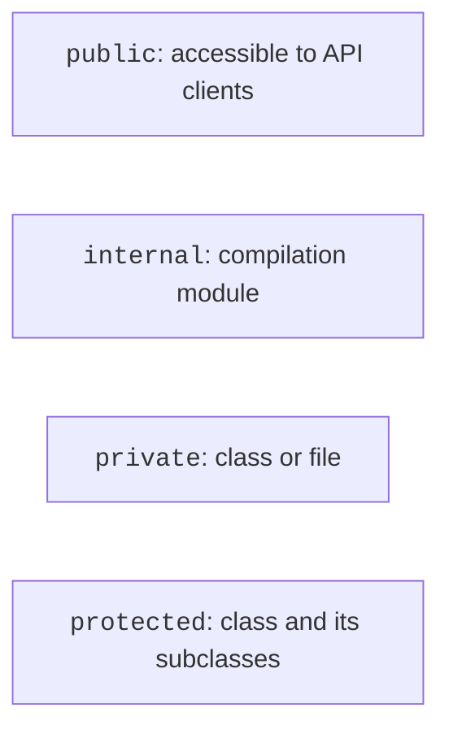

# Visibility, packages, and nested classes

## Visibility and responsibility boundaries

`public` is the default visibility. Inside a class, `private` hides a member from external calls; at the top level, it restricts it to the current file. `protected` is accessible to the class and its subclasses and does not apply to top-level declarations. Inheritance is covered in detail in the next topic. `internal` means access within a compilation module, not a package. Source: <https://kotlinlang.org/docs/visibility-modifiers.html>.



Figure 5.5. Declaration access boundaries {.caption}

In an ordinary Gradle project, a module relates to a source set compiled together; tests may have special access to internal members of the main code. Do not equate a module with a directory at an arbitrary level. A package organizes names, while a modifier determines access. Two files in the same package do not automatically gain access to each other's `private` declarations.

Encapsulation reduces the number of places where state correctness must be established. If `balance` can be written anywhere, all those places must check its bounds. If changes are available only through two methods, validation is localized. However, visibility is not cryptographic protection: secrets do not become safe merely through the word `private`.

## Packages, files, and imports

The declaration `package ua.edu.bank` precedes imports. A class's fully qualified name includes the package. The directory `ua/edu/bank` under `src/main/kotlin` is a convenient convention, although Kotlin syntax does not require the path to match the package. A file can contain several related classes and top-level functions. <https://kotlinlang.org/docs/packages.html>.

`import` allows a short name but does not create objects or run constructors. An import with `as` resolves a name conflict or provides a locally clear name. Do not hide poor package structure behind dozens of aliases.

### Example 4. Two packages in one application

Create two files in one Gradle module. The first file, `src/main/kotlin/ua/edu/bank/Wallet.kt`, contains the model.

```kotlin
package ua.edu.bank

internal class Wallet(val owner: String, val cents: Long) {
    init {
        require(owner.isNotBlank() && cents >= 0)
    }

    fun label(): String = "$owner: $cents kop"
}
```

The second file, `src/main/kotlin/ua/edu/app/Main.kt`, contains the entry point. Both packages belong to the same module, so the internal class is accessible. From another independent module, an ordinary import will not make it public.

```kotlin
package ua.edu.app

import ua.edu.bank.Wallet as StudyWallet

fun main() {
    val wallet = StudyWallet("Taras", 1250)
    println(wallet.label())
}
```

```text
Taras: 1250 kop
```

For this example, the JVM entry point is named `ua.edu.app.MainKt` because the top-level function is in `Main.kt`. The model class's name does not determine the entry point. After changing the package, update the run configuration.

::: info Screenshot
Project tree: src/main/kotlin/ua/edu/bank/Wallet.kt and app/Main.kt; expand packages.
:::

Figure 5.6. Model and console interface packages {.caption}

## Nested and inner classes

A nested `class Track` inside `Player` groups a related type but does not receive a reference to a particular player. It is created as `Player.Track(...)`. The `inner` modifier adds a link to the outer instance; creation looks like `player.Playback()`. Inside, you can explicitly write `this@Player` to distinguish the outer object from the inner one. <https://kotlinlang.org/docs/nested-classes.html>.

Use `inner` only when the operation truly depends on a particular owner. An unnecessary hidden reference complicates the lifecycle: a stored Playback keeps its Player reachable. This is not nested inheritance. In the lab example, Track describes track data, while Playback changes its owner's volume.
