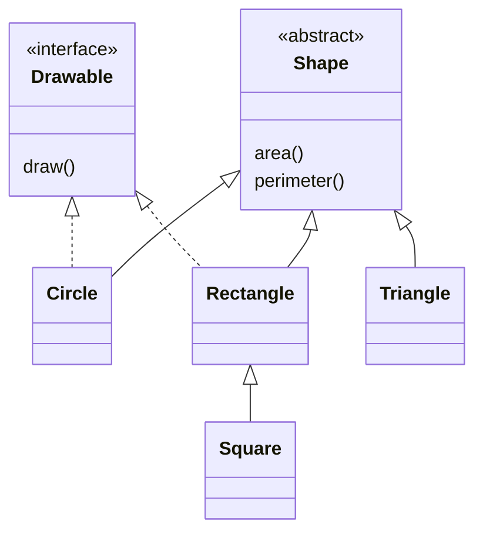

# Abstract classes

## An abstract class and a complete hierarchy

An `abstract class` cannot be instantiated directly. It can have a constructor, state, implemented methods, and abstract members without implementations. A concrete subclass must implement all inherited abstract members. An abstract member does not need an additional `open` modifier.

The Shape contract requires finite positive dimensions. The dimension properties in this example do not change. Square can therefore be a separate way to create a Rectangle with equal sides. If Rectangle promised independent changes to width and height, such a Square could violate that promise. Inheritance is evaluated by operations and invariants, rather than by a formula alone.



Figure 6.2. An immutable shape hierarchy and a drawing interface {.caption}

### Example 2. Shapes and a polymorphic report

For brevity, a triangle is specified by its three sides. The upper bound on side lengths ensures safe intermediate calculations. `Drawable` returns a text description rather than creating a graphical window. It is a separate contract that different shapes can implement.

```kotlin
import kotlin.math.PI
import kotlin.math.sqrt
import java.util.Locale

interface Drawable {
    fun draw(): String
}

abstract class Shape {
    abstract fun area(): Double
    abstract fun perimeter(): Double
}

fun positive(value: Double): Double {
    require(value.isFinite() && value in 0.001..10000.0)
    return value
}

class Circle(radius: Double) : Shape(), Drawable {
    private val radius = positive(radius)
    override fun area(): Double = PI * radius * radius
    override fun perimeter(): Double = 2 * PI * radius
    override fun draw(): String = "Circle"
}

open class Rectangle(width: Double, height: Double) :
    Shape(), Drawable {
    private val width = positive(width)
    private val height = positive(height)
    override fun area(): Double = width * height
    override fun perimeter(): Double = 2 * (width + height)
    override fun draw(): String = "Rectangle"
}

class Square(side: Double) : Rectangle(side, side)

class Triangle(a: Double, b: Double, c: Double) : Shape() {
    private val a = positive(a)
    private val b = positive(b)
    private val c = positive(c)

    init {
        require(a + b > c && a + c > b && b + c > a)
    }

    override fun perimeter(): Double = a + b + c

    override fun area(): Double {
        val s = perimeter() / 2
        return sqrt(s * (s - a) * (s - b) * (s - c))
    }
}

fun main() {
    val shapes: Array<Shape> = arrayOf(
        Circle(1.0), Rectangle(3.0, 4.0),
        Square(2.0), Triangle(3.0, 4.0, 5.0)
    )
    for (shape in shapes) {
        println(String.format(
            Locale.ROOT, "%.2f %.2f",
            shape.area(), shape.perimeter()
        ))
    }
}
```

```text
3.14 6.28
12.00 14.00
4.00 8.00
6.00 12.00
```

`Locale.ROOT` makes the demonstration's decimal separator independent of the computer's settings. The traversal algorithm contains no `when` over shape types. An additional shape must implement the contract, while the report loop remains unchanged. Dimension validation stays in the model.

::: info Screenshot
Inside a Shape subclass use Ctrl+O; inspect Override Members. Abstract members may be offered through Implement Members.
:::

Figure 6.3. Selecting members to override {.caption}
