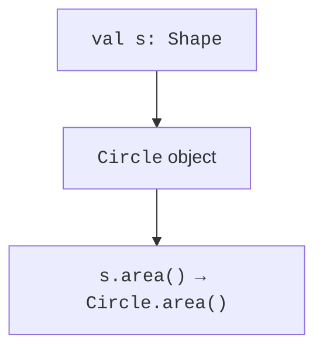

# A common type and open classes

## Why a program needs a common type

Suppose a program needs to display the areas of a circle, rectangle, and triangle. The formulas differ, but the client wants to perform the same action: obtain the area. If the client checked every shape name itself, adding each new type would require changing its code. A common `Shape` contract moves the formula to the object that knows its dimensions.

**Polymorphism** is the ability to work through a common type while obtaining the behavior of a concrete object. **Inheritance** creates a subtype relationship and allows reuse of the base class implementation. These concepts are related but distinct: polymorphism is possible through an interface without shared state. <https://kotlinlang.org/docs/inheritance.html>.

An “is a” relationship is necessary but insufficient. A subtype must fulfill the promises of the base contract. If a base operation accepts any positive distance, a subtype must not arbitrarily reject some of those distances. If a nonnegative area is promised, a subtype cannot return a negative number merely because the method technically compiles.

For multiple objects in this topic, we use `arrayOf`: it creates an array of the specified elements, and a `for` loop traverses them in sequence. Collections will be covered fully in Topic 10. Here, the key point is that an array can have type `Array<Shape>` even though its elements were created by different constructors.

## Classes are closed by default

A regular Kotlin class is `final`: it cannot be extended until its author adds `open` or `abstract`. Class methods are not automatically overridable either. This requirement makes the author mark extension points and define their contracts. Do not add `open` to every class “just in case.”

After a colon, a derived class specifies its base type and calls its constructor. The arguments are evaluated before the base state is initialized. The derived class's own properties appear later. Creating one derived instance does not create two independent “parent” and “child” objects.

`override` is a required marker for overriding. It helps the compiler detect a typo in the name or signature. An overridden member remains open to further subclasses unless you write `final override`. `super.method()` calls the base class implementation, while `this.method()` uses normal dynamic dispatch.

### Example 1. An employee and a bonus

The derived class uses the validated base salary and adds a bonus. The educational amounts are expressed in whole kopiykas; the bounds prevent `Long` overflow. Neither the base constructor nor `init` calls the open `pay` method.

```kotlin
open class Employee(val name: String, private val base: Long) {
    init {
        require(name.isNotBlank())
        require(base in 0..100_000_000L)
    }

    open fun pay(): Long = base
    open fun describe(): String = "$name: ${pay()}"
}

class BonusEmployee(
    name: String,
    base: Long,
    private val bonus: Long
) : Employee(name, base) {
    init {
        require(bonus in 0..100_000_000L)
    }

    final override fun pay(): Long = super.pay() + bonus
    override fun describe(): String = "Bonus ${super.describe()}"
}

fun main() {
    val staff: Array<Employee> = arrayOf(
        Employee("Olena", 10000),
        BonusEmployee("Taras", 10000, 2500)
    )
    var total = 0L
    for (employee in staff) {
        println(employee.describe())
        total += employee.pay()
    }
    println("total=$total")
}
```

```text
Olena: 10000
Bonus Taras: 12500
total=22500
```

Notice that `super.describe()` executes the base body, but the `pay()` call inside it is still polymorphic. The result for Taras therefore includes the bonus. `super` selects a particular call; it does not disable polymorphism for all subsequent operations on that object.

## Dynamic dispatch

A variable's static type determines which members the code can call. The object's actual type determines which override of an open method executes. A `Shape` variable allows an `area` call even if the concrete object is a `Circle`. However, it does not expose circle-specific methods absent from the Shape contract.



Figure 6.1. The static type and actual method execution {.caption}

Polymorphism does not mean that every method is selected dynamically. In particular, the extension functions from Topic 3 are resolved by the receiver's static type. They do not insert a new virtual member into the class. This matters when choosing between an actual contract method and a helper extension.
