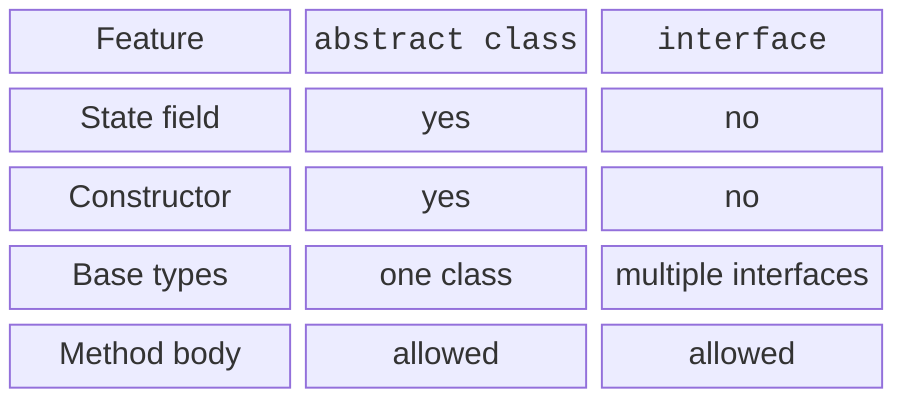
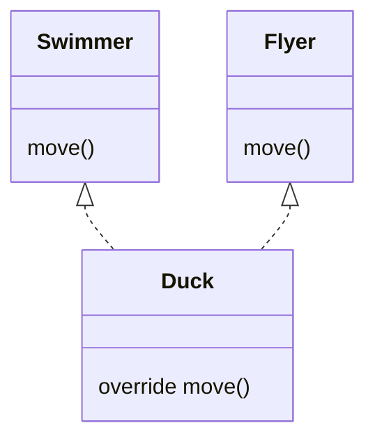

# Interfaces and implementation conflicts

## An interface: a capability without a shared field

An interface describes operations that a client can request from an object. A class can implement multiple interfaces but has only one direct base class. An interface has no instance constructor or property backing field. It can declare a property abstractly or provide a getter that computes its value. <https://kotlinlang.org/docs/interfaces.html>.

A `val` property in an interface promises read access; an implementation can use `var`, since adding write access does not break that promise. Conversely, a `var` requirement cannot be fulfilled with only `val`: the client also expects write access. You cannot arbitrarily narrow the visibility of an override and deprive the client of promised access.

A method with a body in an interface provides default behavior. This avoids making every class duplicate the same lines. However, the implementation must rely only on contract members, rather than assume the existence of a specific private field. An abstract class is sometimes more suitable for shared state and a controlled algorithm.



Figure 6.4. Abstract class and interface {.caption}

### Example 3. A device with two capabilities

```kotlin
interface Switchable {
    val isOn: Boolean
    fun switchOn()
    fun switchOff()
    fun status(): String = if (isOn) "on" else "off"
}

interface Chargeable {
    val charge: Int
    fun recharge(points: Int)
    fun chargeStatus(): String = "$charge%"
}

class Lamp : Switchable, Chargeable {
    override var isOn = false
        private set
    override var charge = 20
        private set

    override fun switchOn() {
        check(charge > 0) { "Empty battery" }
        isOn = true
    }

    override fun switchOff() { isOn = false }

    override fun recharge(points: Int) {
        require(points in 1..100 - charge)
        charge += points
    }
}

fun main() {
    val lamp = Lamp()
    val control: Switchable = lamp
    val battery: Chargeable = lamp
    control.switchOn()
    battery.recharge(30)
    println("${control.status()}; ${battery.chargeStatus()}")
    control.switchOff()
    println(control.status())
}
```

```text
on; 50%
off
```

The two references have different static types but point to the same Lamp. A Switchable client cannot see recharge, even though the object actually supports it. This is a useful restriction: the component receives only the capabilities needed for its work.

## Conflicting default implementations

If two interfaces provide a method with the same name, Kotlin does not guess the author's intent. The class explicitly overrides the method and chooses the required behavior. A qualified call, `super<A>.method()`, specifies a particular base implementation. Do not confuse this with a type cast: it selects the method body.



Figure 6.5. Explicitly resolving an interface conflict {.caption}

### Example 4. A duck that swims and flies

```kotlin
interface Swimmer {
    fun move(): String = "swim"
}

interface Flyer {
    fun move(): String = "fly"
}

class Duck : Swimmer, Flyer {
    override fun move(): String =
        super<Swimmer>.move() + " then " + super<Flyer>.move()
}

fun main() {
    val duck = Duck()
    val swimmer: Swimmer = duck
    val flyer: Flyer = duck
    println(duck.move())
    println(swimmer.move())
    println(flyer.move())
}
```

```text
swim then fly
swim then fly
swim then fly
```

All normal calls reach Duck.move regardless of the reference's static type. Casting to Swimmer does not force a call to the original default body. The `super` selection is made inside the override itself.
