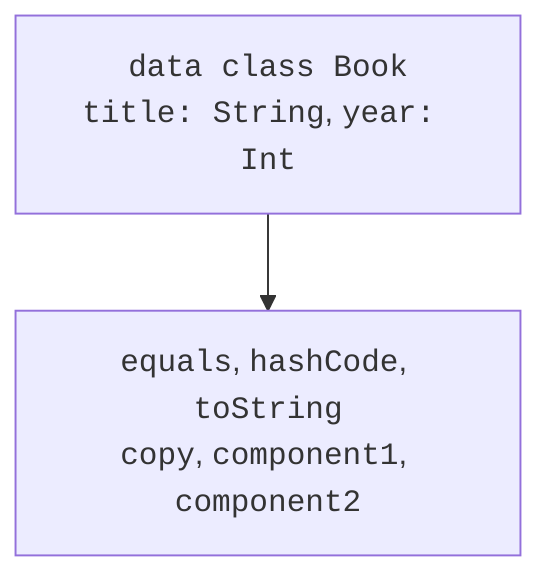

# Data classes and copying

## Choosing a model form by its meaning

Previous topics introduced general classes and inheritance. However, not every model needs a manual equals, an arbitrary hierarchy, or an unlimited number of instances. A book with a title and year is a structured value; a day of the week belongs to a fixed set; an operation result may contain different data for success and failure. Kotlin provides dedicated tools for these cases.

The right type form reduces the number of invalid states that can be created at all. Instead of three nullable fields, `amount`, `trackNo`, and `error`, you can define separate state variants. The compiler then helps check handling rather than leaving all validation to conditions scattered throughout the program.

Do not choose `data`, `sealed`, or `object` just for brevity. Each keyword changes the type's contract: equality, instantiation, extension, or state access. Define the meaning first, then choose the syntax.

## Data classes and generated operations

A `data class` is intended as a data carrier. Its primary constructor must have at least one parameter, and all its parameters must be marked `val` or `var`. A data class cannot be abstract, open, sealed, or inner. It can implement an interface. Official documentation: <https://kotlinlang.org/docs/data-classes.html>.

The compiler generates equals and hashCode from primary constructor properties, a readable toString, a copy function, and componentN functions for destructuring. If the class explicitly defines certain permitted methods, generation rules account for those declarations; you cannot declare custom copy or componentN functions for a data class.



Figure 7.1. Data class members derived from the primary constructor {.caption}

Properties in the class body do not participate in generated equality, hashing, copying, or destructuring. This may be useful for a derived cache but dangerous for meaningful data. If the publication year defines a Book value, it should be a primary constructor parameter rather than a hidden var in the body.

### Example 1. Books, copying, and destructuring

The main data fields are read-only. Copy creates a different instance with some parameters changed. The viewed flag is deliberately placed in the body to show the limits of generation; in a real model, viewing state often belongs to an individual user.

```kotlin
data class Book(val title: String, val year: Int) {
    var viewed: Boolean = false
    init {
        require(title.isNotBlank())
        require(year in 1450..2100)
    }
}

fun main() {
    val first = Book("Kotlin notes", 2025)
    first.viewed = true
    val same = Book("Kotlin notes", 2025)
    val revised = first.copy(year = 2026)
    val (title, year) = revised
    println(first)
    println("equal=${first == same}")
    println("identity=${first === same}")
    println("$title / $year")
    println("viewed=${revised.viewed}")
    println("hash equal=${first.hashCode() == same.hashCode()}")
}
```

```text
Book(title=Kotlin notes, year=2025)
equal=true
identity=false
Kotlin notes / 2026
viewed=false
hash equal=true
```

The viewed=false result is neither deep copying nor a compiler error: this property is not among copy's parameters and receives its normal initializer in the new instance. Equality between the first and second books ignores the difference in viewed. This decision must be deliberate and reflected in tests.

Destructuring with `val (title, year)` calls component1 and component2 in constructor order. The local variables can have different names; binding is positional, rather than by name. An underscore `_` skips a component. Do not change a public type's parameter order without assessing its clients.

Pair and Triple are ready-made small value carriers. They are convenient for locally returning two or three results, but the fields first, second, and third do little to explain domain meaning. For a public API, Point(x,y) or ParseResult(value,position) is usually clearer than nested pairs.


Figure 7.2. Generated data class members {.caption}

## Immutability and shallow copying

`val` prevents reassigning a property but does not guarantee immutability of the referenced object. Copy is **shallow**: references to nested objects are copied, while the nested objects themselves are not automatically cloned. An immutable outer data object containing a mutable container can change through another access path.

The following example uses an ordinary mutable Address object, so it does not require knowledge of collections. After copy, the two Customer objects refer to the same address. Creating a separate Address gives independent state only at this nesting level.

```kotlin
class Address(var city: String)
data class Customer(val name: String, val address: Address)

fun main() {
    val original = Customer("Olena", Address("Kyiv"))
    val shared = original.copy(name = "Taras")
    shared.address.city = "Lviv"
    println(original.address.city)
    println(original.address === shared.address)
    val independent = original.copy(
        address = Address(original.address.city)
    )
    independent.address.city = "Odesa"
    println(original.address.city)
    println(independent.address.city)
}
```

```text
Lviv
true
Lviv
Odesa
```

A complete deep copy requires rules for the entire object graph: how to handle shared references, cycles, and resources. It is often simpler to make nested values immutable and replace them with new values. Copy then conveniently expresses a state change without unexpected effects on the old version.

Mutable primary constructor properties of a data class affect equals and hashCode. Do not modify them while the object is a map key or set element. The compiler allows such code, but the lookup algorithm relies on a stable key. Immutable values are preferable for identifiers.
