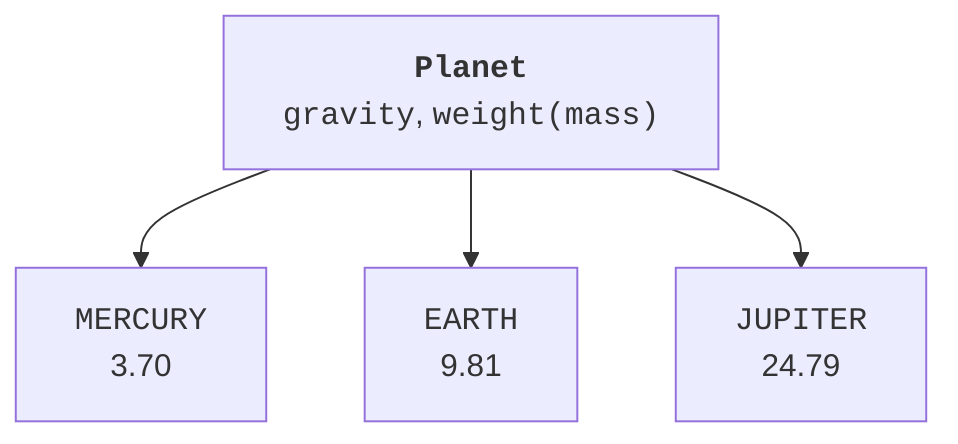
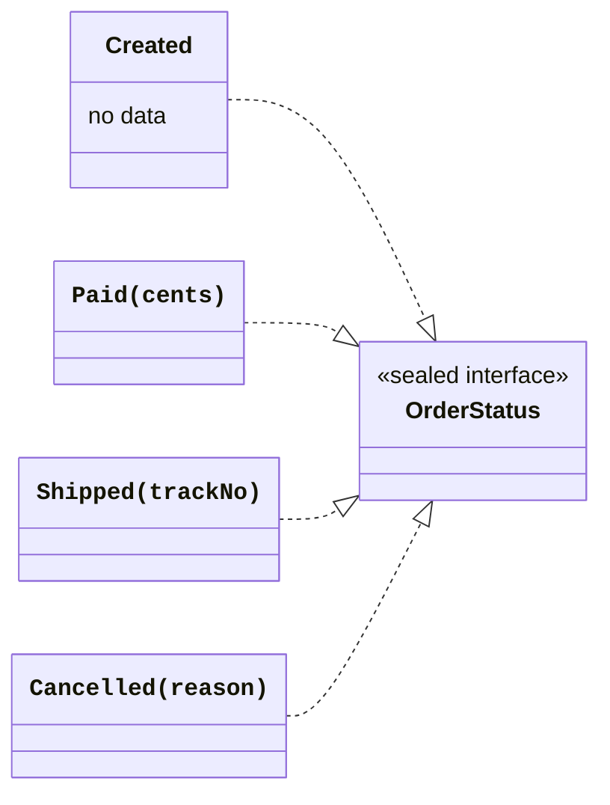

# Enums and sealed hierarchies

## An enum: a fixed set of constants

An `enum class` describes a finite named set of instances. Each constant is an object of that type and can have its own constructor arguments. The name field returns the declared name, ordinal returns the zero-based position, and entries returns a list of all constants in declaration order. <https://kotlinlang.org/docs/enum-classes.html>.

Ordinal is not a stable domain identifier: inserting a new element changes the positions of subsequent ones. For storage or exchange, introduce an explicit code, such as "UAH", or explicitly fix the name format. Do not calculate an educational grade through arithmetic on ordinal.

`valueOf` looks up an exact constant name and throws IllegalArgumentException for an unknown string. Case matters. Converting input with uppercase is an interface decision, rather than valueOf's own behavior. For controlled input, you can iterate over entries and explicitly return absence.



Figure 7.3. One type and several fixed instances {.caption}

### Example 2. Planets and weight

The educational model stores gravitational acceleration for three planets. A body's mass stays the same, while its weight changes according to F=m×g. The g values are approximate and explicitly specified, so the result is reproducible without external data sources.

```kotlin
import java.util.Locale

enum class Planet(val gravity: Double) {
    MERCURY(3.70), EARTH(9.81), JUPITER(24.79);

    fun weight(massKg: Double): Double {
        require(massKg.isFinite() && massKg in 0.0..10000.0)
        return massKg * gravity
    }
}

fun category(planet: Planet): String = when (planet) {
    Planet.MERCURY, Planet.EARTH -> "rocky"
    Planet.JUPITER -> "gas giant"
}

fun main() {
    for (planet in Planet.entries) {
        val value = String.format(
            Locale.ROOT, "%.2f", planet.weight(10.0)
        )
        println("${planet.name}: $value N, ${category(planet)}")
    }
    println(Planet.valueOf("EARTH") == Planet.EARTH)
    try {
        Planet.valueOf("Earth")
    } catch (e: IllegalArgumentException) {
        println("Unknown planet")
    }
}
```

```text
MERCURY: 37.00 N, rocky
EARTH: 98.10 N, rocky
JUPITER: 247.90 N, gas giant
true
Unknown planet
```

When when is an expression that must return a value, the compiler requires exhaustiveness. For an enum, you can list all constants without else. Adding a new constant then forces you to review the handling. A general else would hide this requirement by returning an old “default” answer for new meaning.

An enum can implement an interface. Constants can have their own bodies and implement an abstract enum method, such as an arithmetic calculator operation. Do not use enum when the user determines the number of instances at runtime: each individual product is not a new type constant.

## Sealed hierarchies and variant-specific data

An enum describes a set of constants with a uniform structure well. But Paid has an amount, Shipped has a tracking number, Cancelled has a reason, and Created may have no additional data. A `sealed class` or `sealed interface` allows a closed set of alternatives with different structures. <https://kotlinlang.org/docs/sealed-classes.html>.

Direct subtypes of a sealed type are declared in the same package and module; they must have proper names, so local and anonymous direct subtypes are unsuitable. Multiplatform has additional source-set rules that will be covered separately. In this JVM course, we keep all model variants together.

Sealed restricts direct subtypes. If one of them is an ordinary open class, its descendants can form a broader tree. Read “closed” carefully, and do not open intermediate nodes unnecessarily.



Figure 7.4. Order states with different sets of data {.caption}

### Example 3. Order state

Created is a single value without data, so it is a data object. The other states are data classes with validated parameters. The describe function handles every variant and uses smart casts to access the corresponding properties.

```kotlin
sealed interface OrderStatus

data object Created : OrderStatus
data class Paid(val cents: Long) : OrderStatus {
    init { require(cents > 0) }
}
data class Shipped(val trackNo: String) : OrderStatus {
    init { require(trackNo.isNotBlank()) }
}
data class Cancelled(val reason: String) : OrderStatus {
    init { require(reason.isNotBlank()) }
}

fun describe(status: OrderStatus): String = when (status) {
    Created -> "created"
    is Paid -> "paid ${status.cents} kop"
    is Shipped -> "shipped ${status.trackNo}"
    is Cancelled -> "cancelled: ${status.reason}"
}

fun ship(status: OrderStatus, track: String): OrderStatus {
    require(status is Paid) { "Payment required" }
    return Shipped(track)
}

fun main() {
    val paid: OrderStatus = Paid(12500)
    val shipped = ship(paid, "STUDY-001")
    for (state in arrayOf(Created, paid, shipped)) {
        println(describe(state))
    }
    try {
        ship(Created, "STUDY-002")
    } catch (e: IllegalArgumentException) {
        println(e.message)
    }
    println(describe(paid))
}
```

```text
created
paid 12500 kop
shipped STUDY-001
Payment required
paid 12500 kop
```

A new state is returned as a value; the old Paid remains unchanged. A sealed hierarchy does not itself define allowed transitions: functions such as ship are needed for that. The compiler checks the set of alternatives in when, while the domain contract and its checks determine whether the operation sequence is correct.

For an expected failure, you can return your own sealed result with Success and Failure instead of throwing an exception. The standard Result from Topic 4 has a different contract: a successful value or a Throwable. Do not give your own hierarchy the same name without explanation, to avoid confusing two different types in imports and when reading code.

::: info Screenshot
In a scratch copy remove Cancelled branch; show non-exhaustive when diagnostic and Add remaining branches. Restore before running.
:::

Figure 7.5. Checking completeness of state handling {.caption}
