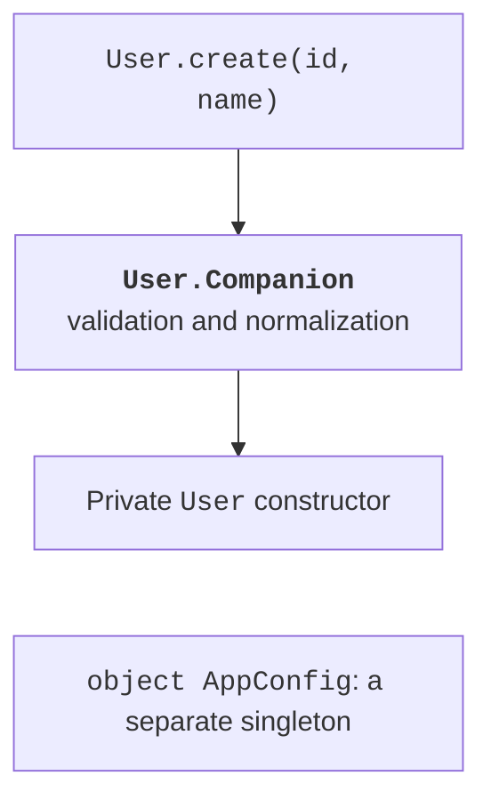

# Singleton objects and companions

## Object: one accessible instance

An object declaration defines both a type and its single named instance. Access takes the form AppConfig.mode, without a constructor call. An object declaration is initialized on first access, and its initialization is thread-safe. This does not mean that subsequent changes to its var properties are automatically safe across multiple threads. <https://kotlinlang.org/docs/object-declarations.html>.

A global mutable object creates a hidden dependency. A test that changes configuration can affect the next test. For a stateful service, an ordinary class supplied through a constructor is often preferable. Object is suitable for an immutable policy, a fixed state marker, or a truly shared resource with a clear lifecycle.

A data object provides consistent equals, hashCode, and a readable toString for a variant without data. In a sealed hierarchy, this makes it symmetric with data classes for other states. Compare such values with `==` rather than basing logic on `===`. A data object has no copy or componentN because it has no parameter set to copy or decompose.

## Companion object and factory methods

A companion object belongs to the class declaration rather than to each instance. Its members are accessible through the class name. On the JVM, it is a companion object, rather than simply a set of static Java methods. It can implement an interface. The `@JvmStatic` annotation adds a convenient static bridge for Java when integration requires it.

A factory with a private constructor controls creation: it can normalize input, validate data, and return a usable object. A name such as create, parse, or fromText explains the intent better than a complex constructor with many flags. `const val` defines a compile-time constant of a suitable simple type; an arbitrary object cannot be declared this way.



Figure 7.6. A class factory and a separate configuration object {.caption}

### Example 4. A type-safe user identifier

UserId wraps Long to avoid confusing it with another amount or number. The factory does not generate random or global IDs: the client explicitly supplies the identifier, making results easier to test. A counter implemented as an object appears in the lab.

```kotlin
@JvmInline
value class UserId(val value: Long) {
    init { require(value > 0) }
}

class User private constructor(
    val id: UserId,
    val name: String
) {
    companion object {
        const val MAX_NAME = 40

        fun create(id: UserId, rawName: String): User {
            val name = rawName.trim()
            require(name.isNotEmpty() && name.length <= MAX_NAME)
            return User(id, name)
        }
    }

    override fun toString(): String = "${id.value}: $name"
}

object AppConfig {
    const val TITLE = "Study users"
}

fun main() {
    println(AppConfig.TITLE)
    val user = User.create(UserId(7), "  Olena  ")
    println(user)
    try {
        User.create(UserId(8), "   ")
    } catch (e: IllegalArgumentException) {
        println("Invalid name")
    }
}
```

```text
Study users
7: Olena
Invalid name
```

A value class has one property in its primary constructor and can have methods, computed properties, and init. On the JVM, the `@JvmInline` annotation is required. It is a distinct type at the Kotlin level, unlike typealias, which merely provides another name for the same type. Representation details: <https://kotlinlang.org/docs/inline-classes.html>.

Do not promise that a value class never creates a wrapper. Nullable use, use through a generic type, or use through an interface may require boxing. Its benefit to the model is type safety; specific performance must be measured. Reference identity is not a meaningful operation for value classes.

::: info Screenshot
Open User source and Structure (Alt+7); expand Companion with MAX\_NAME and create.
:::

Figure 7.7. Factory and properties in the class structure {.caption}

## An anonymous object as a local implementation

The expression `object : Interface { ... }` creates an anonymous object where it executes. Unlike a named object, executing the expression again creates a new instance. This syntax is convenient for a short local interface implementation when a separate class name would not add clarity.

```kotlin
interface Message {
    fun text(): String
}

fun createMessage(prefix: String): Message = object : Message {
    override fun text(): String = "$prefix: ready"
}

fun main() {
    val first = createMessage("A")
    val second = createMessage("A")
    println(first.text())
    println(first === second)
}
```

```text
A: ready
false
```

The function's external contract here is Message. Additional members of the anonymous object do not automatically become accessible to a public function's client. If the client needs such data, declare a named type or extend the contract. Do not make users guess the hidden shape of the result.
