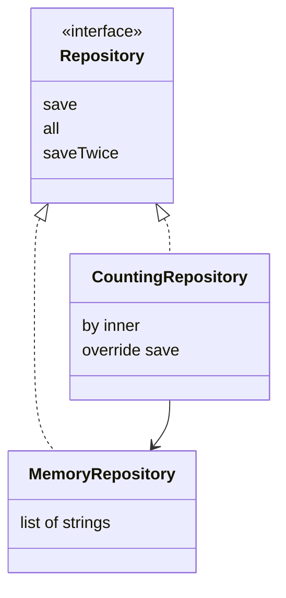

# provideDelegate and class delegation

## provideDelegate: validation at binding time

Normally a delegate is created when the owner is initialized, and getValue is called on read. The provideDelegate operator lets you validate the binding of the property itself and create the object that will serve access. For example, a configuration key can be checked once before the first read.

```kotlin
import kotlin.properties.ReadOnlyProperty
import kotlin.reflect.KProperty

class RequiredText(private val values: Map<String, String>) {
    operator fun provideDelegate(
        owner: Any?, property: KProperty<*>
    ): ReadOnlyProperty<Any?, String> {
        val text = values[property.name]
        require(!text.isNullOrBlank()) { "Missing ${property.name}" }
        return ReadOnlyProperty { _, _ -> text }
    }
}

class Config(values: Map<String, String>) {
    val title: String by RequiredText(values)
}

fun main() {
    val config = Config(mapOf("title" to "Study"))
    println(config.title)
    try {
        Config(emptyMap())
    } catch (e: IllegalArgumentException) {
        println(e.message)
    }
}
```

```text
Study
Missing title
```

The handler returns the validated text and does not reread the Map afterward. So the contract here is a snapshot of the configuration at creation time. Another delegate could read the map every time; that is different semantics, which must be described explicitly. provideDelegate does not replace validation of new values of a mutable property.

## Delegating an interface implementation

The declaration `class Wrapper(inner: Service) : Service by inner` generates forwarding of the interface members to the passed object. Wrapper can be used as a Service, but it does not inherit the concrete implementation class. This is a convenient way to compose objects and build a **decorator** that adds behavior. <https://kotlinlang.org/docs/delegation.html>.

A particular method can be overridden in the wrapper; an external call to that method then goes to the wrapper. There is an important limit: the delegate's internal calls run on the delegate itself and are not automatically redirected back to the wrapper's override. Do not expect delegation to work like virtual inheritance.



Figure 8.6. A decorator with an explicit dependency on a repository {.caption}

### Example 4. A counting repository

List is used here as a simple buffer: mutableListOf creates an empty mutable list, add appends an element, and toList returns a separate read-only copy of the list. All the strings are immutable, so the client does not get direct access to the internal container.

```kotlin
interface Repository {
    fun save(text: String)
    fun all(): List<String>
    fun saveTwice(text: String) {
        save(text)
        save(text)
    }
}

class MemoryRepository : Repository {
    private val rows = mutableListOf<String>()
    override fun save(text: String) {
        require(text.isNotBlank())
        rows.add(text)
    }
    override fun all(): List<String> = rows.toList()
}

class CountingRepository(private val inner: Repository) :
    Repository by inner {
    var calls = 0
        private set
    override fun save(text: String) {
        inner.save(text)
        calls++
    }
}

fun main() {
    val repository = CountingRepository(MemoryRepository())
    repository.save("A")
    repository.saveTwice("B")
    println(repository.all())
    println("counted direct saves=${repository.calls}")
}
```

```text
[A, B, B]
counted direct saves=1
```

The result 1 is intentional: saveTwice is delegated to the inner repository and calls its save. If the counter's contract is to count every save, override saveTwice so that it calls wrapper.save, or move the bookkeeping into the data source itself. The counter's name should explain which events it actually counts.

calls is incremented after a successful inner.save. If the save is rejected, the counter of successful actions does not change. For a counter of attempts, the order would be different. This is a small but important part of the decorator's contract, verified by a separate failure test.

## Designing and testing delegation

A property delegate controls access to a value; class delegation forwards an interface. Both use `by`, but they have different roles and methods. On the UML diagram, show the owner, the interface, and the delegate object, and in the explanation, the moment of creation and the owner of mutable state.

For an operator, test the normal case, a boundary, an invalid argument, and the immutability of the operands if the operation is declared to create a new value. For indexing, add −1 and an index past the end. For a range: empty, single-element, repeated iteration, and next after the end.

For lazy, count initializer executions across two reads. For observable, check the moment of notification; for vetoable, that the old state is kept after false. For a custom delegate, check the initial value and every write path. For a decorator, compare a direct call with an internal call of the delegate so as not to attribute extra behavior to it.

Looking at decompiled code can reveal delegates' backing fields and forwarding methods. However, the exact names and optimizations are not part of your program's contract. Some kinds of delegation may not need a separate field. Rely on documented behavior, not on a single snapshot of the compiler's output.
