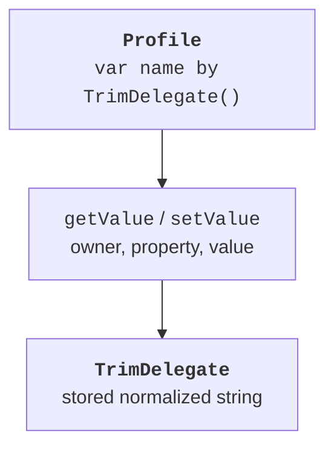
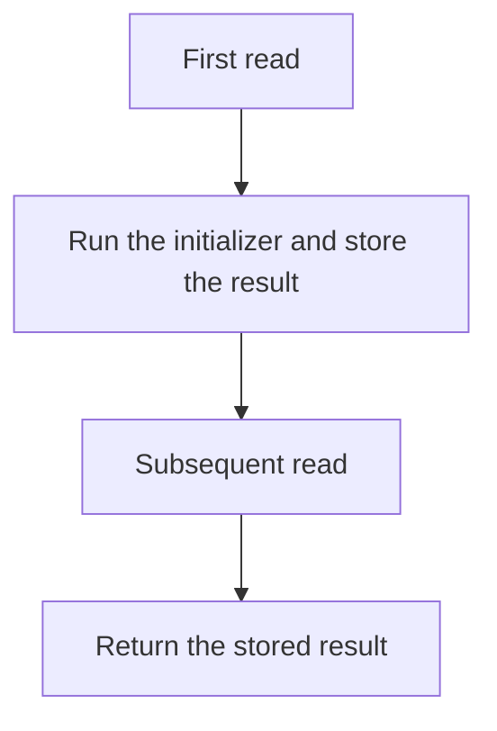

# Delegated properties

## A delegated property

A custom setter may repeat validation, logging, or normalization across many classes. A delegated property hands the access implementation to a separate object after `by`. A val needs getValue; a var also needs setValue. This is a different mechanism from overriding a property in a subclass. <https://kotlinlang.org/docs/delegated-properties.html>.

The thisRef receiver identifies the owner, property contains the property's metadata, including name, and value is the setter's new value. The type `KProperty<*>` means we do not need a specific type parameter for the metadata. This is a local introduction to the syntax; full coverage of variance belongs to Topic 9.



Figure 8.3. Handing property access to a delegate {.caption}

The ReadOnlyProperty and ReadWriteProperty interfaces provide convenient contracts for custom delegates. Kotlin also recognizes the corresponding operator functions without an explicit implementation of these interfaces. The lab example uses an explicit ReadWriteProperty so that the signatures are easy to verify.

## A lambda as a small action for a delegate

The standard delegates accept functions. The `{ ... }` notation here is a lambda: a small block that the library will call at a defined moment. Parameters come before the arrow, and the last expression is the result; `_` denotes an unused parameter. Full coverage of higher-order functions comes in Topic 11.

For lazy, the block computes the initial value; for observable, the handler receives the property, the old value, and the new value; for vetoable, it returns a Boolean that allows or rejects the new write. Do not confuse the moment each handler is called.

## Lazy and initialization modes

`val value by lazy { ... }` is computed on the first read and then returns the stored result. This is not an automatic cache refresh when other fields change. If the source data is mutable, the stored result can become stale. Use lazy for stable dependencies, or explicitly choose another caching model.



Figure 8.4. The first and subsequent reads of a lazy property {.caption}

SYNCHRONIZED is the default mode on the JVM and ensures consistent one-time publication of the result. PUBLICATION may call the initializer several times under contention but publishes a single result. NONE does not synchronize access and is suitable only with an appropriate single-thread guarantee. None of this makes the returned mutable object itself thread-safe.

If a lazy initializer throws an exception, the next read retries. So a side effect inside it must be thought through. Do not assume that a message, file, or request will necessarily be executed exactly once under all circumstances.

## Observable, vetoable, and Map

Observable calls its handler after assignment. It is suitable for notifying about a change that has already happened, but not for canceling it. Vetoable calls a check before the write and keeps the old value if the result is false. The delegate's initial value must also be valid: a change handler is not an automatic check of the initial argument.

Delegating to a Map looks up the value by the property's name. This is convenient for a validated set of configuration data, but a missing key or a wrong type can cause a runtime error. External JSON does not become validated just because you write by map: validate the structure first.

### Example 3. Settings and a deferred description

The Map in the example contains fixed, validated data; maps are covered in detail in Topic 10. The lambdas are deliberately short. Setting the volume above the limit is rejected without an exception, which matches the vetoable contract.

```kotlin
import kotlin.properties.Delegates

class Settings(private val values: Map<String, Any>) {
    val title: String by values
    val width: Int by values

    val summary: String by lazy {
        println("compute summary")
        "$title/$width"
    }

    var theme: String by Delegates.observable("light") {
        _, old, new -> println("theme: $old -> $new")
    }

    var volume: Int by Delegates.vetoable(50) {
        _, _, new -> new in 0..100
    }
}

fun main() {
    val settings = Settings(mapOf("title" to "Study", "width" to 80))
    println(settings.summary)
    println(settings.summary)
    settings.theme = "dark"
    settings.volume = 150
    println("volume=${settings.volume}")
    settings.volume = 75
    println("volume=${settings.volume}")
}
```

```text
compute summary
Study/80
Study/80
theme: light -> dark
volume=50
volume=75
```

NotNull provides late initialization of a non-null value, including for types where lateinit is not applicable. Reading before assignment throws IllegalStateException. Choose this delegate only when the lifecycle really requires deferred initialization, not to avoid a constructor parameter.

Delegating to `this::other` lets you redirect a property to another property, for example when renaming an API. Do not manually maintain two independent fields that must always have the same value. A single storage path reduces the risk of divergence and makes the data's owner clear.

::: info Screenshot
Decompile Settings bytecode; show lazy/observable delegate fields and accessor calls. Generated names may vary.
:::

Figure 8.5. Backing fields of delegated properties {.caption}
