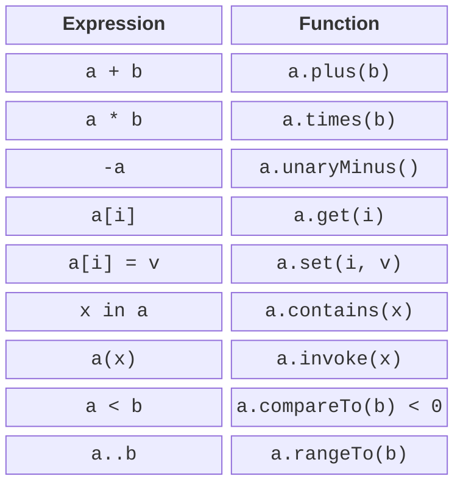
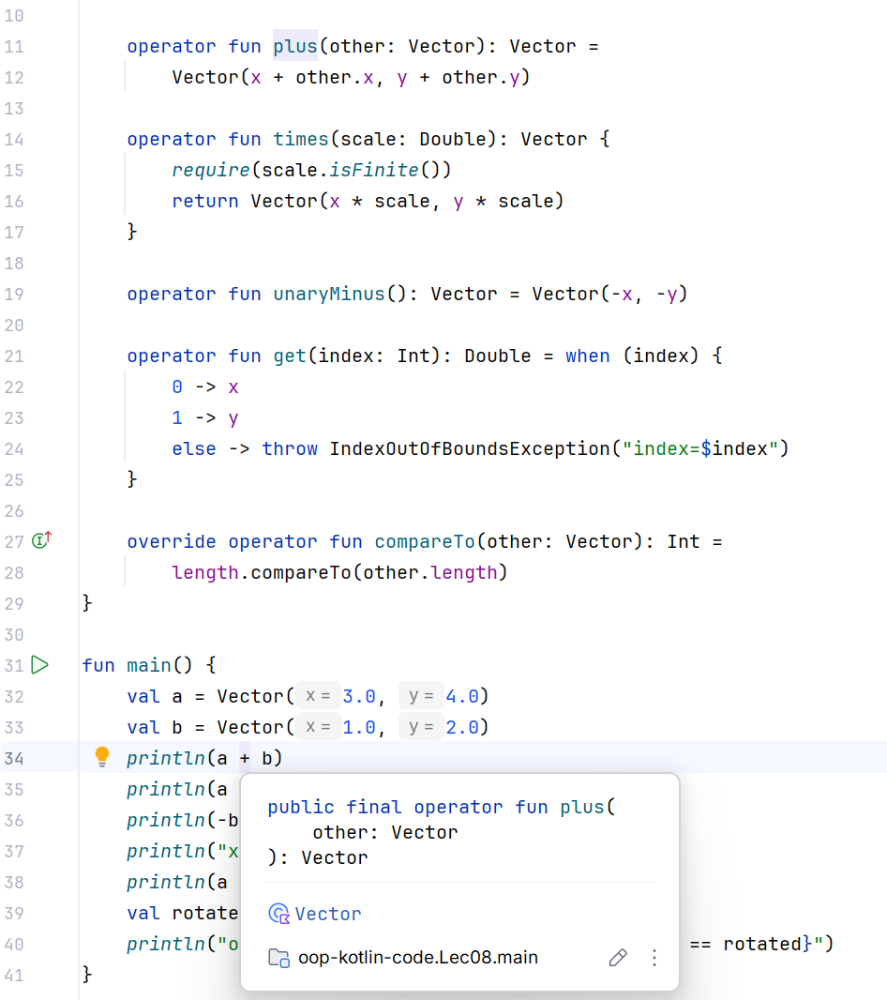

# Comparison and compound assignment

## Short notation must keep a clear meaning

For vectors it is natural to write a sum, for a range, membership, and for a matrix, indexed access. Kotlin lets you give your own types this behavior through functions with predefined names and the `operator` modifier. You cannot create new operator symbols, and the precedence and associativity of existing operators do not change either. <https://kotlinlang.org/docs/operator-overloading.html>.

Overloading is a compiler convention, not a textual substitution of an arbitrary expression. The signature must meet the requirements of the specific operation. Client code becomes shorter, but the type's author is still responsible for validating arguments and results. Do not use `+` to delete files or `!` to make a payment: a familiar symbol creates expectations in the reader.



Figure 8.1. Operator notation and the corresponding functions {.caption}

Arithmetic names: plus, minus, times, div, rem; unary ones: unaryPlus, unaryMinus, not. The expression `a + b` looks for a suitable `a.plus(b)`, and `-a` for `a.unaryMinus()`. The function can be a member or an extension. An extension has the same restrictions on access to private state and static dispatch as in Topic 3.

The choice of result type defines the contract. Adding two Money values returns a new Money in the same currency; multiplying a vector by a scalar returns a Vector. The product of two vectors is ambiguous: the dot and cross products are better expressed as explicitly named methods dot and cross, if a symbol would hide the meaning.

## Comparison and equality semantics

`compareTo` returns a negative, zero, or positive Int. It is the sign, not necessarily −1 or 1, that determines the result of `<`, `<=`, `>`, and `>=`. Implementing `Comparable<T>` gives the type a natural order suitable for sorting. Do not compare large integers by computing their difference: it can overflow; use compareTo on the components.

`==` uses equals, not compareTo. Two vectors of equal length can be unequal by coordinates. If the order compares only length, compareTo can return zero for unequal vectors. This must be explained explicitly to the user and taken into account especially carefully in sorted sets.

### Example 1. An immutable vector

The coordinates are bounded, so length computation and scalar multiplication in the demo remain finite. A new Vector goes through the same init check as the original one. The only indices are 0 and 1; other values are an access error. The data class provides equality by coordinates, while Comparable compares lengths.

```kotlin
import kotlin.math.hypot

data class Vector(val x: Double, val y: Double) :
    Comparable<Vector> {
    init {
        require(x.isFinite() && y.isFinite())
        require(x in -1e6..1e6 && y in -1e6..1e6)
    }
    val length: Double get() = hypot(x, y)

    operator fun plus(other: Vector): Vector =
        Vector(x + other.x, y + other.y)

    operator fun times(scale: Double): Vector {
        require(scale.isFinite())
        return Vector(x * scale, y * scale)
    }

    operator fun unaryMinus(): Vector = Vector(-x, -y)

    operator fun get(index: Int): Double = when (index) {
        0 -> x
        1 -> y
        else -> throw IndexOutOfBoundsException("index=$index")
    }

    override operator fun compareTo(other: Vector): Int =
        length.compareTo(other.length)
}

fun main() {
    val a = Vector(3.0, 4.0)
    val b = Vector(1.0, 2.0)
    println(a + b)
    println(a * 2.0)
    println(-b)
    println("x=${a[0]}; length=${a.length}")
    println(a > b)
    val rotated = Vector(4.0, 3.0)
    println("order=${a.compareTo(rotated)}; equal=${a == rotated}")
}
```

```text
Vector(x=4.0, y=6.0)
Vector(x=6.0, y=8.0)
Vector(x=-1.0, y=-2.0)
x=3.0; length=5.0
true
order=0; equal=false
```

The operation `2.0 * a` does not become available automatically, because the receiver is Double. If needed, you can add a suitable extension on Double that delegates to Vector multiplication. The commutativity of a mathematical operation does not mean the compiler looks up methods symmetrically.



Figure 8.2. Navigating from an operator symbol to its implementation {.caption}

## Compound assignment and increment

Two different contracts are possible for `a += b`. `plusAssign` changes the receiver's state and returns Unit. If there is no suitable plusAssign, the compiler can use plus and assign the result back; the variable must then be a var, and the result type must be suitable for that assignment.

Do not declare both variants without need: ambiguity can arise for a var variable. For immutable values, plus is usually enough; for a container that is deliberately mutable, plusAssign may be appropriate. Being able to write `val` next to a reference does not prevent plusAssign from changing the object itself.

`inc` and `dec` return a new value for reassignment and should not modify the receiver themselves. The postfix form returns the old value of the expression, the prefix form the new one. Do not implement incrementing an immutable date through a hidden change to a shared instance that other variables point to.

```kotlin
data class Counter(val value: Int) {
    init { require(value in 0..100) }
    operator fun plus(step: Int): Counter = Counter(value + step)
    operator fun inc(): Counter = Counter(value + 1)
}

class Bag {
    var count = 0
        private set
    operator fun plusAssign(amount: Int) {
        require(amount in 0..100 - count)
        count += amount
    }
}

fun main() {
    var counter = Counter(5)
    counter += 2
    val old = counter++
    println("old=${old.value}; new=${counter.value}")
    val bag = Bag()
    bag += 3
    println("bag=${bag.count}")
}
```

```text
old=7; new=8
bag=3
```

The example separates the two approaches into different types. Counter creates new values, while Bag changes itself. The client sees the same `+=` symbol, so the type's documentation and familiar semantics are especially important. After a rejection, Bag must keep its previous count.
