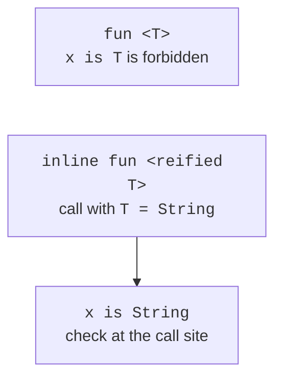

# Type erasure and reified

## Type erasure and reified

The JVM mostly does not store the type argument in each generic object. Checking `value is T` in an ordinary function is impossible: after erasure, it is unknown which type would have to be checked. Likewise, the check `value is List<String>` cannot verify all the elements of the list with an ordinary JVM type check.

The `reified` modifier is allowed on a parameter of an inline function. The compiler substitutes the implementation at the call site together with information about the actual type. This enables `is T`, `T::class`, and typed operations, but it does not undo the erasure of JVM generic arguments. In particular, the nested arguments of `List<String>` still require a content check or a serializer with a schema.



Figure 9.4. Reified moves the check of a known type to the call site. {.caption}

### Example 4. Parsing three scalar types

The program explicitly supports only `Int`, `Double`, and `Boolean`. An unknown type is not created via reflection but rejected. The cast of the result is concentrated in one place after the `T::class` check; its correctness is ensured by the matching branches.

```kotlin
inline fun <reified T : Any> parse(text: String): T {
    val value: Any = when (T::class) {
        Int::class -> text.toInt()
        Double::class -> text.toDouble().also {
            require(it.isFinite()) { "finite number required" }
        }
        Boolean::class -> text.toBooleanStrict()
        else -> error("unsupported type: ${T::class.simpleName}")
    }
    return value as T
}

fun main() {
    println(parse<Int>("42") + 1)
    println(parse<Double>("2.5") * 2)
    println(parse<Boolean>("true"))
    try {
        parse<Boolean>("yes")
    } catch (error: IllegalArgumentException) {
        println("invalid boolean")
    }
    try {
        parse<String>("word")
    } catch (error: IllegalStateException) {
        println("unsupported")
    }
}
```

```text
43
5.0
true
invalid boolean
unsupported
```

This approach does not scale to arbitrary business models: a long `when` becomes a registry of special cases. There it is more appropriate to pass a parsing function or a `Parser<T>` object. Reified is justified when behavior really depends on the static type, not merely to make a signature shorter.

::: info Screenshot
IntelliJ IDEA: Tools &gt; Kotlin &gt; Show Kotlin Bytecode; Decompile a reified is T example.
:::

Figure 9.5. The type check substituted at the inline call site. {.caption}

`typeOf<T>()` returns a `KType` description, which can contain generic arguments and the nullable flag. A type description is not automatic validation of an arbitrary object. Checking the structure of data obtained from JSON remains the job of the decoder and the domain rules.

## Sealed results, Nothing, and aliases

A generic hierarchy can separate a successful value from an error. For example, `Either<out L, out R>` has the variants `Left<L>` and `Right<R>`. The empty side is specified with the type `Nothing`: it has no ordinary values and is a subtype of other types. Thanks to covariance, `Right<Int>` can be used as `Either<String, Int>`. The full implementation is given in the lab assignment.

The alias `typealias UserId = String` gives another name to the same type. It does not prevent passing an arbitrary string instead of an identifier. A separate domain entity needs a class, in particular a value class, if its constraints fit the task. Aliases are useful for long function types and nested generic declarations.

A typical mistake is adding `as T` to a function that has no proof of the type. Another mistake is suppressing the diagnostic with `@UnsafeVariance` without preserving the invariant. These mechanisms are intended for narrow cases in library implementations; an educational API should manage with properly separated producers and consumers.

Testing a generic class has two parts. Runnable examples test behavior, empty structures, and the order of operations. Separate examples that must fail to compile test the type contract. They are kept separately from the working project, their expected diagnostic is recorded, and they are not included in the build.
