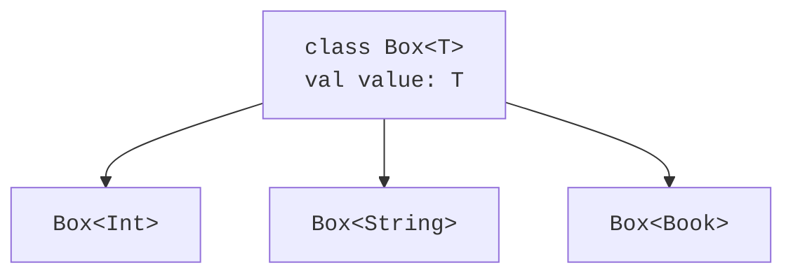

# Type parameters and generic classes

## A type parameter as part of the contract

In `class Box<T>`, the letter `T` denotes a **type parameter**. In `Box<String>`, the type `String` is a **type argument**. Just as a parameter of an ordinary function receives an argument value, a generic parameter receives a type. However, the two mechanisms operate at different times: most generic checks are performed by the compiler, not by each individual call in the JVM.

```kotlin
class Box<T>(val value: T)

fun main() {
    val number = Box(42)
    val word: Box<String> = Box("Kotlin")
    val missing = Box<String?>(null)
    println(number.value + 1)
    println(word.value.length)
    println(missing.value)
}
```

The compiler infers `Box<Int>` from the first object's constructor. The result type of `number.value` remains `Int`, so the addition needs no cast. In the third object the container itself exists, but the value in it allows `null`. That is not the same as `Box<String>?`: in the latter, the container itself may be absent.



Figure 9.1. A single class template produces different container types. {.caption}

The names `T`, `E`, `K`, `V` are a convention: type, element, key, value. In a complex interface, descriptive names such as `Input` and `Output` are helpful. Multiple parameters are separated by commas: `class Entry<K, V>(val key: K, val value: V)`. The parameters do not have to be different types: `Entry<String, String>` is perfectly valid. The relationship between the arguments is defined by the declaration, not by their names.

Type inference does not mean losing static typing. For an empty container there is sometimes no value from which `T` can be inferred; in that case the argument is specified explicitly. In a public API, an explicit result type helps preserve the contract when the implementation changes. Do not declare everything as `Any` just to make a faulty program compile: that loses the very guarantee the type parameter was introduced for.

## Example 1. A stack on linked nodes

A stack follows the LIFO rule: the last element added is the first to leave. Each node stores a value and a reference to the next node. The head is the top. Adding does not traverse the whole structure: one node is created, and then the head changes.

The `T : Any` constraint in this example forbids nullable elements. So `peekOrNull()` unambiguously reports `null` for an empty stack. If `null` were a valid element, a separate emptiness flag or a sealed result would be needed. The `pop()` method has a different contract: it returns an element or throws `NoSuchElementException`.

```kotlin
class Stack<T : Any> {
    private class Node<T>(
        val value: T,
        val next: Node<T>?
    )

    private var head: Node<T>? = null
    var size: Int = 0
        private set

    fun push(value: T) {
        head = Node(value, head)
        size++
    }

    fun peekOrNull(): T? = head?.value

    fun pop(): T {
        val first = head
            ?: throw NoSuchElementException("empty stack")
        head = first.next
        size--
        return first.value
    }
}

fun main() {
    val numbers = Stack<Int>()
    numbers.push(10)
    numbers.push(20)
    println("${numbers.peekOrNull()} ${numbers.size}")
    println("${numbers.pop()} ${numbers.pop()}")
    println(numbers.peekOrNull())
    try {
        numbers.pop()
    } catch (error: NoSuchElementException) {
        println(error.message)
    }
    val words = Stack<String>()
    words.push("first")
    println(words.pop())
}
```

The expected result is verified by running the program:

```text
20 2
20 10
null
empty stack
first
```

The stack invariant: `size` equals the number of nodes reachable from `head`; an empty stack has zero size and an empty head. The `pop()` error is checked before the fields change, so a failed call does not change the state. The nodes are private: external code cannot create a cycle or modify the chain while bypassing the counter.

The `push`, `pop`, and `peekOrNull` operations have constant time complexity O(1). Memory grows as O(n), where n is the number of elements. Generalization does not change these estimates. On the JVM, a numeric type argument may require boxing the values; that is why the next topic separately covers the specialized `IntArray` arrays.
