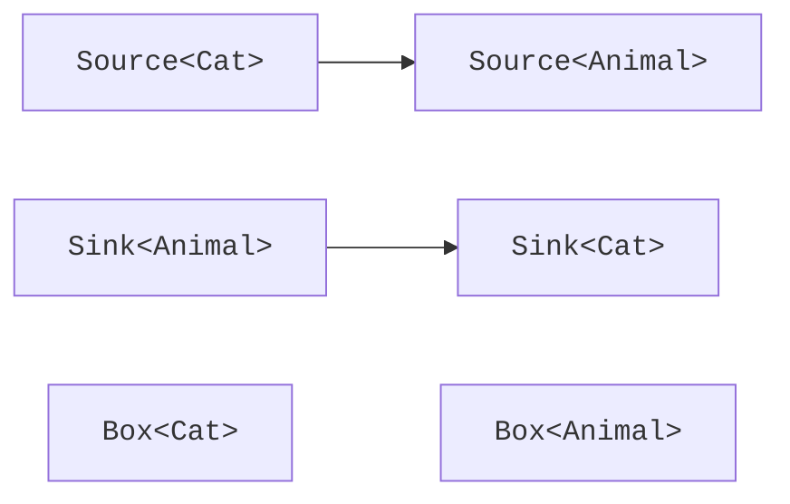

# Variance and projections

## Invariance: why an element subtype is not enough

Let `Cat` be a subtype of `Animal`. It does not follow that `MutableBox<Cat>` is a subtype of `MutableBox<Animal>`. If a dog could be written through the second reference, the first reference would no longer guarantee a cat. That is why an ordinary class parameter is **invariant** by default.

```kotlin
class MutableBox<T>(var value: T)

fun main() {
    val words = MutableBox("hello")
    // Deliberate error: uncomment separately.
    // val anything: MutableBox<Any> = words
    println(words.value.length)
}
```

The error occurs at the assignment, before any possible incorrect write. Declaring `words` as `val` does not make the `value` field immutable: it only forbids reassigning the reference itself. Even a read-only class stays invariant until its parameter is explicitly marked `out`.

::: info Screenshot
IntelliJ IDEA: MutableBox&lt;String&gt; assigned to MutableBox&lt;Any&gt;; show compiler diagnostic.
:::

Figure 9.2. The compiler rejects an unsafe container assignment. {.caption}

## Declaration-site variance

The parameter `out T` means a covariant contract: the interface produces values of `T` but does not accept an arbitrary `T` from the client. Then a source of cats can be used as a source of animals. The parameter `in T` means a contravariant contract: a consumer accepts `T` but does not promise to return it. A consumer of all animals is also suitable for cats.

The rule "producer is out, consumer is in" helps you read an API, but you must check all available operations. A function parameter is an in-position, and the result is an out-position. A `var` property has a getter and a setter, so it uses the type in both directions.



Figure 9.3. The direction of allowed assignments for a producer and a consumer. {.caption}

### Example 3. Producers and consumers

```kotlin
open class Animal(val name: String)
class Cat(name: String) : Animal(name)

fun interface Source<out T> {
    fun next(): T
}

fun interface Sink<in T> {
    fun accept(value: T)
}

fun <T> transfer(source: Source<T>, sink: Sink<T>) {
    sink.accept(source.next())
}

fun main() {
    val cats: Source<Cat> = Source { Cat("Murka") }
    val animals: Source<Animal> = cats
    val printer: Sink<Animal> = Sink { println(it.name) }
    val catPrinter: Sink<Cat> = printer
    catPrinter.accept(cats.next())
    transfer(animals, printer)
}
```

```text
Murka
Murka
```

The lambdas here merely create implementations of functional interfaces with a single method; the detailed syntax of functional programming is covered in Topic 11. The example can be rewritten with ordinary classes without changing any variance guarantee.

Variance does not transform or copy the object. The references `cats` and `animals` point to the same source but expose different static contracts. Likewise, `Sink<Animal>` does not start accepting only cats: all that is restricted is how it is used through a particular variable.

## Use-site projections

Sometimes a class cannot be changed, or it is legitimately invariant. `Array<T>` and a container with a getter/setter have both directions. The projection `out T` restricts a particular use to reading; `in T` allows passing values of `T`, but the result of a read has to be treated as the general upper type.

```kotlin
fun copyFirst(from: Array<out Number>, to: Array<in Int>) {
    require(from.isNotEmpty() && to.isNotEmpty())
    val first: Number = from[0]
    to[0] = first.toInt()
}

fun main() {
    val source = arrayOf(7, 8)
    val target = arrayOf<Any>("old")
    copyFirst(source, target)
    println(target[0])
}
```

The projection does not prove that the numeric conversion is safe for all values: `toInt()` can drop the fractional part. That is a separate domain contract. In the demo, the source is integral; universal copying without conversion is better described with a single parameter `T`.

The star projection `Box<*>` means an unknown but consistent type argument. It is not the same as `Box<Any?>`. Values can be read with respect to the upper bound, but an arbitrary value cannot be written. For `Foo<out T : Upper>`, it behaves like `Foo<out Upper>`; for a consumer, the safe input narrows to `Nothing`.

The check `is Box<*>` tests the outer class. It does not prove that there is a `String` inside. Use the star when the algorithm really does not need the exact element type, for example to print a diagnostic representation. It should not replace a concrete argument in an ordinary application API.
