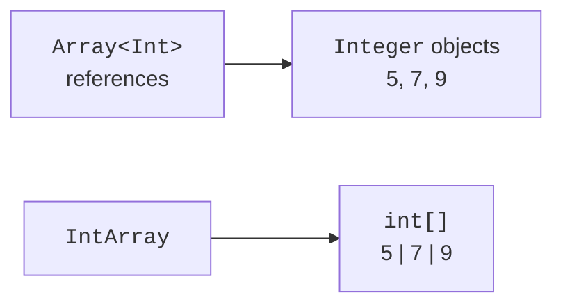

# Arrays

## Arrays: size and element type

`Array<T>` stores a fixed number of elements. Indices start at zero, and the last valid index equals `size - 1`. The `indices` property gives the range of all valid indices, and `lastIndex` is -1 for an empty array. Access with an invalid index throws an exception.

```kotlin
fun main() {
    val names = arrayOf("Ada", "Bohdan")
    names[1] = "Olena"
    val squares = IntArray(4) { index -> index * index }
    println(names.contentToString())
    println(squares.contentToString())
    println(squares.getOrNull(4))
    val copy = squares.copyOf()
    println(squares == copy)
    println(squares.contentEquals(copy))
}
```

```text
[Ada, Olena]
[0, 1, 4, 9]
null
false
true
```

The constructor's lambda here specifies the value by index. Its full syntax is covered later; at this stage it is enough to read the expression as a rule for filling each element. The array remains mutable even though the variable is declared with `val`.

For arrays, `==` does not mean comparing all elements. Use `contentEquals`, and for nested arrays, `contentDeepEquals`. For printing, use `contentToString` and `contentDeepToString` respectively. A plain `toString()` may give a technical representation of the reference, which is not a report about the contents.



Figure 10.1. A general array of references and a specialized numeric array. {.caption}

On the JVM, `Array<Int>` corresponds to an array of references to boxed numbers, and `IntArray` to `int[]`. Likewise there are `DoubleArray`, `LongArray`, and other specialized arrays. They are not subtypes of `Array<Number>` or `Array<Int>`. The `toTypedArray()` conversion creates a different representation and may cause boxing.

## Example 1. A week of temperatures

For seven finite temperatures, we compute the minimum, maximum, and mean. A separate function works with an arbitrary non-empty array; the absence of data is a contract violation, not a mean of zero. Using a loop makes the sequence of computations explicit.

```kotlin
data class Summary(
    val minimum: Double,
    val maximum: Double,
    val mean: Double
)

fun summarize(values: DoubleArray): Summary {
    require(values.isNotEmpty()) { "empty data" }
    var minimum = Double.POSITIVE_INFINITY
    var maximum = Double.NEGATIVE_INFINITY
    var total = 0.0
    for (value in values) {
        require(value.isFinite()) { "non-finite value" }
        if (value < minimum) minimum = value
        if (value > maximum) maximum = value
        total += value
    }
    require(total.isFinite()) { "sum overflow" }
    return Summary(minimum, maximum, total / values.size)
}

fun main() {
    val week = doubleArrayOf(10.0, 12.0, 9.0, 11.0,
        13.0, 14.0, 15.0)
    println(summarize(week))
    check(summarize(doubleArrayOf(-3.0)).mean == -3.0)
    try {
        summarize(doubleArrayOf())
    } catch (error: IllegalArgumentException) {
        println(error.message)
    }
}
```

```text
Summary(minimum=9.0, maximum=15.0, mean=12.0)
empty data
```

The value `NaN` is dangerous for the minimum and maximum: ordinary comparisons with it do not give the expected numeric order. That is why the finiteness check is done before aggregation. Very large data sets with different scales need numerically stable summation algorithms; this example has the educational contract of a small set of measurements.

## Two-dimensional arrays

A matrix `Array<IntArray>` is an array of rows. Each row is a separate object and can have its own length. So the type by itself does not guarantee a rectangular shape. Before transposing or accessing by two indices, check that the rows have the same length.

The correct construction `Array(rows) { IntArray(columns) }` creates a new inner array at each step. If one created row is placed in every position, a change to an element will be visible through every reference. Copying only the outer array does not copy the rows either. The required copy depth is determined by the ownership contract.
