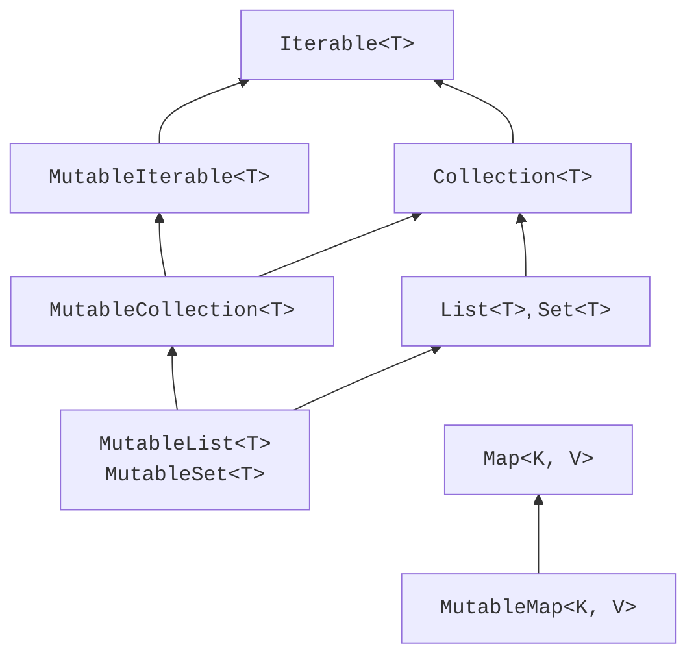
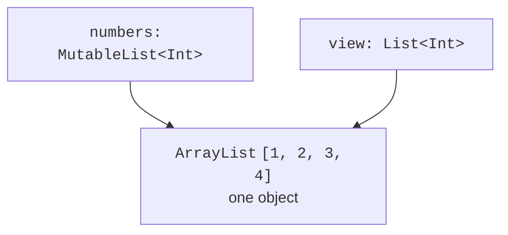

# The collection hierarchy and lists

## The collection hierarchy

`Iterable<T>` lets you obtain an iterator. `Collection<T>` adds the size and checks for emptiness and membership. `List<T>` adds positional access and order; `Set<T>` adds uniqueness. `Map<K,V>` forms a separate branch, since its element is a mapping from a key to a value rather than just a single `T`.



Figure 10.2. The main collection contracts; the mutable interfaces extend the corresponding read-only interfaces. {.caption}

The `MutableList`, `MutableSet`, and `MutableMap` interfaces expose modifying operations. If a function only reads a list, a `List<T>` parameter expresses its needs more precisely than `MutableList<T>`. The covariance of `List<out T>` allows passing a list of subtypes; mutable lists are invariant to prevent incorrect insertion.

In a map, values are covariant in the read-only interface, but the key should not be mechanically assumed to be covariant. The best practice is to accept the minimal sufficient interface and make no assumptions about the actual implementation. The `List` interface does not promise constant-time indexed access for every possible implementation.

## Read-only does not mean immutable

A reference of type `List<Int>` has no `add` method, but the same object can change through another reference. `val` forbids replacing the reference, not changing the contents. These are three different properties: the variable being constant, the operations available through the interface, and the actual immutability of the object.

```kotlin
fun main() {
    val numbers = mutableListOf(1, 2, 3)
    val view: List<Int> = numbers
    val snapshot: List<Int> = numbers.toList()
    numbers.add(4)
    println(view)
    println(snapshot)
}
```

```text
[1, 2, 3, 4]
[1, 2, 3]
```



Figure 10.3. Two references expose different interfaces of the same list. {.caption}

`toList()` creates a snapshot of the elements but does not clone the objects inside. If an element contains mutable fields, both collections can see their changes. Returning a defensive copy is appropriate at a class boundary, when the client must not gain access to the internal structure.

For persistent immutable structures there is the `kotlinx.collections.immutable` library. It is beyond the scope of the required work; do not call just any `listOf` a deeply immutable structure. The documentation of your own API should say explicitly whether it returns a live view, a snapshot, or an independent deep copy.

## Lists and positional operations

`listOf` creates a read-only list, `mutableListOf` a mutable one. `ArrayList` explicitly specifies the common implementation backed by a dynamic array. `buildList` lets you fill a list in a local builder and return a read-only interface; a reference to the builder should not escape its lambda.

`get(index)` or square brackets require a valid index; `getOrNull(index)` returns `null` if the position does not exist. `indexOf(value)` returns -1 for a missing element. The `remove(value)` method removes the first equal element, and `removeAt(index)` removes by position. For a list of integers, this difference is especially important.

The `+` and `-` operators usually produce a new collection. The expression `items + value` without assigning the result does not change the original list. The behavior of `+=` depends on the static type and the available operators, so in educational code `add` or an explicit assignment often shows the intent better.

### Example 2. A shopping list

```kotlin
class ShoppingList {
    private val items = mutableListOf<String>()

    fun add(name: String) {
        val normalized = name.trim()
        require(normalized.isNotEmpty()) { "empty name" }
        items.add(normalized)
    }

    fun removeFirst(name: String): Boolean = items.remove(name)

    fun rename(index: Int, name: String) {
        require(index in items.indices) { "bad index" }
        require(name.isNotBlank()) { "empty name" }
        items[index] = name.trim()
    }

    fun snapshot(): List<String> = items.toList()
}

fun main() {
    val shopping = ShoppingList()
    shopping.add("bread")
    shopping.add("milk")
    shopping.add("bread")
    val before = shopping.snapshot()
    println(shopping.removeFirst("bread"))
    shopping.rename(0, "water")
    println(before)
    println(shopping.snapshot())
    println(shopping.removeFirst("tea"))
}
```

```text
true
[bread, milk, bread]
[water, bread]
false
```

The class deliberately allows duplicates. If the domain task requires one item with a quantity, a map from name to quantity would be the more appropriate structure. There is no need to force a list to fit a contract that is naturally expressed by another collection.

`subList(from, to)` is a view of a section in which the left bound is included and the right one is not. A change through the view can change the original list. A structural change of the parent list outside the view can make further use of the view invalid. For an independent result, explicitly create a copy with `toList()`.
