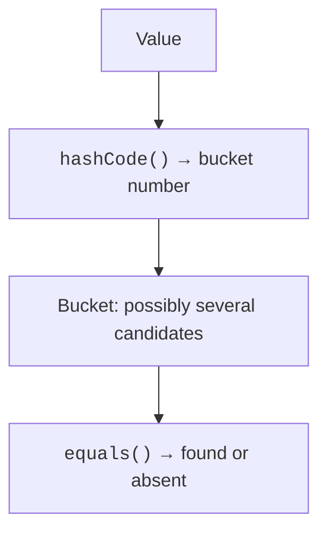

# Sets and maps

## Sets and equality

`Set<T>` stores at most one element with a given equality. Adding a duplicate does not increase the size. `HashSet` usually provides fast lookup but does not promise an iteration order. `LinkedHashSet` preserves insertion order. On the JVM, `sortedSetOf` creates a set sorted by natural order or by a comparator.



Figure 10.4. The hash narrows the search to a bucket, and equality distinguishes collisions. {.caption}

The diagram does not give the exact formula of a specific implementation: mapping a hash to a bucket depends on the structure and size of the table. Equal objects must have the same `hashCode`. The same hash does not prove equality: collisions are normal, and an `equals` check is needed within a bucket.

If a field that equality and the hash depend on is changed after insertion, the element may remain in the "old" bucket. Lookup and removal become unreliable. So keys and elements of hash sets must be stable with respect to equality for as long as they are in the collection.

### Example 3. Unique words

```kotlin
fun words(text: String): Set<String> {
    val result = linkedSetOf<String>()
    for (part in text.lowercase().split(' ')) {
        val word = part.trim('.', ',', '!', '?')
        if (word.isNotEmpty()) result.add(word)
    }
    return result
}

fun main() {
    val first = words("Cat dog cat owl.")
    val second = words("Dog fox!")
    println(first)
    println(first intersect second)
    println(first union second)
    println(first subtract second)
    check(words("   ").isEmpty())
}
```

```text
[cat, dog, owl]
[dog]
[cat, dog, owl, fox]
[cat, owl]
```

The parsing contract is limited to spaces and the listed characters at the edges of a word. This is not universal linguistic tokenization: hyphens, apostrophes, and various kinds of whitespace need a separate rule. Union, intersection, and difference return new sets without changing the original data. Difference is asymmetric: `A subtract B` and `B subtract A` can give different results.

For a sorted set, uniqueness is determined by comparison. If a comparator compares people only by age, two different people of the same age may be treated as one element. The comparator must match what the domain task considers key identity.

## Maps: key, absence, and value

`Map<K,V>` associates each key with at most one value. Inserting with an existing key replaces the value. The constructor `mapOf("Ada" to 90)` uses the infix function `to`, which creates a pair; it is not special map syntax.

`map[key]` returns a nullable result. If `V` is itself nullable, `null` can mean either a missing key or a stored empty value. To distinguish them, use `containsKey`. `getValue` throws an exception if the key is absent; `getOrDefault` returns a fallback value for a missing key.

`getOrPut` is convenient for creating a nested collection. It calls the initial-value function when the existing value is absent or equal to `null`. An ordinary mutable map with this operation should not be considered thread-safe; concurrent interaction is covered separately in the coroutines topic.

### Example 4. A frequency map

```kotlin
fun frequencies(text: String): Map<String, Int> {
    val counts = mutableMapOf<String, Int>()
    for (word in text.lowercase().split(' ')) {
        if (word.isBlank()) continue
        counts[word] = counts.getOrDefault(word, 0) + 1
    }
    return counts.toSortedMap()
}

fun main() {
    val counts = frequencies("red blue red green blue red")
    for ((word, count) in counts) {
        println("$word: $count")
    }
    val positions = mutableMapOf<String, MutableList<Int>>()
    val tokens = listOf("red", "blue", "red")
    for ((index, word) in tokens.withIndex()) {
        positions.getOrPut(word) { mutableListOf() }.add(index)
    }
    println(positions)
    println(counts["black"])
}
```

```text
blue: 2
green: 1
red: 3
{red=[0, 2], blue=[1]}
null
```

Sorting by keys ensures a reproducible report. The internal structure can be chosen for update speed, and the order for the user can be set at the output stage. For a `HashMap`, you cannot rely on an order that happens to be stable in a particular run.

`keys`, `values`, and `entries` are views of the map. In a mutable map, removal through the corresponding mutable view affects the map itself. A `toMap()` copy separates the structure of mappings, but nested mutable lists may remain shared.

::: info Screenshot
IntelliJ IDEA Debug: expand positions map, red entry and its list; show sizes and values.
:::

Figure 10.5. A nested map of positions in the debugger. {.caption}
