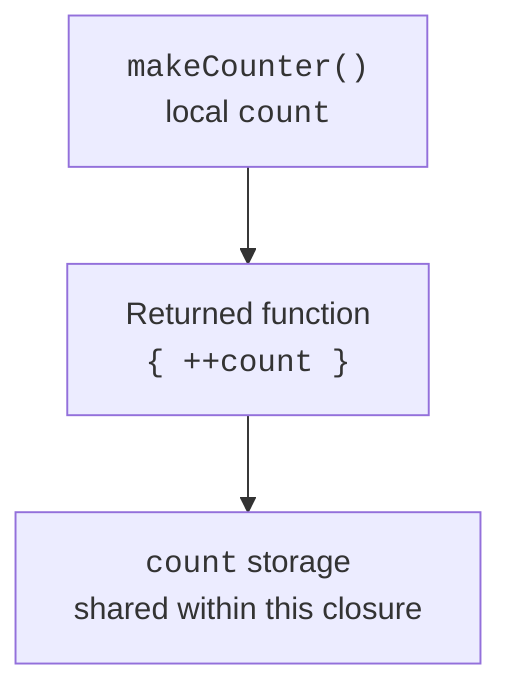

# Closures and inline functions

## Closures and the lifetime of state

A lambda can access the local variables of the enclosing function. Together with the required environment, it forms a **closure**. The captured state can outlive the call of the function that created it. Each call of a closure factory can have its own independent environment.



Figure 11.2. The returned function keeps access to the captured state. {.caption}

Capturing a `var` does not create an immutable snapshot of its value. If several lambdas refer to the same variable, they can see shared changes. This is convenient for a local counter, but it makes the order of calls part of the behavior. Such state is not thread-safe by itself.

A higher-order function can not only receive a function but also return one. For example, a discount factory captures a percentage, and the returned function receives an amount. The percentage should be validated when the strategy is created, and the amount when it is applied.

Composition combines two functions: first `f`, then `g`. The result type of the first must match the input type of the second. The generic signatures `(A) -> B` and `(B) -> C` give the result `(A) -> C`. Name the order of composition explicitly so as not to confuse the mathematical and programming conventions.

```kotlin
fun <A, B, C> then(
    first: (A) -> B,
    second: (B) -> C
): (A) -> C = { value -> second(first(value)) }

fun main() {
    val normalizedLength = then(
        { text: String -> text.trim() },
        { text: String -> text.length }
    )
    println(normalizedLength("  Kotlin  "))
}
```

## Inline and return control

`inline` lets the compiler substitute the body of a function and the corresponding lambdas at the call site. This can remove some function objects and indirect calls, but it increases the generated code. The modifier is not a universal "make it faster" command; it is used for small higher-order functions and reified parameters.

In a lambda for `forEach`, which is an inline function, `return` can exit the enclosing function. `return@forEach` exits only the current lambda invocation and moves on to the next element. It is not a full analog of `break`: for interrupting a search, `firstOrNull` or an ordinary loop is often a better fit.

```kotlin
fun containsZero(values: List<Int>): Boolean {
    values.forEach { value ->
        if (value == 0) return true
    }
    return false
}

fun main() {
    listOf(-1, 0, 2).forEach { value ->
        if (value < 0) return@forEach
        println(value)
    }
    println(containsZero(listOf(1, 0, 3)))
}
```

`noinline` forbids inlining a particular function parameter. This is needed when it is stored as a value or passed on to an ordinary API. `crossinline` allows inlining but forbids non-local return, because the call may end up in a different context, for example inside a `Runnable` object.

```kotlin
inline fun task(crossinline action: () -> Unit): Runnable =
    Runnable { action() }

inline fun combine(
    first: () -> Unit,
    noinline later: () -> Unit
): () -> Unit {
    first()
    return later
}

fun main() {
    task { println("task") }.run()
    val later = combine({ println("now") }, { println("later") })
    later()
}
```

This example does not start a thread: `run()` executes the action on the current thread. The words `later` and `task` describe the order of calls, not concurrency. A stored callback has its own lifetime and may keep captured objects alive even if they are no longer visible in another part of the program.
