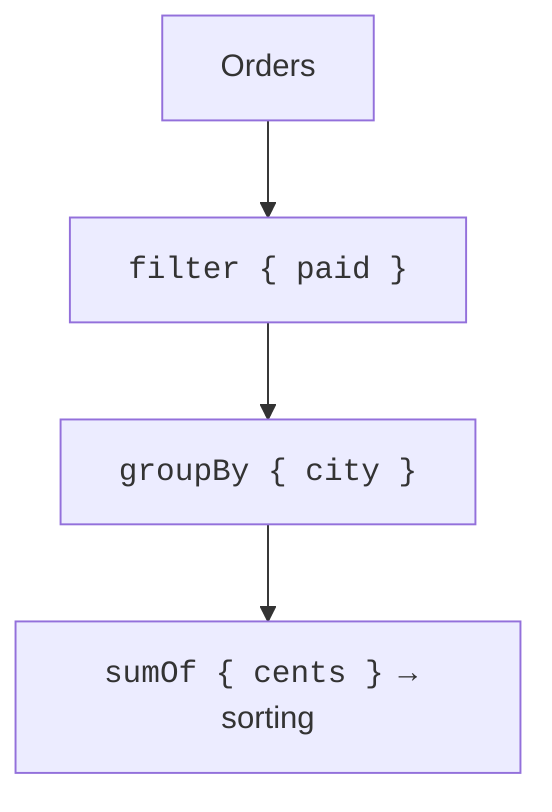

# Collection operations

## Transformation and filtering

`map` returns one result for each element. `mapNotNull` additionally drops nullable results. `filter` keeps the elements that satisfy a predicate. `forEach` performs actions and returns `Unit`: do not use it instead of `map` when you need a collection of results.

`any`, `all`, and `none` check conditions and stop as soon as the result is known. For an empty collection, `all` and `none` are true and `any` is false. If the domain requirement says "there is at least one element and all are valid", the `all` check alone is not enough.

`first` throws an exception when there is no result; `firstOrNull` returns `null`. `maxByOrNull` also lets you handle an empty set naturally. `count` counts elements, and `sumOf` computes the sum of the selected values. For money, it is convenient to store whole kopiykas and choose `Long`, checking the allowed range of amounts.

::: info Screenshot
IntelliJ IDEA editor: filter/map chain; enable Kotlin lambda and chain type inlay hints.
:::

Figure 11.4. Parameter and result types of a chain in the editor. {.caption}

## Grouping, indexes, and folding

`groupBy` creates a map of lists: all elements with a common key remain in a group. `associateBy` creates one element per key; a repeated key replaces the previous one. Do not use it as a uniqueness check without a separate check for repeats.

`groupingBy().eachCount()` counts per key without creating a list of each group for the client. `partition` returns a pair of lists: first those that passed the predicate, then the rest. `associate` builds a key/value pair for each element and also has a replacement policy for repeated keys.

`fold(initial)` starts with the given accumulator and works correctly on empty data. `reduce` uses the first element as the start and, without a separate policy, is not suitable for an empty set. The accumulator type of `fold` can differ from the element type.

### Example 3. An order report

```kotlin
data class Order(
    val id: Int,
    val city: String,
    val cents: Long,
    val paid: Boolean
)

fun totals(orders: List<Order>): List<Pair<String, Long>> {
    require(orders.all { it.cents in 0..1_000_000 })
    require(orders.size <= 100_000)
    require(orders.map { it.id }.toSet().size == orders.size)
    return orders.filter { it.paid }
        .groupBy { it.city }
        .map { (city, values) -> city to values.sumOf { it.cents } }
        .sortedWith(
            compareByDescending<Pair<String, Long>> { it.second }
                .thenBy { it.first }
        )
}

fun main() {
    val orders = listOf(
        Order(1, "London", 500, true),
        Order(2, "Madrid", 700, true),
        Order(3, "London", 200, true),
        Order(4, "Paris", 900, false)
    )
    println(totals(orders))
    println(totals(emptyList()))
    println(orders.groupingBy { it.paid }.eachCount())
    println(orders.fold(0L) { sum, order -> sum + order.cents })
}
```

```text
[(London, 700), (Madrid, 700)]
[]
{true=3, false=1}
2300
```



Figure 11.5. The report selects paid orders, groups them, and aggregates. {.caption}

The second sort key is needed for a reproducible tie order. The upper limits on the count and price make it possible to prove that the sum fits into a `Long`. An empty result is not an error; it means there are no paid orders. The original list is not changed.

`zip` pairs up the elements of two collections by position and stops at the shorter one. If the lengths must match, they must be checked separately. `flatMap` turns each element into a collection and concatenates those collections. `chunked(n)` splits into blocks, and `windowed(n)` forms sliding windows; the step and partial-window parameters change the result.

`distinctBy` keeps the first element for each key. This is also a policy of losing repeated records, so it must be chosen deliberately. For example, if you need the latest sensor measurement, the first element of the original list may be the wrong choice.
