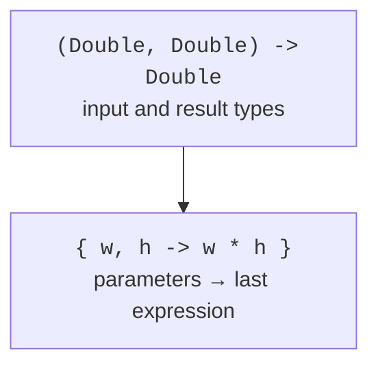

# Function types and lambdas

## Function types

The type `(Int, Int) -> Int` describes a function with two integer parameters and an integer result. The type `() -> Unit` describes an action with no parameters and no useful result. The type `(String) -> Boolean` is often called a predicate. The type itself does not say whether the function changes external state; that must be documented separately.

```kotlin
typealias IntOperation = (Int, Int) -> Int

fun sum(a: Int, b: Int): Int = a + b

fun apply(a: Int, b: Int, operation: IntOperation): Int =
    operation(a, b)

fun main() {
    val add: IntOperation = ::sum
    val multiply: IntOperation = { a, b -> a * b }
    println(apply(3, 4, add))
    println(apply(3, 4, multiply))
    val optional: (() -> String)? = null
    println(optional?.invoke() ?: "no action")
}
```

```text
7
12
no action
```

The parentheses of a nullable function matter. `(() -> String)?` is a function that may be absent or present, while `() -> String?` is a function that is always present but may return `null`. Calling `invoke()` is equivalent to the call parentheses; a safe call is useful for a nullable function.

An alias makes code easier to read but does not create a new type. Two functions with identical signatures can have completely different domain meanings. If an API must distinguish a payment strategy from formatting, separate functional interfaces may express the intent better.

## Lambda syntax

A lambda has curly braces, an optional parameter list, an arrow, and a body. The value of the last expression becomes the result. Parameter types can be omitted if they are known from the expected function type. For a single parameter the name `it` is often available, but in nested lambdas explicit names reduce confusion.



Figure 11.1. The function type defines the contract, and the lambda the implementation. {.caption}

If the last parameter of a function is a function, the lambda can be moved outside the parentheses: `values.filter { it > 0 }`. If it is the only argument, the parentheses can be omitted. The `_` symbol denotes a parameter that is deliberately unused, for example when destructuring a key–value pair.

The reference `::function` passes an already declared function. The reference `::ClassName` can pass a constructor. `object::method` binds a function to a specific receiver object. A reference to an overloaded function sometimes needs an explicit expected type so that the compiler selects the right signature.

An anonymous function `fun(x: Int): Int { return x * x }` differs from a lambda in its `return` rules. Its ordinary `return` exits the anonymous function itself. A lambda passed to an inline function can, under certain conditions, perform a non-local return from the enclosing function.

## Example 1. A calculator with a map of operations

A map associates a text command with behavior. The table of operations is separated from argument validation and command lookup. Division has a domain rejection for a zero divisor; finiteness is checked for both the inputs and the result.

```kotlin
typealias Operation = (Double, Double) -> Double

val operations: Map<String, Operation> = mapOf(
    "+" to { a, b -> a + b },
    "-" to { a, b -> a - b },
    "*" to { a, b -> a * b },
    "/" to { a, b ->
        require(b != 0.0) { "division by zero" }
        a / b
    }
)

fun calculate(symbol: String, a: Double, b: Double): Double {
    require(a.isFinite() && b.isFinite()) { "invalid input" }
    val operation = operations[symbol]
        ?: throw IllegalArgumentException("unknown operation")
    val result = operation(a, b)
    require(result.isFinite()) { "result overflow" }
    return result
}

fun main() {
    println(calculate("+", 2.0, 3.0))
    println(calculate("/", 9.0, 2.0))
    try {
        calculate("/", 1.0, 0.0)
    } catch (error: IllegalArgumentException) {
        println(error.message)
    }
    try {
        calculate("?", 1.0, 2.0)
    } catch (error: IllegalArgumentException) {
        println(error.message)
    }
}
```

```text
5.0
4.5
division by zero
unknown operation
```

All functions in the map share one type contract but have their own preconditions. Adding a new operation does not require changing the lookup mechanism. On the other hand, changing the number type or the rounding policy changes the common contract and requires reviewing all the strategies.
