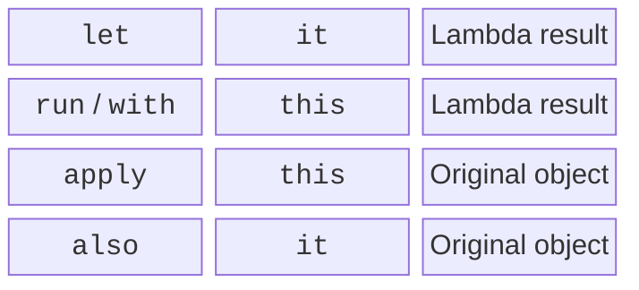

# Scope functions

## Lambdas with a receiver and scope functions

The type `StringBuilder.() -> Unit` adds a receiver object to the lambda. In the body, its methods are available as calls on `this`, often without an explicit name. `buildString` creates a builder, runs the lambda, and returns the finished string. This approach underlies small domain-specific DSLs.



Figure 11.3. Choosing a function by how it accesses the object and by its result type. {.caption}

`let` is convenient after `?.` for working with a present nullable value. `run` is suitable for computing a result in the context of an object. `with(obj)` groups calls on an existing object. `apply` returns the configured object, and `also` allows an additional action with it via `it`. `takeIf` returns the object if the predicate is true, or `null`; `takeUnless` has the opposite condition.

Do not nest several functions with implicit `this` and `it` without need. If it is hard to tell which object a field belongs to, name the parameter explicitly or use an ordinary variable. Scope functions do not create a new thread, do not copy the object, and do not change the null safety rules.

### Example 2. Configuring an object

```kotlin
class ReportOptions {
    var title: String = "Report"
    var limit: Int = 10
}

fun options(rawTitle: String?): ReportOptions {
    val title = rawTitle?.trim()?.takeIf { it.isNotEmpty() }
    return ReportOptions().apply {
        this.title = title ?: "Untitled"
        limit = 5
    }.also { value ->
        require(value.limit > 0)
    }
}

fun main() {
    val configured = options("  Sales  ")
    val text = with(configured) { "$title: $limit" }
    println(text)
    println(options(null).title)
    val message = buildString {
        append("Title=")
        append(configured.title)
    }
    println(message)
}
```

```text
Sales: 5
Untitled
Title=Sales
```

In `apply`, the local variable `title` and the property have the same name, so `this.title` explicitly refers to the object. The check in `also` does not change the value passed on. If the desired result were the finished text, `run` would be more appropriate than `apply`.
