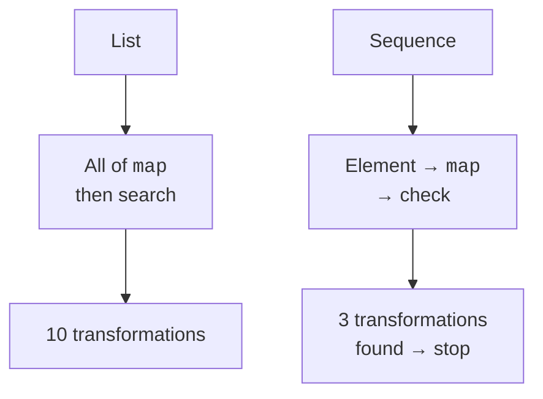

# Sequences and SAM interfaces

## Sequences and lazy processing

Operations on ordinary collections are mostly executed immediately and create intermediate collections. `Sequence<T>` describes element-by-element retrieval of values. The intermediate `map` and `filter` configure the pipeline; the terminal `toList`, `first`, and `sum` run it.



Figure 11.6. A list processes in stages, a sequence along the path of an individual element to the result. {.caption}

Laziness lets you stop work once the required number of items has been found. However, `sorted` must see all the elements to produce the first one in the correct order. An infinite sequence cannot be unconditionally sorted or converted to a list.

A sequence is not necessarily faster than a list. For a small set, the extra objects and indirect calls can outweigh the benefit of not having intermediate lists. You need to compare the actual workload, with the same result and JVM warm-up.

### Example 4. Prime numbers and a computation limit

The generator produces prime numbers up to an explicitly given limit. The condition `divisor <= number / divisor` avoids overflow of the multiplication `divisor * divisor`. The educational upper limit is bounded for a predictable running time.

```kotlin
fun isPrime(number: Int): Boolean {
    if (number < 2) return false
    var divisor = 2
    while (divisor <= number / divisor) {
        if (number % divisor == 0) return false
        divisor++
    }
    return true
}

fun primes(limit: Int): Sequence<Int> = sequence {
    require(limit in 0..1_000_000)
    for (number in 2..limit) {
        if (isPrime(number)) yield(number)
    }
}

fun main() {
    println(primes(100).take(5).toList())
    println(primes(1).toList())
    var eagerCalls = 0
    val eager = (1..10).map { eagerCalls++; it * it }
        .first { it >= 9 }
    var lazyCalls = 0
    val lazy = (1..10).asSequence()
        .map { lazyCalls++; it * it }
        .first { it >= 9 }
    println("$eager $eagerCalls")
    println("$lazy $lazyCalls")
}
```

```text
[2, 3, 5, 7, 11]
[]
9 10
9 3
```

The counters in the example were added only to observe the order. In an application pipeline, `map` should preferably be a pure transformation: a repeated traversal may repeat all side effects. `sequence {}` usually runs its body again for a new traversal; some sources may allow only one traversal. Check the source's contract.

`generateSequence(seed) { next }` conveniently specifies a recurrence rule. Returning `null` ends the generation. For Fibonacci numbers, you need to define the behavior before `Long` overflows; a mathematical series that is infinite by design does not become an infinite machine numeric type.

::: info Screenshot
IntelliJ IDEA Debug: break after first; show eagerCalls=10 and lazyCalls=3. Use stream trace only if supported for this Kotlin chain.
:::

Figure 11.7. Observing the number of computations in a lazy pipeline. {.caption}

A lazy resource must not outlive its owner. If a sequence of lines comes from an open file, it must be processed before the reader is closed. Returning such a sequence from `use` creates an object that will try to read an already closed resource. In the next topic, this contract is shown with `useLines`.

## Functional interfaces and Java SAM

`fun interface Predicate<T> { fun test(value: T): Boolean }` has one abstract method and can be created with a lambda. Unlike an alias of a function type, it is a separate contract type with its own name and possible helper methods. Java interfaces such as `Runnable` also support SAM conversion.

When passing a lambda to a Java API, pay attention to nullable types, exceptions, and execution time. The API may store the callback and call it later or on another thread. Captured mutable state then needs a different analysis than a local sequential `map`.

The practical rule of choice is simple: a loop shows complex state management and early exits well; collection operations show filtering, transformation, and aggregation well; a sequence is appropriate when laziness and short-circuiting are useful. Each option should be tested on an empty set, repeated keys, and the limits of numeric types.
