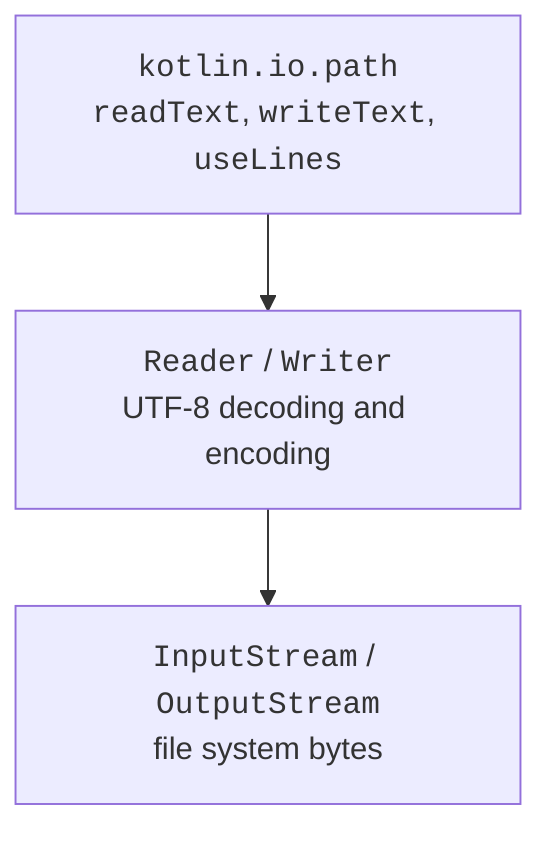

# Files, text, and bytes

## The path and the working directory

`java.nio.file.Path` describes a path, but it does not open the file or prove that it exists. The function `kotlin.io.path.Path("data", "books.json")` conveniently builds a path from components. `resolve` appends a relative part, `parent` gives the parent directory, and `fileName` the last component. An absolute path defines a location regardless of the current working directory.

A relative path is resolved against the process's working directory, not against the directory of the `.kt` source file. IntelliJ IDEA, Gradle, and running a JAR can have different settings for this directory. For diagnostics, print `Path("").toAbsolutePath()`, and in the program's interface it is better to accept the input and output paths as arguments.

`normalize()` removes the syntactic segments `.` and `..`, but it does not establish real identity through symbolic links. `toRealPath()` accesses the file system and can throw an exception. If a program restricts its work to a particular directory, checking only a textual prefix is not enough for every file system situation.

`exists()` is useful for a message, but it does not guarantee that the next read will succeed: the state can change between the check and the opening. The main operation must still be performed with error handling. `createDirectories()` creates missing parent directories; an already existing directory is an ordinary success case.



Figure 12.1. High-level reading relies on encodings and lower-level resources. {.caption}

## Text, bytes, and closing resources

Text data is stored as bytes in a specific encoding. The examples use UTF-8 explicitly. One Unicode letter can take several bytes, and on the JVM `String.length` counts UTF-16 code units, not necessarily visible characters. So the file size in bytes, the string length, and the number of graphemes are different measures.

`readText` loads the whole file into a string; `readLines`, into a list of lines. For small configuration files this is convenient. `useLines` provides a lazy sequence of lines inside a block and closes the reader when it finishes, including on exit via an exception.

```kotlin
import java.nio.file.Files
import kotlin.io.path.readText
import kotlin.io.path.useLines
import kotlin.io.path.writeText

fun main() {
    val file = Files.createTempFile("lines-", ".txt")
    try {
        file.writeText("Ada\nBohdan\n", Charsets.UTF_8)
        val count = file.useLines(Charsets.UTF_8) { lines ->
            lines.count()
        }
        println(count)
        println(file.readText(Charsets.UTF_8).startsWith("Ada"))
    } finally {
        Files.deleteIfExists(file)
    }
}
```

```text
2
true
```

Do not return `lines` from `useLines`: after leaving the block, the resource is already closed. Inside, you must compute the result or materialize the data you need. `use` applies to a closeable resource, such as a buffered reader, writer, or stream. It does not mean the write is transactional and does not undo bytes already written.

`writeText` replaces the file's contents, while `appendText` appends to the end. Before calling one, make sure the policy fits the task. For a report built from an input file, do not use the same path without a specially implemented safe replacement.

## Example 1. An event log

Each record has the simple structure `LEVEL|message`, one record per line. A message cannot contain line breaks or the separator. The program appends several events and counts only ERROR-level lines. A temporary file makes the demonstration independent of previous runs.

```kotlin
import java.nio.file.Files
import java.nio.file.Path
import kotlin.io.path.appendText
import kotlin.io.path.useLines

fun appendEvent(path: Path, level: String, message: String) {
    require(level in setOf("INFO", "WARN", "ERROR"))
    require(message.isNotBlank())
    require(message.none { it == '\n' || it == '\r' || it == '|' })
    path.appendText("$level|$message\n", Charsets.UTF_8)
}

fun errorCount(path: Path): Int =
    path.useLines(Charsets.UTF_8) { lines ->
        lines.count { it.startsWith("ERROR|") }
    }

fun main() {
    val path = Files.createTempFile("events-", ".log")
    try {
        appendEvent(path, "INFO", "start")
        appendEvent(path, "ERROR", "missing item")
        appendEvent(path, "WARN", "retry")
        println(errorCount(path))
        try {
            appendEvent(path, "INFO", "bad\nmessage")
        } catch (error: IllegalArgumentException) {
            println("invalid message")
        }
        println(errorCount(path))
    } finally {
        Files.deleteIfExists(path)
    }
}
```

```text
1
invalid message
1
```

The message is validated before writing, so an invalid record does not add a partial line. This is not a full multi-process logging system: concurrent writers, rotation, and synchronization need a separate solution. For an application log, a specialized library is often used rather than a custom text file.
