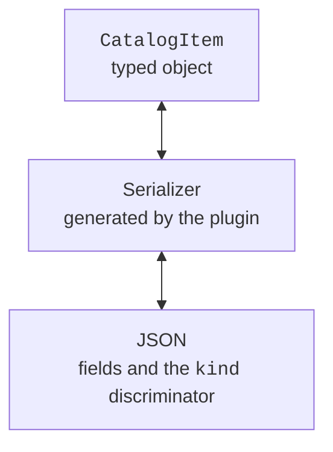

# JSON serialization

## Adding kotlinx.serialization and tests

The compiler plugin generates serializers for annotated classes, and the runtime library performs encoding and decoding. The plugin version matches Kotlin 2.4.20, while the runtime has its own numbering. Here we pin the stable kotlinx.serialization 1.11.0 and JUnit 6.0.3. A release candidate of the library is not a course requirement.

The complete `build.gradle.kts` for the examples of this topic:

```kotlin
import org.jetbrains.kotlin.gradle.dsl.JvmTarget

plugins {
    kotlin("jvm") version "2.4.20"
    kotlin("plugin.serialization") version "2.4.20"
}

repositories { mavenCentral() }

kotlin {
    jvmToolchain(27)
    compilerOptions { jvmTarget.set(JvmTarget.JVM_26) }
}
tasks.withType<JavaCompile>().configureEach {
    options.release.set(26)
}

dependencies {
    implementation(
        "org.jetbrains.kotlinx:kotlinx-serialization-json:1.11.0"
    )
    testImplementation(kotlin("test"))
    testImplementation(platform("org.junit:junit-bom:6.0.3"))
    testImplementation("org.junit.jupiter:junit-jupiter")
    testRuntimeOnly("org.junit.platform:junit-platform-launcher")
}

tasks.test { useJUnitPlatform() }
```

JDK 27 is the toolchain and the runtime environment. The bytecode target 26 is set explicitly according to what the Kotlin 2.4.20 compiler supports; this is not a substitute for the installed JDK. In the verified environment, Gradle runs on a compatible JVM 25, and the tasks use toolchain 27. The path to the local JDK is set in the IDE settings or a local `gradle.properties`, without copying someone else's absolute path into the project.

In `settings.gradle.kts`, it is enough to set the project name. To run the main class from the command line, you can add the `application` plugin; tests work through the `test` task even without it. If versions are moved to `gradle/libs.versions.toml`, keep one consistent Kotlin version for the JVM and serialization plugins.

::: info Screenshot
IntelliJ IDEA: build.gradle.kts with Kotlin JVM/serialization2.4.20, JSON1.11.0 and JUnit6.0.3; Gradle sync successful.
:::

Figure 12.2. The serialization plugin and dependencies in Gradle. {.caption}

## JSON and serializable models

The `@Serializable` annotation lets the plugin create a serializer. Calling `Json.encodeToString(value)` produces JSON, and `decodeFromString<Type>(text)` restores a value according to the type's schema. The decoder must not guess an arbitrary class from an external name; the program defines the available models.



Figure 12.3. The generated serializer reconciles the model and its JSON representation. {.caption}

`prettyPrint` changes the formatting, not the content. `encodeDefaults` determines whether fields with default values are written. `ignoreUnknownKeys` lets you skip unknown fields; for configuration this can help compatibility, but it can also hide a typo. `explicitNulls` controls explicit nulls in JSON; turning it off can affect the round trip for nullable fields with a non-null default value.

`@SerialName` sets the external name of a field or type. This lets you rename a Kotlin property without changing the file format. `@Transient` excludes a property from the schema; it must have a default value. Do not confuse this annotation with other JVM annotations with a similar name: the import matters.

### Example 3. A catalog with sealed polymorphism

Books and audiobooks have different fields but are stored in one list of the base type. The `kind` discriminator indicates the schema variant. The stable external names `printed` and `audio` do not depend on the fully qualified class name in the package.

```kotlin
import kotlinx.serialization.SerialName
import kotlinx.serialization.Serializable
import kotlinx.serialization.encodeToString
import kotlinx.serialization.json.Json

@Serializable
sealed interface CatalogItem {
    val title: String
}

@Serializable
@SerialName("printed")
data class PrintedBook(
    override val title: String,
    val pages: Int
) : CatalogItem {
    init { require(title.isNotBlank() && pages > 0) }
}

@Serializable
@SerialName("audio")
data class AudioBook(
    override val title: String,
    val minutes: Int
) : CatalogItem {
    init { require(title.isNotBlank() && minutes > 0) }
}

fun main() {
    val format = Json {
        classDiscriminator = "kind"
        prettyPrint = true
    }
    val items: List<CatalogItem> = listOf(
        PrintedBook("Kobzar", 200),
        AudioBook("Forest", 90)
    )
    val text = format.encodeToString(items)
    println(text)
    val restored = format.decodeFromString<List<CatalogItem>>(text)
    println(restored == items)
    check(restored.size == 2)
}
```

```text
[
    {
        "kind": "printed",
        "title": "Kobzar",
        "pages": 200
    },
    {
        "kind": "audio",
        "title": "Forest",
        "minutes": 90
    }
]
true
```

The JSON above is formatted with the `prettyPrint` option so that each object and field is easy to read in an editor. The static type `List<CatalogItem>` matters for polymorphic encoding: it tells the serializer that the elements are variants of the base contract. An open hierarchy instead of a sealed one would require registering the allowed subtypes in a `SerializersModule`.

::: info Screenshot
IntelliJ IDEA: data/books.json with printed/audio entries, kind discriminator and Project tree; no personal data.
:::

Figure 12.4. A formatted catalog in the JSON editor. {.caption}

For an unknown or partially known schema, you can decode a `JsonElement`, check for a `JsonObject`, and read the required fields. This is a JSON tree, not an automatically type-safe domain model. After checking the structure, you still need to validate the values and convert them into the model.

The JVM API `encodeToStream` lets you write to an `OutputStream` without creating a large intermediate string. In the version used, experimental APIs require the corresponding `@OptIn`. The stream must be closed with `use`; passing a stream to the serializer does not automatically hand it the ownership policy.

## Dates and a custom serializer

`java.time.LocalDate` represents a calendar date without a time or time zone. For the ISO string `2026-09-17`, the natural contract is `LocalDate.parse` and `toString`. The serializer must explicitly specify a primitive string descriptor rather than rely on the internal fields of the JDK class.

```kotlin
import java.time.LocalDate
import kotlinx.serialization.KSerializer
import kotlinx.serialization.Serializable
import kotlinx.serialization.descriptors.PrimitiveKind
import kotlinx.serialization.descriptors.PrimitiveSerialDescriptor
import kotlinx.serialization.encoding.Decoder
import kotlinx.serialization.encoding.Encoder
import kotlinx.serialization.encodeToString
import kotlinx.serialization.json.Json

object DateSerializer : KSerializer<LocalDate> {
    override val descriptor = PrimitiveSerialDescriptor(
        "LocalDate", PrimitiveKind.STRING
    )

    override fun serialize(encoder: Encoder, value: LocalDate) {
        encoder.encodeString(value.toString())
    }

    override fun deserialize(decoder: Decoder): LocalDate =
        LocalDate.parse(decoder.decodeString())
}

@Serializable
data class Deadline(
    @Serializable(with = DateSerializer::class)
    val date: LocalDate
)

fun main() {
    val value = Deadline(LocalDate.of(2026, 9, 17))
    val text = Json.encodeToString(value)
    println(text)
    println(Json.decodeFromString<Deadline>(text) == value)
}
```

```text
{"date":"2026-09-17"}
true
```

`@Contextual` is another approach: the serializer is looked up in the module of a specific `Json` instance. This is appropriate when the choice of representation belongs to the format configuration. Without registering the required contextual serializer, decoding will not start working on its own. For a first implementation, the explicit `with = DateSerializer::class` is easier to trace.
