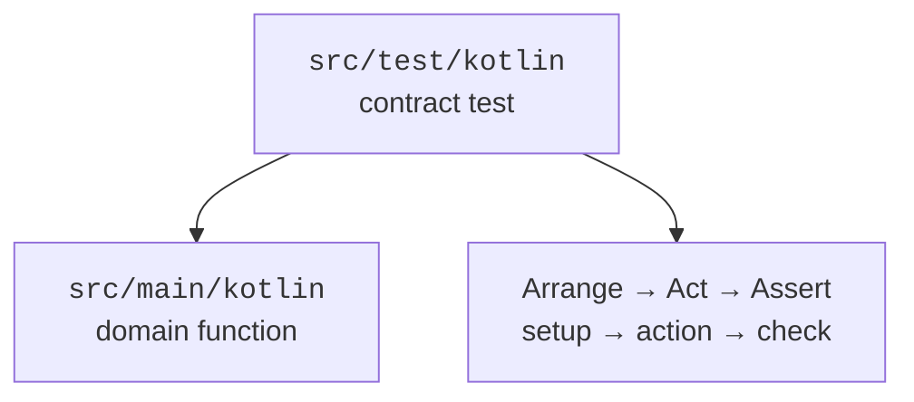

# Unit testing

## A unit test as an executable contract

A unit test checks specific behavior with a known input. It has an Arrange setup, an Act step, and an Assert check. The expected value is determined independently of the algorithm, not computed by the same function being tested.



Figure 12.5. Source code and tests have separate roles and separate directories. {.caption}

The main code lives in `src/main/kotlin`, and tests in `src/test/kotlin`. `kotlin.test` provides `assertEquals`, `assertTrue`, and `assertFailsWith`. The JUnit Platform discovers and runs tests, and Jupiter is the engine that executes them. `useJUnitPlatform()` is needed for Gradle to run the corresponding test platform correctly.

### Example 4. A grade calculator and a parameterized test

The file `GradeCalculator.kt` in the main source directory:

```kotlin
fun passed(score: Int): Boolean {
    require(score in 0..100) { "score outside 0..100" }
    return score >= 60
}

fun averageScore(scores: List<Int>): Double {
    require(scores.isNotEmpty()) { "empty scores" }
    require(scores.all { it in 0..100 })
    return scores.map { it.toDouble() }.average()
}
```

The file `GradeCalculatorTest.kt` in the test directory:

```kotlin
import kotlin.test.Test
import kotlin.test.assertEquals
import kotlin.test.assertFailsWith
import kotlin.test.assertTrue
import org.junit.jupiter.params.ParameterizedTest
import org.junit.jupiter.params.provider.CsvSource

class GradeCalculatorTest {
    @ParameterizedTest
    @CsvSource("0,false", "59,false", "60,true", "100,true")
    fun boundaries(score: Int, expected: Boolean) {
        assertEquals(expected, passed(score))
    }

    @Test
    fun mean() {
        val input = listOf(50, 70, 90)
        val result = averageScore(input)
        assertEquals(70.0, result)
        assertTrue(passed(result.toInt()))
    }

    @Test
    fun invalid() {
        assertFailsWith<IllegalArgumentException> { passed(-1) }
        assertFailsWith<IllegalArgumentException> { passed(101) }
        assertFailsWith<IllegalArgumentException> {
            averageScore(emptyList())
        }
    }
}
```

The four `CsvSource` rows create four test invocations, so the class has six executed tests. The boundaries 59 and 60 test the exact transition of the rule, and 0 and 100 test the inclusion of the extreme valid values. Invalid values are tested as a rejection, not as an arbitrary Boolean.

`@BeforeTest` and `@AfterTest` define setup and cleanup for an individual test. Tests must not depend on the execution order or modify a shared user file. For file checks, JUnit's `@TempDir` provides a separate temporary directory that is cleaned up after the test. The complete repository example is given in the lab assignment.

::: info Screenshot
IntelliJ IDEA: run GradeCalculatorTest; show six passing invocations. Demonstrate one deliberate failed assertion only in a separate temporary change.
:::

Figure 12.6. Results of parameterized and ordinary tests. {.caption}

## Running, reports, and coverage

Run `./gradlew test`, or on Windows `.\gradlew.bat test`. Gradle returns a nonzero code when tests fail. The HTML report is located in `build/reports/tests/test/index.html`; the XML results are easily read by an automated checking system. A saved report applies to a specific run, not to future changes.

::: info Screenshot
Browser: local build/reports/tests/test/index.html; show tests, failures, packages and test classes.
:::

Figure 12.7. A Gradle HTML report with actual test results. {.caption}

Coverage shows which lines or branches were executed. It does not prove that the expectations are correct. A test that calls a function and checks nothing can yield high coverage and miss a serious bug. First test the behavior and boundaries, and then use the report to find important branches that were not executed.

::: info Screenshot
IntelliJ IDEA Run with Coverage: GradeCalculator.kt gutter and Coverage tool window; show actual percentages, no invented values.
:::

Figure 12.8. Coverage helps find untested branches. {.caption}

Kover is a separate coverage tool for Kotlin; adding it is not required for this lab. If you measure coverage, record the tool and configuration, and do not compare numbers from different modes as if they were the same metric.

File tests must check the round trip, a missing file, a corrupted format, and invalid domain data. When saving fails, it is important to check the state of the previous file, not just the exception type. For a JSON schema, also test default values, unknown fields, and an unknown type discriminator.
