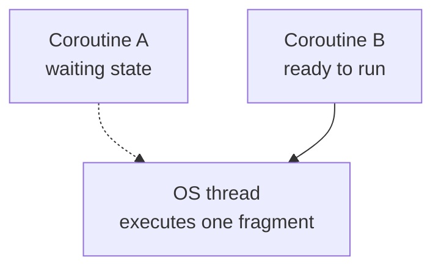
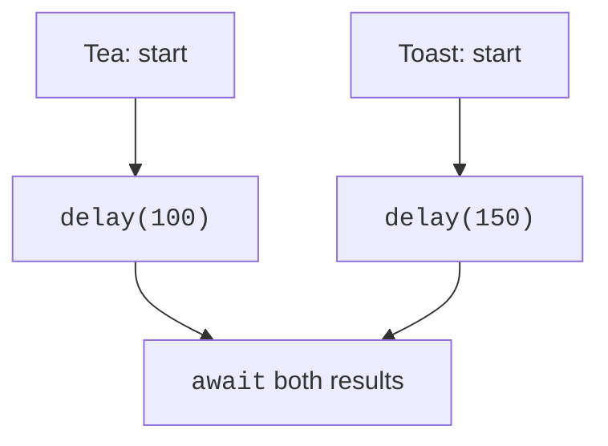

# Coroutines and suspend functions

## Why a program needs coroutines

While a program waits for a network response, a timer, or a new record, the processor can do other work. **Concurrency** means that several tasks make progress over the same period of time. **Parallelism** means simultaneous execution on several cores. A concurrent program can run on a single thread; the mere presence of coroutines does not guarantee a speedup.

A **coroutine** is a computation that can be suspended and resumed. An OS thread executes its code between suspension points. When a coroutine calls the non-blocking wait `delay`, the thread can execute another coroutine. `Thread.sleep`, in contrast, holds the thread. Not every `suspend` call actually suspends execution: a ready result can be returned immediately.

Support for `suspend` is part of Kotlin, while `launch`, `async`, `Flow`, and dispatchers belong to the **kotlinx.coroutines** library. The official introduction: <https://kotlinlang.org/docs/coroutines-overview.html>. The examples use `kotlinx-coroutines-core:1.11.0`. The version of this library is not the same as the version of the Kotlin compiler.



Figure 13.1. The thread executes code; the coroutine stores the waiting state {.caption}

### Setup and the first run

Add the dependency to the JVM project from Topic 1. Run each complete program in this lecture separately: replace `Main.kt` so as not to create several `main` functions in one package. The Gradle wrapper and the JDK remain as configured at the beginning of the course.

```kotlin
dependencies {
    implementation(
        "org.jetbrains.kotlinx:kotlinx-coroutines-core:1.11.0"
    )
    testImplementation(kotlin("test"))
    testRuntimeOnly("org.junit.platform:junit-platform-launcher")
    testImplementation(
        "org.jetbrains.kotlinx:kotlinx-coroutines-test:1.11.0"
    )
}
tasks.test { useJUnitPlatform() }
```

After *Load Gradle Changes*, the `kotlinx.coroutines` imports should be recognized. Adding the dependency to another module will not help a file in the current module. An unknown-import message is checked first in Gradle, and only then in the editor settings.

## Suspend functions and builders

The `suspend` modifier lets a function call other suspending functions. It is called from a coroutine or another `suspend` function. The compiler turns execution into a state machine: it saves the continuation point and the needed local values. This does not create a new thread for each call and does not promise to run the code in the background.

`runBlocking` creates a coroutine and blocks the current thread until it completes. It is convenient at the boundary between an ordinary console `main` and asynchronous code. Inside a `suspend` function, use `coroutineScope` rather than a nested `runBlocking`. In a GUI handler, blocking the main thread freezes the window.

`launch` returns a **Job**, which controls the task's lifecycle. `join()` waits for completion but does not return a computation result. `async` returns a **Deferred**; `await()` waits and returns `T` or throws an exception. By default both builders start immediately, as soon as the dispatcher allows execution.

The sequence `async { ... }.await()` before creating the second task remains sequential. To overlap the waits, first create both `Deferred` objects, then read the results. The order of `await` calls does not determine the order in which the tasks actually complete.

### Example 1. Making breakfast

Two independent actions are simulated with delays. This is a model of waiting, not real control of appliances. The functions return strings; the parent coroutine prints the output after both results.

```kotlin
import kotlinx.coroutines.*
import kotlin.time.measureTime

suspend fun tea(): String {
    delay(100)
    return "tea"
}

suspend fun toast(): String {
    delay(150)
    return "toast"
}

suspend fun breakfast(): List<String> = coroutineScope {
    val drink = async { tea() }
    val food = async { toast() }
    listOf(drink.await(), food.await())
}

fun main() = runBlocking {
    var sequential: List<String> = emptyList()
    val first = measureTime {
        sequential = listOf(tea(), toast())
    }
    var concurrent: List<String> = emptyList()
    val second = measureTime { concurrent = breakfast() }
    check(sequential == concurrent)
    println(concurrent.joinToString(" + "))
    println("Sequential: $first")
    println("Concurrent: $second")
}
```

The first line is `tea + toast`. The timing lines depend on the machine, the load, and JVM warm-up; they should not be checked by exact comparison. The model predicts roughly the sum of the delays for the sequential variant and the largest delay for the concurrent one. Measuring a single iteration is not a proper benchmark.



Figure 13.2. The waits of the two actions overlap {.caption}
